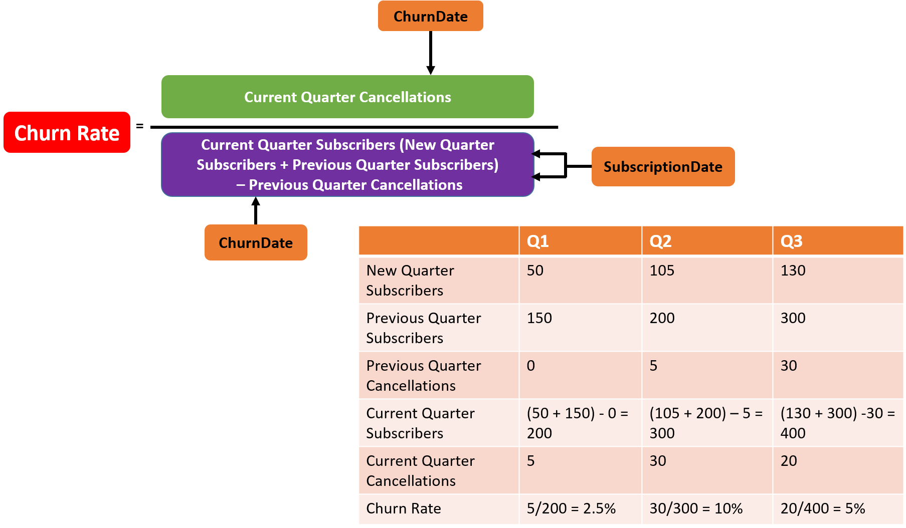
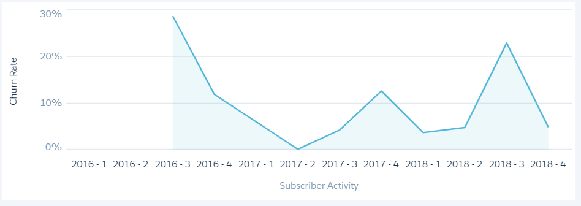
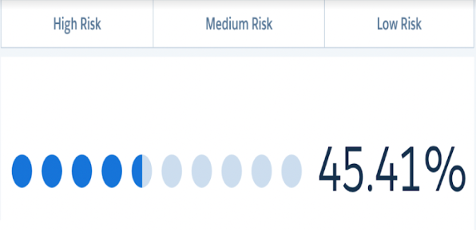
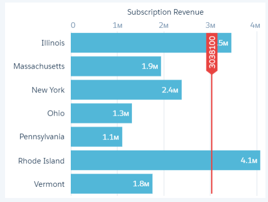

# Tableau CRM and Einstein Discovery Insights Specialist
 
* Trailhead のスーパーバッジ、[Tableau CRM and Einstein Discovery Insights Specialist](https://trailhead.salesforce.com/content/learn/superbadges/superbadge_analytics_insights_specialist) の日本語訳(**非公式**)です。
* 各カスタマイズ要素のラベル部分には補足として日本語を括弧内に記載している場合がありますが、正解チェックは英語のラベルを元に行われるため、実際のチャレンジには日本語表記を含めず、英語表記のみを使用して行って下さい。また、チャレンジ前にユーザと組織の言語・ロケールを英語に切り替えておくことを推奨します。

---
## このスーパーバッジを取得するためにすること
1. 解約率を計算する
2. 加入期間別の解約率を表示する
3. 顧客の獲得コストを計算する
4. 契約期間と顧客満足度スコアを比較する
5. サービスの解約を減らすためのソリューションを提供する

## このスーパーバッジでテストする概念
1. ビジネス要件をダッシュボードのレンズに落とし込む
2. ダッシュボードの JSON ファイルを設定する
3. SAQLを使用してダッシュボードやレンズのデータセットにアクセス、分析、フォーマットする
4. 選択バインドと結果バインドを設定する
5. 関連する行のセットにわたってデータセットの計算を実行する
6. Einstein Discovery のストーリーを作成する
7. Einstein Discovery の予測結果を確認し改善する
8. Salesforce のオブジェクトに Einstein Discovery のおすすめを追加する

所要時間 : 推定 8 時間 - 12 時間

### 注意
Challenge を始める前に、[Tableau CRM and Einstein Discovery Insights Specialist: Trailhead Challenge Help (英語)](https://trailhead.salesforce.com/help?article=Health-Cloud-Specialist-Superbadge-Trailhead-Challenge-Help) を確認してください。

以前のバージョンの `Beattie Dashboard.json` ファイルは、互換性を高めるためにいくつかの調整が行われました。Summer '21 リリース以前に zip ファイルをダウンロードした場合は、新しいバージョンの [data-insight-specialist.zip](https://developer.salesforce.com/files/sb-files/superbadge_analytics_insights_specialist/data-insight-specialist.zip) をダウンロードしてください。そうすれば、このスーパーバッジに必要な JSON ファイルの最新バージョンを使用することができます。

## 事前準備とメモ
* ペンや鉛筆を用意して、要件を読み進める際にメモを取ってください。
* 解約率を測定およびレポートするための多くの計算および指標があります。以降のシナリオと Challenge において、解約率は、現在の四半期の解約数を現在の四半期のサービス加入者数で割ったものとして計算されます。
* Challenge を検証する際に使用されるため、クエリや項目、射影の名前については、シナリオで指定されている命名規則に慎重に従ってください。
  * Challenge で使用されるダッシュボードにクエリを作成したり、ウィジェットを追加したりする際は、検証に必要となるため、クエリ名を Challenge で指定された名前で更新してください。
  * 変数と射影の名前にはキャメルケースのスペルを使用します。つまり、``lastName`` のように設定します[1](#footnote1)。
  * 項目名にはタイトルケースを使用します。つまり、``Last Name`` のように設定します。
  * スペースを含むクエリや項目、データセットの API名はアンダースコア (_) を使用します。つまり、``Last_Name`` のように設定します。
* Challenge が正しく検証されるようにするため、クエリやトリガにコメントやメモを追加しないことを推奨します。
* この Challenge に対して [Tableau CRM Developer Edition (DE)](https://developer.salesforce.com/promotions/orgs/analytics-de) 組織を作成します。この環境は Tableau CRM が有効になっており、Challenge で使用されるサンプルデータが含まれています (注 : この Challenge では Default App は使用しません) 。 
* [未管理パッケージ](https://login.salesforce.com/packaging/installPackage.apexp?p0=04tf4000003qbmx)をインストールして、サービス加入者 (Subscriber) オブジェクトを実装します。この未管理パッケージはカスタムオブジェクトのタブを作成しないため、[手順](https://help.salesforce.com/articleView?id=creating_custom_object_tabs.htm&type=5&language=ja)に従って、組織にタブを作成しておくことを推奨します。もし管理・未管理パッケージ、または AppExchange アプリケーションをインストールする際に問題が発生した場合は、この[記事](https://force.desk.com/customer/en/portal/articles/2710899-installing-a-package-or-app-to-complete-a-trailhead-challenge?b_id=13478)の手順に従ってください。
* Challenge を完了するためには、Beattie Subs.csv、Beattie OEM Survey.csv、Beattie Dashboard.json のファイルをアップロードする必要があります。
* [data-insights-specialist.zip](https://developer.salesforce.com/files/sb-files/superbadge_analytics_insights_specialist/data-insight-specialist.zip) をダウンロードして解凍してください。
* CSV ファイルには、米国フォーマットの日付項目が含まれています。組織のロケールが米国以外の場合は、次の[手順](https://help.salesforce.com/articleView?id=000004999&type=1&language=ja)に従って変更するか、組織のロケールに基づいて Subscription Date (サービスの加入日) および Churn Date (サービスの解約日) 項目の形式を変更することを検討してください。

#### リファレンス
* SAQL クエリの構造と文法については、[Analytics SAQL リファレンス](https://developer.salesforce.com/docs/atlas.ja-jp.218.0.bi_dev_guide_saql.meta/bi_dev_guide_saql/bi_saql_intro.htm)を参照してください。
* Tableau CRM Learning Adventure アプリケーションには、Challenge に役立つかもしれない例が含まれています。新しく作成した Analytics Developer Edition 組織にはこのアプリケーションが備わっています。Analytics Studio で、**作成 | アプリケーション | テンプレートからアプリケーションを作成 | Learning Adventure** をクリックします。
* [Let's Play Salesforce](https://www.youtube.com/channel/UCkNDwCEl-BbAsaGSQ7I6Xtg/playlists)の Youtubeチャンネルにも SAQL やバインディングの例を多く使った参考になる動画があります。

#### データをインポートする
Challenge のために、複数のアップロード処理が求められます。スーパーバッジの検証では、以下に示す手順に従うことが推奨されます。Tableau CRM にデータをアップロードするために、データフローを使用することを選択できますが、データ同期 (レプリケーション) は使用しません。データ同期では、データセットの項目名に接尾辞が追加されるため、Challenge が正しく検証できなくなります。

#### Subscriber オブジェクトにレコードをインポートする
1. Salesforce データインポートウィザードを使用します。設定で、クイック検索ボックスに``データインポートウィザード``と入力し、**データインポートウィザード** を選択します。
2. **ウィザードを起動する** をクリックします。
3. **カスタムオブジェクト** をクリックし、**Subscribers** を選択します。
4. **新規レコードを追加** を選択します。ドロップダウンメニューの選択肢では、[--なし--] を選択します。
5. **CSV** をクリックします。**ファイルを選択** を選択して、解凍した Beattie Subs.csv を選択します。**次へ** をクリックしてください。[*2](#footnote2)
6. **次へ** をクリックしてから **インポートの開始** をクリックします。
7. **OK** をクリックします。

#### Tableau CRM Plus Admin 権限を自身のユーザ Id に割り当てる
1. 設定のクイック検索ボックスに `権限セット` と入力し、**権限セット**を選択します。
2. **Tableau CRM Plus Admin** 権限をクリックします。
3. **割り当ての管理**ボタンをクリックし、**割り当てを追加**ボタンをクリックします。
4. ユーザのリストの中から自分の名前を探し、その横にチェックを入れます。
5. **割り当て** ボタンをクリックし、**完了**をクリックします。

#### Beattie Subs.csv と Beattie OEM Survey.csv ファイルをそれぞれアップロードする
1. Analytics Studio で、Challenge のために、`Beattie` という名前で空白のアプリケーションを作成します。(注 : 作成ボタンが表示されていない場合は、「Tableau CRM Plus の管理者権限を自分のユーザ ID に割り当てる」セクションに進んでください。)
2. **作成** ボタンをクリックし、**データセット** を選択します。
3. 次のページで **CSV ファイル** をクリックします。
4. **ファイルを選択するか、ここにファイルをドラッグしてください** をクリックし、解凍した CSV ファイルを選択します。
5. **次へ** をクリックします。
6. アプリケーションで Beattie アプリケーションを選択します。
7. **次へ** をクリックします。
8. デフォルトのメタデータ設定のままにします。
9. 右下にある **ファイルをアップロード** ボタンをクリックします。
10. **閉じる** をクリックします。

#### Beattie Dashboard.json ファイルをアップロードする
1. JSON ファイルをテキストエディタで開き、コピーします。
2. Analytics Studio のホームページで、**作成 | ダッシュボード | 空白のダッシュボードを作成** の順にクリックします。
3. JSON エディタを開きます。 `Ctrl+E` (Mac は `Cmd+E`)キーを押下します。
4. 既存のダッシュボードの JSON を、全選択し削除します。
5. JSON エディタの 1行目をクリックし、コピーした JSON を貼り付けます。
6. **完了** ボタンを押下します。
7. ダッシュボードを Beattie アプリケーションに保存します。
8. **X** をクリックしてタブを閉じ、Analytics Studio のホームページに戻ります。

#### Tableau CRM Plus の管理者権限を自分のユーザ ID に割り当てる
1. 設定で、クイック検索ボックスに``権限セット``と入力し、**権限セット** を選択します。  
2. **Tableau CRM Plus 管理者 (Admin)** をクリックします。  
3. **割り当ての管理** ボタンをクリックしてから、**割り当ての追加** ボタンをクリックします。  
4. ユーザのリストの中から自分の名前を見つけて、その横にチェックマークを付けます。  
5. **割り当て** ボタンをクリックしてから **完了** をクリックします。

## シナリオ
Arnas と Olivia Beattie は、40 年前に始めた小規模で低出力のラジオ局が、全国の電気通信会社である Beattie Media and Broadcasting (Beattie Media) に進化するとは夢にも思っていませんでした。何年もの間、彼らの離れた町では、娯楽と情報を得るのに遠くの駅に頼っていました。電波は弱く、コンテンツはその地域固有のものではありませんでした。Arnas と Olivia はこれらの問題を地元のラジオ局を立ち上げることで対処し、その後すぐにテレビ局を始めました。

Arnas と Olivia は、テレビ局やラジオ局の窮地を乗り越えて事業を拡大し、Beattie Media は主要な市場に進出することができました。彼らはまた、全国でシンジケートされる新しいトークラジオフォーマットを導入しました。彼らは自分たちの収入をさらなる拡大のための資金に充て、現在では電話、家庭用およびビジネス用のインターネット、ストリーミングサービスなどサービスを多様化しています。

Beattie Media の成長は目覚しいものでしたが、Arnas と Olivia は、自分たちがまだ大きな池の小さな魚であることを認識しています。何年もの間、彼らは独立性を維持し、売却の申し出に抵抗してきました。彼らは買収されていないので、彼らは常により大きなメディア・コングロマリットによって追い出されうることを知っています。大企業と競争するために、彼らは Beattie Media を上場企業に変える過程で助言を得るための投資銀行を雇いました。Arnas と Olivia は、株式を公開することで、資本基盤を強化し、名声を高めることを期待しています。しかし、新規株式公開 (IPO) の資格を得るには、Beattie Media は銀行が定めたいくつかの要件を満たす必要があります。

幸いなことに、Beattie Media は以下のように、既にそれらの多くを満たしています。
* 堅実な収益を伴う強い成長の歴史
* 経験豊富な経営陣
* 低い負債比率

しかし、彼らに足りてないのは予測可能な収入です。企業が収益を確実に予測するのに問題がある場合、市場はそれを好みません。これは長期的な成功に不可欠な要素です。

Arnas と Olivia は電話、インターネット、ストリーミングサービスをビジネスに追加したので、顧客の減少や解約に問題を抱えていました。インターネットが優れたイコライザーであるため、消費者は今までにない選択肢を得ています。Beattie Media は休むことなく働いて、顧客ロイヤリティを獲得または再獲得するためのプロモーションを行い、お買い得な情報を提供していますが、それらのアプローチは体系的または戦略的ではありませんでした。

銀行は Beattie Media が大きな可能性を秘めていると考えており、そしてより安定した収益を達成するための計画を考え出すために Arnas と Olivia に助言しています。

Arnas と Olivia は、Salesforce の長年の顧客であり、Tableau CRM から得られる可視性と洞察について耳にしています。彼らのオンサイトの Salesforce 管理者は、組織に Tableau CRM をセットアップし、Subscriber カスタムオブジェクトをデータセットとしてインポートしました。Beattie Media の BI チームの一員として、Tableau CRM のトレーニングに送りこまれたあなたは、今戻ってきて、顧客の解約を管理しやすくするエグゼクティブダッシュボードを構築することを Arnas と Olivia から依頼されています。Analytics のスキルを活用することで、Arnas と Olivia が新しい洞察を発見し、顧客を積極的に維持していくためのソリューションを作成しましょう。

Beattie Media はあなたを頼りにしています。さあ始めましょう！

## 標準オブジェクト
標準オブジェクトは今回のハンズオン Challenge には使用されません。

## カスタムオブジェクト
* **Subscriber** (顧客/サービス加入者) - Beattie Media の電話、インターネット、ストリーミング放送の加入者

|項目|定義|
|-|-|
|Account Manager|担当者の ID|
|Rep Name|担当者の氏名|
|Account Number|顧客管理番号|
|Name|顧客の氏名|
|Address|顧客の住所|
|Subscription Date|サービスの加入日|
|Senior Citizen|お年寄りかどうか (1, 0)|
|Partner|OEMパートナに関連付けられているかどうか (Yes, No)|
|Dependents|扶養家族がいるかどうか (Yes, No)|
|Tenure|サービス加入期間 (月)|
|Phone Service|電話サービスへの加入状況 (Yes, No)|
|Multiple Lines|複数の電話回線を契約しているかどうか (Yes, No, No phone service)|
|Internet Service|インターネットサービスの加入状況 (DSL, Fiber optic, No)|
|Modem Age|モデムの使用年数 (New, Less than 1 year, 1 - 2 years, > 4 years)|
|Online Security|オンラインセキュリティのオプションに加入しているかどうか (Yes, No, No Internet service)|
|Online Backup|オンラインバックアップのオプションに加入しているかどうか (Yes, No, No Internet service)|
|Device Protection|端末保護サービスのオプションに加入しているかどうか (Yes, No, No Internet service)|
|Tech Support|テクニカルサポート契約があるかどうか (Yes, No, No Internet service)|
|Streaming TV|TVのストリーミングに加入しているかどうか (Yes, No, No Internet service)|
|Streaming Movies|映画のストリーミングに加入しているかどうか (Yes, No, No Internet service)|
|Contract|契約期間 (Month-to-month, One year, Two year)|
|Paperless Billing|オンライン請求かどうか (Yes, No)|
|Payment Method|支払方法 (Electronic check, Mailed check,  Bank transfer (automatic), Credit card (automatic))|
|Monthly Charges|月のサービス使用料|
|Total Charges|サービス使用料の累計|
|Churn|サービス解約済みかどうか (Yes or No)|
|Churn Date|サービスの解約日|
|Latitude|顧客の所在地 (経度)|
|Longitude|顧客の所在地 (緯度)
|Postal Code|顧客の自宅住所 (郵便番号)|
|Region|顧客の自宅住所 (米国の州)|

## 外部ファイル
* **Beattie Subs** - Beattie Media の電話、インターネット、ストリーミングの顧客の CSV ファイル (Subscriber オブジェクトのメタデータを参照してください)
* **Beattie OEM Survey** - Beattie Media の、OEM パートナシップを通して獲得した顧客基盤の CSV ファイル

|項目|定義|
|-|-|
|Account Manager|担当者の ID|
|Rep Name|担当者の氏名|
|Account Number|顧客番号|
|Subscription Date|サービスの加入日|
|Region|顧客の自宅住所 (米国の州)|
|OEM|OEMパートナの名前|
|OEM Type|OEMの業種 (Cable Provider, Media Player,  PC Manufacturer, Phone Manufacturer, Television Manufacturer)|
|CSAT|顧客満足度スコア (1–10)|

## ビジネス要件の概要
* 解約率を計算する
* 加入期間別の解約率を表示する
* 顧客の獲得コストを計算する
* 加入期間と顧客満足度スコアを比較する
* サービスの解約を減らすためのソリューションを提供する

## ビジネス要件の詳細
### 解約率を計算する
正確に解約率 (Churn Rate) を計算することは、Beattie Media の株式公開計画には不可欠です。自分のお気に入りの番組(例えば *Keeping Up with the Real Housewives In Paradise* や *The Walking Handmaids*[*3](#footnote3)) やお気に入りのスポーツイベントがあったときだけに申し込む顧客もいるため、ストリーミングサービスの解約数は高い状態です。

収入と利益を守るために、Arnas と Olivia は、四半期ごとの Beattie Media の解約率について理解を深めるためのグラフを求めています。

1. Beattie Media ダッシュボードを開き、**編集** モードに入ります。
2. ``CHALLENGE 1`` というラベルのダッシュボードセクションを見つけて、グラフウィジェットで置き換えます。
3. **Beattie Subs** データセットを使用します。
4. `Churn Rate` という名前のクエリを追加します。
5. 四半期中にサービスを解約した顧客の割合を示す Churn Rate 項目を作成します。Beattie Media での定義は以下の通りです。

* 解約率を計算するには、四半期ごとの顧客の活動 (加入と解約) ごとにデータを整理する必要があります。たとえば、``ActivityDate_Year``や``ActivityDate_Quarter``などの射影を使用して、サービスの加入日と解約日でデータをグループ化することができます。
* Beattie Subs ファイルには、1種類の活動のみを含む四半期があります。たとえば、サービスの加入がなく、解約だけがある場合です。データストリームを group や cogroup、または union するときには、この点に留意してください。
* この Challenge であなたが作成しようとしている計算は大変ですが、Arnas と Olivia はあなたを信頼しています！上記の解約率の表を使用して、この Challenge に対する計算式を考案してください。

1. 作成したソリューションは折れ線グラフで表示してください。
2. 解約率を表示している最初の四半期にグラフマーカーを追加してください。作成したソリューションを正しく検証するために、グラフマーカーはハードコーディングしてください。
3. ダッシュボードを、``Beattie Media Executive Dashboard`` という名前で **Beattie** アプリケーションに保存してください。
4. 作成したソリューションは次の例のようになるはずです。

### 加入期間別の解約率を表示する
新しい顧客を幸せにするための Beattie Media の精力的な働きもまた、初めの頃からサービスに加入していたロイヤリティの高い顧客に対して犠牲を払っていました。Arnas と Olivia は、長年サービスに加入している顧客が無視されているように感じロイヤリティを失い始めていると聞いて落胆しています。これらのかつて安定していた顧客はまた、より良いお買い得情報を求めてサービスを解約しています。Arnas と Olivia は、加入期間内の解約をモニタリングしたいと考えています。たとえば、2 年以上契約が続いていてキャンセルされた顧客の数を測定します。彼らは、加入期間別の解約率を示すグラフを求めており、すべての顧客に対して、より戦略的になり、より的を絞るようにしたいと考えています。

1. ``CHALLENGE 2`` というラベルのダッシュボードセクションを見つけて、グラフウィジェットに置き換えます。  
2. ``Churn Tenure`` という名前のクエリを追加します。  
3. 解約した顧客 (条件は ``Churn = "Yes"``) の数を顧客の総数で割る計算を追加します。解約した顧客の数が分子になり、総顧客数が分母になります。  
4. Churn Tenure グラフの上に切り替えウィジェットを追加します。  
5. 表示ラベルとして、``Tenure Length`` を追加します  
6. 以下のカスタム定義をウィジェットに追加します。

| Tenure Length (表示名) | Length of Tenure (対応する値の範囲) |
|-|-|
|High Risk|1〜12 か月|
|Medium Risk|13〜24 か月|
|Low Risk|25〜36 か月|

Tenure Length 切り替えウィジェットを Churn Tenure グラフにバインドし、Tenure 項目をフィルタリングします。作成したソリューションは以下の例のようになるはずです。

### 顧客の獲得コストを計算する
Beattie Media は無制限のサービスプランを提供していますが、それは有料のサブスクリプションによるものです。サービスを解約する顧客が彼らの顧客基盤を縮小させています。顧客のプールが小さくなればなるほど、代わりの顧客を獲得するための費用が高くなります。この費用は、1世帯あたり 950.00ドル(USD) と推定されています。サービスの解約により、Beattie Media はあちこちに行ってしまう顧客を新しい顧客で補いづらくなっています。

Arnas と Olivia から、州別の顧客からの収益および、彼らが失った顧客を埋め合わせるために費やした損失コストを表示するグラフを作成するように依頼されています。加入期間を分類することができたので、彼らはまた、加入期間によって損失コストがファセットで絞り込まれる様子も見たいと思っています。

1. ``CHALLENGE 3`` というラベルのダッシュボードセクションを見つけて、グラフウィジェットに置き換えます。
2. ``Subscriber Revenue`` という名前のクエリを追加します。
3. この手順では、``TotalCharges`` 項目を合計して ``Region`` 項目でグループ化する棒グラフを作成します。
4. ``Attrition Cost`` という名前でクエリをもう 1つ作成します。このクエリでは顧客の損失コストを次の式で計算します。[ 解約した顧客の数 (条件は Churn = 'Yes') × 950.00ドル (USD) ]
5. 前の手順での計算には、射影の名前に ``attrCost`` を使用してください。
6. Subscriber Revenue グラフに基準線を追加します。
7. 基準線に損失コストを表示する結果バインドを作成します。また、基準線の値を Tenure Length のトグルウィジェットを用いて、加入期間の長さでフィルタリングできるようにします。
8. 作成したソリューションは以下の例のようになるはずです。

### 契約期間と顧客満足度スコアを比較する
Beattie Media の顧客基盤の大部分は、PC とテレビの製造業者を含む OEMメーカーとの提携によるものです。これらの企業は、自社の機器でストリーミングコンテンツにアクセスするために、自社の機器に Beattie Media のアプリを携帯することに同意しました。

Beattie Media はこれらの顧客に対して、ストリーミングサービスに対する満足度をランク付け(1 = 非常に不満 から 10 = 非常に満足 まで)するように依頼しました。Arnas と Oliviaは、CSAT (顧客満足度) スコアが低かったり、加入期間が短かったりする地域や OEM メーカーを見ることに興味があります。

1. ``CHALLENGE 4`` というラベルのダッシュボードセクションを、2つのグラフウィジェットに置き換えます。
2. 1つ目のグラフで、``Beattie Survey`` という名前のクエリを追加します。
3. Beattie Subs データセットの Tenure (加入期間) 項目を使用して平均の Tenure を計算し、Beattie OEM Survey データセットの CSAT項目を使用して平均 CSAT を計算します。
4. 2つ目のグラフで、``OEM`` という名前のクエリを追加します。
5. Beattie OEM Survey データセットのデータを OEM 項目別にグループ化し、[行 計数] (Count of Rows) の基準 (Measure) を追加してツリーマップグラフとして表示します。
6. ファセットを使用して、ピラミッドグラフでの選択によりツリーマップグラフが絞り込まれることを確認します。
7. 平均 CSATスコアが最も低い**最初**の州の Beattie Survey グラフにグラフマーカーを追加します。Challenge を検証する際に作成したソリューションが正しく評価されるように、マーカーはハードコーディングしてください。

 **クエリを作成するときには、以下の情報を考慮してください**
 
* Beattie OEM パートナのファイルのすべての顧客は、Beattie の顧客のファイル内の最低 1 つのレコードと紐づきます[*4](#footnote4)。  
* Beattie Media のアカウントマネージャは OEM パートナーに割り当てられ、その関係を管理しています。  
* Account Manager 項目と Region 項目を使用してデータセットをグループ化します。  
* CSAT と Tenure の結果を整数に丸めます。  
* 結果を CSAT スコアで昇順に並べ替えます。  
* 作成したソリューションはピラミッドグラフとして表示します。

作成したソリューションは以下の例のようになるはずです。

### サービスの解約を減らすためのソリューションを提供する
Beattie Media が雇った投資銀行は、少なくとも 2年の契約がより安定した収益のイメージにつながり、契約更新につながるであろうと提言しています。Beattie Media は、既存顧客および潜在顧客がそれを好んでいないことを知っているので、長期契約にこだわっていませんでした。これまでのプロモーションでは、せいぜい数か月の契約継続を獲得することはありましたが、長期契約に対する勝ち手は見出せていません。

あなたは Arnas と Olivia に、Einstein Discovery と、その高速で・利用しやすい・予測的な洞察について話しました。あなたはこれが繰り返し行うプロセスになるだろうという予想を説明しました。Arnas と Olivia はそれに同意し、あなたが考えついたものを見ることを楽しみにしています。また、Einstein Discovery からのおすすめ情報が Subscriber のサービスのレコードにどのように表示されるかのモックアップを作成する予定であることも 2人に伝えました。Arnas と Olivia は、このアイデアを気に入っていて、この情報をカスタマーサクセスエージェントを支援するために手元に置いておくことを望んでいます。

あなたの仕事はデータセットを分析して加入期間を増やすためのおすすめを作成することです。

#### Einstein Discovery でストーリーを作成する
1. 「インサイトと予測」のストーリーを手動モードで、Beattie Subs データセットを使用して作成します。顧客の加入期間を最大化することをストーリーの目標に設定します。
2. ストーリーで使用されるすべての項目を確認し、データリーケージの原因となりそうな項目を削除し、新しいストーリーバージョンを作成します。ヒントとして、レコードが終了状態になったときのみに入力されるため、予測モデルでは使用すべきでない項目が 1 つあります。
3. モデルで使用されるすべての日付項目を確認します。年を含める必要はありますか？このモデルでスコアリングされる新しいレコードを検討します。予測モデルは年をどのように処理するか知っていますか？「曜日」または「年の月」にフォーカスすることを検討します。 
4. モデルの評価基準を検討し、このモデルがリリースするのに十分なものであることを確認します。

#### Einstein Discovery の予測をリリースする
1. ストーリーを調整してから、この[手順](https://help.salesforce.com/articleView?id=bi_edd_model_deploy.htm&type=5)を使用して新しい予測をリリースし、予測を Subscriber オブジェクトに関連付けます。
2. 予測の名前を `Predicted Tenure` にします。
3. Subscriber オブジェクトに予測を関連付けます。
4. ストーリーのすべての項目を Subscriber オブジェクトに対応付けます。
5. 新しい予測項目を作成し、`Predicted Tenure` という名前を付けます。
6. Contract (契約期間) と Payment Method (支払方法) をアクション可能な変数として選択します。
7. モデルを確認しリリースします。

#### Einstein Prediction の Lightning カードを Subscriber レコードの Lightning ページに追加する
1. Lightning アプリケーションビルダーを使用して、Subscriber オブジェクトのレコードページを作成します。
2. ページの名前を `Default` にします。
3. Salesforce のデフォルトのページをコピーし、
4. 右サイドパネルに、Einstein 予測の Lightning コンポーネントをドラッグアンドドロップします。
5. Einstein 予測の設定パネルで、`Predicted Tenure` を選択します。
6. ページを有効化し、デスクトップの組織のデフォルトとして割り当てます。

#### Subscriber リストビューに予測の項目を追加する
1. オブジェクトマネージャを使用して、Subscriber オブジェクトに移動して、`Predicted Tenure` 項目を開きます。
2. この項目を自身のプロファイルから参照できるように、項目レベルセキュリティを設定します。
3. Subscriber タブに移動します。
4. `All Subscribers` という名前の新しいリストビューを作成します。
5. Subscriber Name、`Predicted Tenure` および表示したい他の任意の項目を含めて、リストビューを保存します。
6. `Predicted Tenure` 項目は空になっています。これは、新しい予測がレコードを作成または更新された後にのみ生成されるためです。

#### 予測を表示し、新しい予測を生成する
1. 任意の Subscriber レコードに移動します。
2. Lightning カードに表示される予測を確認します。
3. 上位 5 件の予測因子のうち、1 つの項目値を変更しレコードを保存します。
4. リストビューに戻り、更新したレコードの `Predicted Tenure` 項目の値を確認します。

## Challenge
### Challenge 1: 解約率を計算する
四半期の解約率を表示する折れ線グラフを作成してください。

注: Summer '21 リリースから、このスーパーバッジの Challenge をパスするために、[data-insight-specialist.zip](https://developer.salesforce.com/files/sb-files/superbadge_analytics_insights_specialist/data-insight-specialist.zip) に含まれる、新しいバージョンの "Beattie Dashboard.json" ファイルが必要になります。 

### Challenge 2: 加入期間別の解約率を表示する
加入期間別の解約率を表示する評価グラフを作成してください。加入期間の長さでグラフをフィルタできるように設定してください。

### Challenge 3: 顧客の獲得コストを計算する
州別に顧客からの収益を表示し、失った顧客を埋め合わせるために費やした損失コストを表示する棒グラフを作成してください。

### Challenge 4: 契約期間と顧客満足度スコアを比較する
OEM 契約を通して獲得した顧客に対して 2つのグラフを作成してください。1つ目は、地域別に平均の顧客満足度スコアと加入期間を表示するピラミッドグラフです。2つ目は、OEM パートナ毎に顧客の数を表示するツリーマップグラフです。

### Challenge 5: サービスの解約を減らすためのソリューションを提供する
**注: この Challenge の要件は、最近のリリースで導入された新機能のために変更されました。**データセットを分析し、ストーリーを作成し、おすすめを Salesforce のオブジェクトのページレイアウトに追加してください。

## 訳注
* <a name="footnote1">[1]</a> : 原文には記載がありませんが、厳密に言うと <a href="https://ja.wikipedia.org/wiki/%E3%82%AD%E3%83%A3%E3%83%A1%E3%83%AB%E3%82%B1%E3%83%BC%E3%82%B9">Lower Camel Case</a> ということです。
* <a name="footnote2">[2]</a> : 原文には記載がありませんが、文字コードは UTF-8、値の区切り文字にはカンマを指定してください。
* <a name="footnote3">[3]</a> : どちらも架空のテレビ番組ですが、<a href="https://en.wikipedia.org/wiki/The_Real_Housewives_of_Beverly_Hills">The Real Housewives of Beverly Hills</a>、<a href="https://en.wikipedia.org/wiki/The_Walking_Dead_(TV_series)">The Walking Dead</a> と <a href="https://en.wikipedia.org/wiki/The_Handmaid%27s_Tale">The Handmaid's Tale</a> あたりが元ネタだと思います。
* <a name="footnote4">[4]</a> : Account Number で紐づくということです。前述の通り、Beattie Subs データセットには同じ Account Number のレコードが複数存在します。
