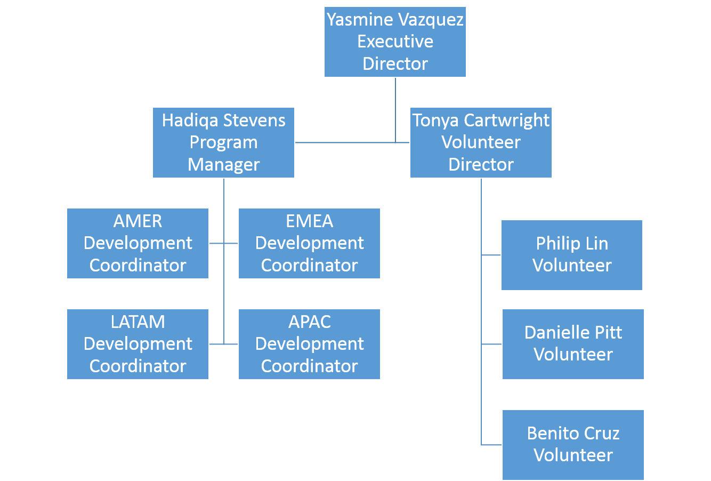
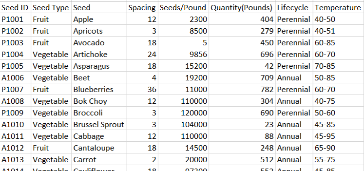

# Tableau CRM Data Preparation Specialist
 
* Trailhead のスーパーバッジ、[Tableau CRM Data Preparation Specialist](https://trailhead.salesforce.com/content/learn/superbadges/superbadge_analytics_integration_specialist) の日本語訳(**非公式**)です。
* 各カスタマイズ要素のラベル部分には補足として日本語を括弧内に記載している場合がありますが、正解チェックは英語のラベルを元に行われるため、実際のチャレンジには日本語表記を含めず、英語表記のみを使用して行って下さい。また、チャレンジ前にユーザと組織の言語・ロケールを英語に切り替えておくことを推奨します。

---
## このスーパーバッジを取得するためにすること
1. Tableau CRM でデータを抽出、ロード、変換するためのユーザ権限を設定する
2. Tableau CRM での分析に備えて、Salesforce および Salesforce 以外のデータを抽出してロードする
3. データロードのパフォーマンスを改善する
4. Tableau CRM でデータアクセスを管理する
5. 失敗したデータアップロードを診断しトラブルシューティングする

## このスーパーバッジでテストする概念
* Tableau CRM のセキュリティ
* アセットの組織と役割
* データの読み込み
* データの修正
* データフロージョブのトラブルシューティング

所要時間 : 推定 4 時間 - 6 時間

### 注意
Challenge を始める前に、[Tableau CRM Data Preparation Specialist: Trailhead Challenge Help (英語)](https://trailhead.salesforce.com/ja/help?article=Tableau-CRM-Data-Preparation-Specialist-Superbadge-Trailhead-Challenge-Help) を確認してください。

## 事前準備とメモ
* ペンや鉛筆を用意して、要件を読み進める際にメモを取ってください。
* データセットに関する Challenge は、そのデータセットがデータフローを使用して作成および変更されることを前提としています。
<!-- textlint-disable jtf-style/1.1.3.箇条書き -->
* Challenge を検証する際に使用されるため、データフローやデータセットの名前について、シナリオで指定されている命名規則に慎重に従ってください。
  * データセットのエイリアスには小文字のスペルを使用してください。
  * 名前にスペースを含むデータセットの場合は、データセットエイリアスにアンダースコア（_）を使用します。
    * データセット名：Seed Bank
    * データセットエイリアス：seed_bank（小文字のスペル）
<!-- textlint-enable jtf-style/1.1.3.箇条書き -->
* この Challenge に対して [Tableau CRM Developer Edition (DE)](https://developer.salesforce.com/promotions/orgs/analytics-de) 組織を作成します。この環境は Tableau CRM が有効になっており、Challengeで使用されるサンプルデータが含まれています (注 : この Challenge では DTC Default App は使用しません) 。 
* Challenge の一部として、レンズを作成するように依頼されるでしょう。表示される結果数を制限することは上位の N件を分析する際のベストプラクティスであり、SAQL クエリを試したいと思うかもしれません。しかし、このスーパーバッジにおける Challenge の検証では、単純にデータをフォーカスしたりフィルタすることが要求されます。
* 以下の詳細な要件を読みながら、エンティティリレーション図を確認してください。

#### リファレンス
* SAQL の構文については、[Analytics SAQL リファレンス](https://developer.salesforce.com/docs/atlas.ja-jp.bi_dev_guide_saql.meta/bi_dev_guide_saql/bi_saql_intro.htm)を参照してください。
* Tableau CRM Learning Adventure アプリケーションには、Challenge に役立つかもしれない例が含まれています。新しく作成した DE 組織にはこのアプリケーションが備わっています。Analytics Studio で、**作成 | アプリケーション | テンプレートからアプリケーションを作成 | Learning Adventure** をクリックします。
* [Let's Play Salesforce](https://www.youtube.com/channel/UCkNDwCEl-BbAsaGSQ7I6Xtg/playlists) の Youtubeチャンネルにも役立つ動画があります。

Challenge を完了するには、このスーパーバッジに関連しているデータを、取引先オブジェクトに事前に入力する必要があります。Agency Data.txt ファイルを Tableau CRM DE 組織の取引先オブジェクトにインポートします。取引先オブジェクトへインポートしたら、課題に取り組む準備が整います。

1. [ea-data-preparation-specialist-data.zip](https://developer.salesforce.com/files/ea-data-preparation-specialist-data.zip) をダウンロードしてデスクトップに保存してください。
2. zip ファイルを解凍します。
3. Salesforce データインポートウィザードを使用します。 設定で、クイック検索ボックスに``データインポートウィザード``と入力し、**データインポートウィザード** を選択します。
4. **ウィザードを起動する** をクリックします。
5. **取引先と取引先責任者** を選択します。
6. **新規レコードを追加** を選択します。 [取引先責任者の一致条件] および [取引先の一致条件] でそれぞれ、[--なし--] を選択します。
7. **CSV** をクリックします。**ファイルを選択** を選択して、解凍した Agency Data.txt を選択します。**次へ** をクリックしてください。[*1](#footnote1)
8. 以下の通り項目マッピングを設定します。

| Salesforceのオブジェクト項目 | Agency Data.txt のタイトル列 |
|-|-|
| Account: Account Number (取引先: 取引先番号) | AccountNumber |
| Account: Record Owner (取引先: 所有者) | RecordOwner |
| Account: Account Name (取引先: 取引先名) | AccountName |
| Contact: Name (取引先責任者: 氏名) | Name |
| Account: Shipping Street (取引先: 丁目・番地(納入先)) | ShippingStreet |
| Account: Shipping City (取引先: 市区郡(納入先)) | ShippingCity |
| Account: Shipping State/Province (取引先: 都道府県(納入先)) | ShippingState |
| Account: Shipping Country (取引先: 国(納入先)) | ShippingCountry |
| Account: Phone  (取引先: 電話)| Phone |

**次へ** をクリックしてから **インポートの開始** をクリックします。 終了したら **OK** をクリックします。

#### Challenge のためのアプリを作成する  
1. **Analytics Studio** を開きます。  
2. **作成** | **アプリケーション** | **空白のアプリケーション** | **空白のアプリケーションを作成** をクリックします。
3. アプリケーションの名前に **Mosaic** と入力して **作成** ボタンをクリックします。 

## ユースケース
Mosaic Council が始まってからの 5 年間で、この非営利団体はより良い世界を創造しやすくするというその使命において印象的な進歩を遂げました。Mosaic は、慈愛は家庭から始まるという格言を重視し、地域社会のための仕事に注力しています。Mosaic は全体的な使命を果たすために、国際的に活動する人道支援機関とも提携しています。Mosaic がより成功した地域のプログラムの 1 つに、果樹園や菜園を始めることに興味を持っている地域社会を支援するという活動があります。近隣を美化し、共同体意識を築くことに加えて、果樹園や菜園がその地域のフードバンクやシェルターに新鮮な食材を提供します。

ここであなたの出番です。あなたは Mosaic のエグゼクティブ・ディレクターである Yasmine Vazquez から歓迎の電話を受け、Mosaic が先導することを求められている新しいベンチャー事業について伺いました。Yasmine があなたに連絡してきたのは、過去に Mosaic と仕事をし、Mosaic の Salesforce 組織の立ち上げを助けたことがあるためです。そのため、あなたは自身のカレンダーに予定を入れ、Mosaic のオフィスに向かうことにしました。

Mosaic が、以前に行われたことがない新しいプロジェクトを行っていることを知りました。見逃すにはもったいないほど興奮する機会です。これまでの地域社会の果樹園・菜園での成功に基づいて、Mosaic は、種子の信託を形成し管理し、世界中の小規模農場への種子の分配を監督するよう求められています。Mosaic は、プログラムに参加する農家に対して種子の提供を担当している国際的な代理機関と直接連携しています。

企画会議では、そのプログラムとそれに対する Mosaic の目標について話し合う時間がありました。Mosaic は既にプログラムを試験運用しており、実際に開始するために利用できるデータを蓄積しています。また、Mosaic は、このプロジェクトの拡大を妨げうる未知の要素がいくつかあることを認識しています。プロジェクトに参画するにあたり、あなたは Tableau CRM で Mosaic が現在抱えるデータをより良く理解でき、将来の計画を立てられると考えています。Yasmine は Tableau CRM に精通していませんが、彼女に概要を説明したところ、それを試すことには積極的です。

## 主要なステークホルダ
Mosaic のステークホルダは、要求を推進し、データニーズを定義し、そして何が起こるべきかを指示することに関して重要な役割を果たしています。加えて、彼らは質問をしたり承認を得るために頼りになる人々です。

* Yasmine Vazquez (エグゼクティブ・ディレクター)  
* Hadiqa Stevens (プログラム・マネージャ)  
* Tonya Cartwright (ボランティア・ディレクター)
* Philip Lin (ボランティア) 
* Danielle Pitt (ボランティア) 
* Benito Cruz (ボランティア) 
* AMER Development Coordinator (未着任)
* EMEA Development Coordinator (未着任)
* LATAM Development Coordinator (未着任) 
* APAC Development Coordinator (未着任)

## 標準オブジェクト
* 取引先 - Agency Data.txt ファイルからインポートされた、種子銀行の代理機関を含む。

## 外部ファイル
* Agency Detail (代理機関の詳細) - 取引先オブジェクトにまだ追加されていないが最近必要になった項目
* Global Climates (世界の気候) - 地域ごとの気温データ
* Temperature Mapping Classes (気温マッピングクラス) - 気温クラスを算出するために用いる補足ファイル
* Seed Chart (種子の表) - 作物の種子の在庫一覧
* Seed Bank Orders (種子銀行の注文) - 代理機関からの種子の注文履歴

## エンティティリレーション図

* Seed Bank Agencies データセットは、外部ファイル Agency Data.txt からインポートしたレコードを含む Salesforce の取引先オブジェクトから生成されます。
* データをインポートした後に、新しい項目が Agency Detail.txt に追加されたため、Seed Bank Agencies データセットをそれらの項目で更新する必要があります。
* 代理機関は、Global Climates.txt ファイルから取得する気温データを保持しています。
* 種子は、Temperature Mapping Classes.txt ファイルから取得される気温データを保持しています。
* Seed Bank Orders データセットは、Seed Bank Agencies データセットにある代理機関による注文と、Seed Bank データセットにリストされている代理機関が注文した種子を保持します。

## ビジネス要件
### チームを組む
Mosaic のプロジェクトのボランティアには全員、レポートやダッシュボードの作成や操作、データベースに関する機能的な知識など、それぞれ Salesforce の専門知識があります。皆興奮していて、腕まくりしてすぐに飛び込む準備ができています。あなたの仕事は、それぞれのボランティアがテーブルに持ってきたものを受け取り、彼らが Eisntein Analytics と協力して Mosaic の種子配布の目標を現実のものにできるようにすることです。

あなたは、皆に手助けをする機会を与えたいと思っており、それにより結果として彼らが最善を尽くすことになります。しかし、最初に、Tableau CRM と連携する新しい役割に必要な権限を決定する際に、それぞれに何ができるかを確認する必要があります。Philip、Danielle、そして Benito は、この機会に最高に興奮していました。

* Benito は、Mosaic の Salesforce のレポート作成に関する、頼りになるエキスパートです。あなたは彼がダッシュボードの構築とデータセットの検証に理想的だと考えました。
* Danielle と Philip は、Salesforce のコアとデータベース全般に慣れているため、データセット検証の支援ができ、あなたの仕事が終わったときにはデータの準備とシステム管理のタスクを引き継ぐことになるでしょう。
* Yasmine、Hadiqa、Tonya は、種子銀行プログラムのマネージャおよび主な担当者であり、データからどの情報を引き出すことが最も重要かを決定します。あなたの分析によると、彼らはシステム管理やメンテナンスに積極的な役割を果たさず、エンドユーザになるでしょう。

### データ読み込みのパフォーマンスを向上させる
ディスカッション中に、複数のインテグレーション操作の計画を立て始めました。データトランザクションを遅くする可能性がある単一の操作に頼りたくはありません。

Mosaic が最適なパフォーマンスでデータ準備を運用できるようにするため、Mosaic の Salesforce 組織でデータ同期を有効化してください。

### Seed Bank Agencies (種子銀行の代理機関) のデータセットを作成する
Mosaic は、プログラムに参加している農家に対して種子の配布を担当している国際機関と直接協力しています。Yasmine は Tonya にプロジェクトのこの部分を管理するように依頼しました。

Tonyaは、Danielle と Philip がフラットなファイルである Agency Data.txt から取引先オブジェクトにレコードをインポートしたため、手作業によるデータ入力にかかる時間を大幅に節約できたと説明しています。しかし、データインポート以降に、Mosaic は代理機関とそれらが担当する地域に関連する、報告目的のための追加のデータを集めなければなりませんでした。彼らは Agency Detail.txt に最新の更新情報を文書化していますが、まだその項目を取引先オブジェクトに追加していません。

あなたはオブジェクトにカスタム項目は必要ではななく、種子銀行用の新しいデータセットを作成する際に Tableau CRM に項目を追加できることを説明しました。Tonya は、追加された項目が種子銀行に固有のものであり、Tableau CRM に送信されるレコードを種子銀行に関係するレコードだけに制限したかったため、この説明を受けて嬉しく思っています。

項目を調べていくと、とても具体的に見える 1つの項目、Acres (エーカー数) がありました。Tonya の説明によると、地元の代理機関が、プログラムに参加している農場の平均サイズをエーカー単位で文書化するプロセスを既に完了しているため、ある農場が特定の作物を栽培するのに十分な土地を持っているかどうかを決定するために Acres 項目が使用されます。

以下が新しい Seed Bank Agencies データセットを作成するためのプロセスです。
1. 予め用意している取引先オブジェクトをロードします。
2. Agency Detail.txt ファイルをロードして、最初にインポートして以降最近追加された項目で、ロードした取引先オブジェクトを更新します。
3. 種子銀行プロジェクトに関係するレコードを選択するためのフィルタを作成します。
4. Agency Detail.txt ファイルからのカスタム項目を追加します。
5. レコードを新しく Seed Bank Agencies データセットとして登録します。
6. Yasmine は、これから作成する新しいデータセットで、Mosaic が何ができるようになるかを知りたがっています。そのことを念頭に置いて、エグゼクティブチームが試せるようにデータセットからレンズを作成する方法を Benito に示します。

**データフローの名前 : Load Seed Bank Agencies**

**データコンポーネント**

|ノード名|説明|項目|
|-|-|-|
|Load Account|取引先オブジェクトを読み込む|- Account Name - Account Number - Account Phone - Shipping City - Shipping Country - Shipping State/Province - Shipping Street - Shipping Postal Code|
|Load Agency Detail|Agency Detail.txt ファイルを読み込む|- AccountNumber - SubRegion - Region - Latitude - Longitude - Currency - Acres|

**操作**

|ノード名|説明|
|-|-|
|ID Agency Records| IsAgency という項目を作成して、取引先オブジェクトのレコードが種子銀行プロジェクトに関係しているかどうかを判定する。(ヒント: 種子銀行の代理機関だけ、電話項目に値があります)|
|Filter Agency Records| IsAgency 項目を用いて、種子銀行プロジェクトに関係する取引先オブジェクトのレコードをフィルタする。|
|Add Agency Fields| Agency Details.txt ファイルから以下の項目を、データフロー内の取引先オブジェクトに追加する。マッチングのためそれぞれのキーに Account Number (取引先番号) を使用する。また、リレーションに AgencyDetailを設定する。 - Currency - Acres - SubRegion - Region - Latitude - Longitude|
|Create Seed Bank Agencies|レコードを新しく Seed Bank Agencies データセットとして登録する。 出力する項目: - Account Name - Account Number - Account Phone - Shipping City - Shipping Country - Shipping State/Province - Shipping Street - Shipping Postal Code - AgencyDetail.Latitude - AgencyDetail.Longitude - AgencyDetail.Currency - AgencyDetail.Acres - AgencyDetail.SubRegion - AgencyDetail.Region

**レンズ**

種子銀行プロジェクトに参加している上位 5 の代理機関を表示する、**Top 5 Agencies** のレンズを構築します。

1. Analytics Studio のタブから、**データセット** をクリックします。
2. **Seed Bank Agencies** データセットをクリックします。
3. 横棒 (Bars) の下にある **+** ボタンをクリックして、**Account Name** (取引先名) を選択します。
4. グラフのヘッダーにある **[行 計数:]** (Count of Rows) をクリックして、一覧の値を降順に並べます。
5. 先頭の 5 件をクリックしてハイライトします。
6. レンズの右上にある **フォーカス** (Focus) ボタンをクリックします。
7. **保存** ボタンをクリックし、タイトルに **Top 5 Agencies** を追加し、アプリケーションに Mosaic を選択します。
8. 完了したら **保存** ボタンをクリックします。**X** をクリックしてタブを閉じます。

### Seed Bank データセットを作成する
Mosaic には、種子銀行に種子を寄付しアドバイスを行うことを約束してくれている地元の種子ベンダーがいます。また、Mosaic には、寄付された種子についてベンダーの在庫ファイルがあります。Hadiqa はベンダーとの関係を管理しています。それに加えて、彼女は Mosaic に住み込みで働いている園芸の第一人者です。Tableau CRM で種子銀行を構築するにあたり、彼女は商品の専門知識で支援してくれるでしょう。Hadiqa はあなたと相談している間に一緒に種子のファイルを調べます。

Hadiqa は、データに明白な異常がないことを確認しています。しかし、ファイルを有用なものにする前に、そのファイルへの変更が必要となるプロジェクト要件があります。

### 作付面積を算出する
種子の寄付はまとめて行われます。1ポンドあたりの種子の数に注意してください。この値は 1 ポンドあたり少ないと 5 個(アボカドの種子の場合)、多いと 1,000,000 個(セロリの種子の場合)になります。

Hadiqa はまた、種子の間隔を記録する Spacing 項目についても教えてくれました。これは Acres 項目とよく似ているので、同じかどうかを尋ねたところ、それらの項目は関連しているが同じではないと説明してくれました。Spacing 項目は、それぞれの種子が成長するのに必要なスペースの広さを平方インチで格納します。農家がそれほど多くの土地を持っていない地域があり、1 エーカー以下の場合もあります。Mosaic は、農家の土地が特定の数の種子を収容できるかどうかを知る必要があります。特に、複数の種子の種類がリクエストされた場合です。Hadiqa によると、これを把握するための最良の方法は、種子 1 ポンドあたりに必要なエーカー数を知ることです。

種子のデータを新しい Seed Bank データセットにロードするデータフローを作成します。さらに、このプロセスには新しい Acreage 項目を作成するステップも含める必要があります。

以下が新しい Seed Bank データセットを作成するためのプロセスです。
1. Seed Chart.txt からレコードを読み込みます。
2. 各作物の種子を育てるために必要な土地の広さを算出する、Acreage 項目を作成します。
3. 新しい Seed Bank データセットを登録します。
4. Seed Bank データセットからレンズを作成します。

**データフロー名 : Load Seed Bank**

**データコンポーネント**

|ノード名|説明|項目|
|-|-|-|
|Load Seed Chart|Seed Chart.txt ファイルを読み込む|- Seed ID - SeedType - Seed - Spacing - Seeds_Pound - Quantity_Pounds - Lifecycle - Temperature|

**操作**

|ノード名|説明|
|-|-|
|Calculate Acreage|以下の式で新しい項目 Acreage を作成する。[*2](#footnote2) ``(Seeds_Pound*Spacing)/6272640`` 精度 (Precision) を 18 に、スケール (Scale) を 6 に設定する。
|Create Seed Bank| Seed Bank データセットを登録する。 出力する項目: - Acreage - Seed ID - Seed Type - Seed - Spacing - Seeds_Pound - Quantity_Pounds - Lifecycle - Temperature|

**レンズ**

種子銀行の上位 5 つの作物のエーカー数を表示する **Top 5 Crop Seeds** のレンズを作成します。

1. Analytics Studio のタブから、**データセット** をクリックします。
2. **Seed Bank** データセットをクリックします。
3. 棒の長さ (Bar Length) の下にある、**[行 計数:]** (Count of Rows) をクリックして、**合計 | Acreage** (Sum | Acreage) の順に選択します。
4. 横棒 (Bars) の下にある **+** ボタンをクリックして、**Seed** を選択します。
5. グラフのヘッダーにある **Acreage 合計** (Sum of Acreage) をクリックして、一覧の値を降順に並べます。
6. 先頭の 5 件をクリックしてハイライトします。
7. レンズの右上にある **フォーカス** (Focus) ボタンをクリックします。
8. **保存** ボタンをクリックし、タイトルに **Top 5 Crop Seeds** を追加し、アプリケーションに Mosaic を選択します。
9. 完了したら **保存** ボタンをクリックします。**X** をクリックしてタブを閉じます。

### 誰が何を見られるかを制御する
Mosaic は種子銀行プロジェクトのスタッフを増やしています。Yasmine は以下のロールの人たちに対して、データの可視性を自身が管理する地域だけに制限したいと考えています。

* AMER Development Coordinator - 北米とアメリカの領土
* EMEA Development Coordinator - ヨーロッパ、中東、アジア地域
* LATAM Development Coordinator - ラテンアメリカ地域
* APAC Development Coordinator - アジア太平洋地域

彼女の指導の下、Philip は組織内にデータセキュリティを設定して、これらのロールの人たちが、割り当てられた地域内の代理機関のみを表示できるようにしました。また、Seed Bank Orders データセットからは自身の地域の注文だけが参照できるようにする必要があります。Yasmine、Tonya、Hadiqa はすべての注文と代理機関を参照できます。

### 最適な気候を決定する
Hadiqa は、各種子が繁栄するのに最適な環境について Mosaic の種子ベンダーと話し合っています。在庫ファイルの各種子には、華氏で気温の範囲がリストされています。日光と湿気を多く必要とする作物は、涼しい地域ではうまく育たないので、これは重要な情報です。結果的に、リクエストが入ったとき、Mosaic はリクエストされた種子の種別が地域で順応できるかどうかを知りたがっています。

Hadiqa は、地元の大学で勉強している Danielle に、彼女が通う大学の大気科学科から気候データを入手できるかどうか尋ねました。 Danielle は、年、気温、国を含む CSVファイルを持ってきました。大学は彼女にデータを 1991 年までさかのぼって提供してくれましたが、種子のベンダーは今回の目的には 1 年間のデータがあれば十分であると言っています。

ベンダーはまた、気温クラスをより単純な代替手段として使用してもよいと述べました。気温クラスには、「Polar (極地)」、「Cool (寒冷)」、「Tropical (熱帯)」、「Continental (大陸)」があります。混ぜ合わさって、それらのゾーンが地球を覆っています。ほとんどの地域と作物の種子は複数の気温クラスに属します。たとえば、アフガニスタンは 1年のほとんどの間が Continental に属し、冬の間の数か月は Cool に属します。キャベツの種は Cool、Continental、Tropical の地域で育てることができます。

Hadiqa は、この方法が気に入っています。なぜなら、それは、代理機関の地域と作物の種子との間の気温範囲を計測することよりも簡単だからです。

|Temperature Class (気温クラス)|Temperature Range (気温の範囲: 華氏)|
|-|-|
|Tropical|85Fより大きい|
|Continental|51Fから 85F|
|Cool|25Fから 50F|
|Polar|25F未満|

Mosaic が、気候がマッチする地域に種子を送ることができるように、各代理機関と種子の在庫レコードに気温クラスを追加する必要があります。

Seed Bank Agencies および Seed Bank データセットを作成するための以前のデータフローは非常にうまく機能しています。そしてテスト目的では、新しいデータフローに変更を加えることが最善の方法であるとあなたは考えています。以下に記載されているように、Load Seed Bank Agencies および Load Seed Bank データフローのコピーをダウンロードし、それらを新しいデータフローとしてアップロードします。

1. Load Seed Bank Agencies データフローを新しく Load Seed Bank Agencies w/Climate Data データフローとしてアップロードします。
2. Load Seed Bank データフローを新しく Load Seed Bank w/Temperature Classification データフローとしてアップロードします。
3. Global Climates.txt ファイルを用いて、Seed Bank Agencies データセットに対して新しく TempClass 項目を算出します。
4. Temperature Classes Mapping.txt ファイルを用いて、Seed Bank データセットに対して新しく TempClass 項目を算出します。
5. それぞれのデータセットから上位の気温クラスを表示するレンズを作成します。

**データフロー名 : Load Seed Bank Agencies w/Climate Data**

**データコンポーネント**

|ノード名|説明|項目|
|-|-|-|
|Load Climate|Global Climates.txt ファイルを読み込む|- Temperature - Date - Country|

**操作**

|ノード名|説明|
|-|-|
|Filter 2015|Global Climates.txt の中で 2015年の気候データを特定する。|
|Add Temp Class|Global Climates.txt を用いて、新しい TempClass 項目を算出する。TempClass のデフォルト値は Continental とする。|
|Augment TempClass|TempClass 項目を Seed Bank Agencies データセットに追加する。項目は 1つまたは複数の気温クラスの値を保持している。マッチングのために Country をそれぞれのキーに使用して、リレーションに Climate を設定する。|
|Create Seed Bank Agencies|新しい TempClass 項目で Seed Bank Agencies データセットを登録します。 - Climate.TempClass - Account Name - Account Number - Account Phone - Shipping City - Shipping Country - Shipping State/Province - Shipping Street - Shipping Postal Code - AgencyDetail.Latitude - AgencyDetail.Longitude - AgencyDetail.Currency - AgencyDetail.Acres - AgencyDetail.SubRegion - AgencyDetail.Region|

**レンズ**

上位の気温クラスを表示する **Agency Temp Class** レンズを作成します。

1. Analytics Studio のタブから、**データセット** をクリックします。
2. **Seed Bank Agencies** データセットをクリックします。
3. 横棒 (Bars) の下にある **+** ボタンをクリックして、**Climate.TempClass** を選択します。
4. グラフのヘッダーにある **[行 計数:]** (Count of Rows) をクリックして、一覧の値を降順に並べます。
5. グラフの一番先頭の棒をクリックしてハイライトします。
6. レンズの右上にある **フォーカス** (Focus) ボタンをクリックします。
7. **保存** ボタンをクリックし、タイトルに **Agency Temp Class** を追加し、アプリケーションに Mosaic を選択します。
8. 完了したら **保存** ボタンをクリックします。**X** をクリックしてタブを閉じます。

**データフロー名 : Load Seed Bank w/Temperature Classification**

**データコンポーネント**

|ノード名|説明|項目|
|-|-|-|
|Load Temp Class Mapping|Temperature Classes Mapping.txt ファイルを読み込む|- TempKey - TempClass|

**操作**

|ノード名|説明|
|-|-|
|Define Temp Range|Seed Bank の Temperature 項目から気温の下限と上限を特定する。|
|Add Temp Class|前述の気温クラスのマッピングテーブルを用いて、Temperature Class Mapping ファイルの TempKey 項目と結合するための新しいキー項目を算出する。|
|Augment Temp Class|Temperature Classes Mapping ファイルの TempClass 項目を Seed Bank データセットに追加します。項目は 1 つまたは複数の気温クラスの値を保持している。リレーションに Climate を設定する。|
|CleanUp| このノードで、次の Create Seed Bank ノードの出力項目に含まれない項目を取り除く。|
|Create Seed Bank|Seed Bank データセットを新しい気温クラスの項目と一緒に登録する。 - Climate.TempClass - Acreage - Seed ID - Seed Type - Seed - Spacing - Seeds_Pound - Quantity_Pounds - Lifecycle - Temperature|

**レンズ**

上位の気温クラスを表示する **Seed Bank Temp Class** レンズを作成します。

1. Analytics Studio のタブから、**データセット** をクリックします。
2. **Seed Bank** データセットをクリックします。
3. 横棒 (Bars) の下にある **+** ボタンをクリックして、**Climate.TempClass** を選択します。
4. グラフのヘッダーにある **[行 計数:]** (Count of Rows) をクリックして、一覧の値を降順に並べます。
5. グラフの一番先頭の棒をクリックしてハイライトします。
6. レンズの右上にある **フォーカス** (Focus) ボタンをクリックします。
7. **保存** ボタンをクリックし、タイトルに **Seed Bank Temp Class** を追加し、アプリケーションに Mosaic を選択します。
8. 完了したら**保存** ボタンをクリックします。**X** をクリックしてタブを閉じます。

**失敗したデータロードを診断しトラブルシューティングする**

データ読み込みプロセスの開発については大きく進捗がありましたが、あなたには以前から予定されていた別のクライアントへの訪問の予定があり、Mosaic を 1 週間離れることになりました。あなたは離れている間に、確認のために Mosaic へ電話を掛けました。安心した Danielle があなたの電話を取り、彼女と Philip がデータ読み込みに関する仕事の 1 つであなたの助けを必要としていることを伝えました。

Tonya と Hadiqa は、種子銀行から各代理機関の注文に的を絞った分析を行いたいと考えています。以前の注文は Seed Bank Orders スプレッドシートに手動で記録されていました。

Tonya と Hadiqa が分析で行うクエリの種類は次のとおりです。
* 代理機関毎の注文
* 気温クラス毎の注文
* 代理機関毎の種子の種類と数量

注文情報と一緒に必要となるデータの多くは、Seed Bank Agencies データセットにあります。

新しいデータフローとデータセットを構築する代わりに、Danielle と Philip は Seed Bank Orders ファイルを追加して Load Seed Bank Agencies データフローを更新しようとしました。Danielle は誤っていくつかのノードを削除してそれらを復元しようとしたことをあなたに伝えました。しかし、データフローは実行されません。また彼女には適切なノードを使用しているかどうか、また正しく設定されているかどうかもわかりません。

あなたは Danielle と Philip の自発性を称え、データフローを修正することを約束しました。あなたは彼女にデータフローの JSON をダウンロードし、確認のためにそれを電子メールで送ってもらうように頼みました。

この Challenge では、Load Seed Bank Agencies with Seed Orders [Broken] データフローを診断して修復し、新しい Load Order History データフローとして復元してから、Tonya と Hadiqa が確認できるようにレンズを作成します。

以下が、データフロー修復のためのプロセスです。

1. Load Seed Bank Agencies with Seed Orders [Broken] データフローを、新しく Load Order History という名前でアップロードします。
2. データフローを診断し必要に応じて修復します。
3. データフローを保存し実行します。
4. Order History データセットからレンズを作成します。

**レンズ**

1. Analytics Studio のタブから、**データセット** をクリックします。
2. **Order History** データセットをクリックします。
3. 棒の長さ (Bar Length)の下にある、**[行 計数:]** (Count of Rows)をクリックして、**合計 | Quantity Ordered** (Sum | Quantity Ordered)の順に選択します。
4. 横棒 (Bars)の下にある **+** ボタンをクリックして、**Seed_ID**を選択します。
5. グラフのヘッダーにある **Quantity Ordered 合計** (Sum of Quantity Ordered) をクリックして、一覧の値を降順に並べます。
6. 先頭の 5件をクリックしてハイライトします。
7. レンズの右上にある **フォーカス** (Focus) ボタンをクリックします。
8. **保存** ボタンをクリックし、タイトルに **Top 5 Seed Bank Orders** を追加し、アプリケーションに Mosaicを選択します。
9. 完了したら **保存** ボタンをクリックします。**X** をクリックしてタブを閉じます。

## Challenge
### Challenge 1: チームを組む
シナリオに記載されているように、ロールに基づいてユーザが Tableau CRM を利用できるようにしてください。

### Challenge 2: Analytics 組織を検証する
この Challenge のために、Einstein Analytics の Developer Edition (DE) 組織にサインアップしてください。

### Challenge 3: Seed Bank Agencies データセットを作成する
Salesforce のオブジェクトと外部のファイルを使用して、Seed Bank Agencies データセットとレンズを作成してください。

### Challenge 4: Seed Bank データセットを作成する
外部ファイルを読み込んで、Seed Bank データセットを作成してください。

### Challenge 5: 誰が何を見られるかを制御する
Tableau CRM で Seed Bank Agencies と Seed Bank Order オブジェクトに対してセキュリティルールを適用してください。

### Challenge 6: 最適な気候を決定する
データフローを構築して Seed Bank Agencies と Seed Bank データセットに Temperature Class (気温クラス) を追加してください。

### Challenge 7: 失敗したデータロードを診断しトラブルシューティングする
壊れている JSON のデータフローファイルを調べて修復してください。

## 訳注
* <a name="footnote1">[1]</a> : インポートウィザードについて、原文には指定がありませんが、文字コードは UTF-8、値の区切り文字はカンマを指定してください。
* <a name="footnote2">[2]</a> : 6272740 は 1 エーカーを平方インチで表した数です。1 [acre] = 4046.86 [m2] = 4046.86 * 1550 [in2] ~= 6272740 [in2] となります。

## 補足とヒント
### 全般
* [Salesforce Help - 選択したデータに焦点を絞る](https://help.salesforce.com/articleView?id=bi_explorer_focus.htm&type=0&language=ja)

### Challenge 6
* Define Temp Range ノードでは、気温の上限と下限をそれぞれ 2項目に分けて追加し、Add Temp Class ノードでその 2 項目に基づいて TempKey 項目を算出すると良いでしょう。
