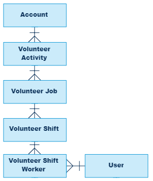

# App Customization Specialist
 
* Trailhead のスーパーバッジ、[App Customization Specialist](https://trailhead.salesforce.com/content/learn/superbadges/superbadge_lightning_platform_app_builder) の日本語訳(**非公式**)です。
* 各カスタマイズ要素のラベル部分には補足として日本語を括弧内に記載している場合がありますが、正解チェックは英語のラベルを元に行われるため、実際のチャレンジには日本語表記を含めず、英語表記のみを使用して行って下さい。また、チャレンジ前にユーザと組織の言語・ロケールを英語に切り替えておくことを推奨します。

---
## このスーパーバッジを取得するためにすること
1. レコードタイプを追加する
2. 項目を作成する
3. 承認プロセスを作成する
4. レポートとダッシュボードを作成する
5. アプリケーションとそのホームページを作成する

## このスーパーバッジでテストする概念
* レコードタイプ
* スキーマ
* 承認プロセス
* レポート
* アプリケーションビルダー

## 事前準備とメモ
* ペンと紙を準備して、要件を読み進める際にメモを取ってください。
* このスーパーバッジ用に、新しい Trailhead Playground を作成してください。この組織をほかの目的で使用すると、課題について検証する際に問題を引き起こす可能性があります。
* ボランティアトラッカーの資産をすべてのユーザに対して実装するために[未管理パッケージ](https://login.salesforce.com/packaging/installPackage.apexp?p0=04tB0000000Q3Cb)をインストールしてください。(パッケージ ID: 04tB0000000Q3Cb) 管理パッケージ、未管理パッケージ、アプリケーションを AppExchange からインストールする際に問題が発生した場合は、[この記事](https://force.desk.com/customer/en/portal/articles/2710899-installing-a-package-or-app-to-complete-a-trailhead-challenge?b_id=13478)に示す手順に従ってください。
* このスーパーバッジで利用される用語のいくつかは、UI に表示される設定上の名称名と完全に一致しない場合があります。これは、Salesforce の機能に関する知識と、ビジネス上のニーズを満たす正しい機能を選択する能力をテストするためです。

## ユースケース
高品質の太陽エネルギー機器を提供する Ursa Major Solar, Inc. は、従業員のボランティア活動を促進することに関心があります。経営陣はコミュニティの改善を気にかけており、従業員と会社の健康に対するボランティア活動の利点を理解しています。

* ボランティアを奨励された従業員は雇用主に対して積極的に感じています。改善された健康と幸福さのおかげで従業員の欠勤が減っています。
* ボランティアをしている間、従業員は、新しい事業責任を引き受けるためのより多くのスキルを習得したり経験を積むことができます。
* 従業員に会社の時間にボランティアをするように奨励することで、会社はその一部であるコミュニティに投資し還元します。

従業員のボランティア活動を追跡することは、目標に向けた個々の進捗状況の表示や全体および特定のコミュニティグループへの時間の提供など、さらなる恩恵をもたらします。

Ursa Major Solar では、他のシステム管理者と共同でボランティアトラッカーを作成しています。これは、従業員がサインアップしてボランティア時間を追跡するために使用できるアプリケーションです。あなたは以前、イベントやボランティアを管理するために、Salesforce の Volunteers for Salesforce アプリケーションを使用する非営利団体(※詳細については、[非営利団体向けのボランティアの管理](https://trailhead.salesforce.com/ja/content/learn/trails/nonprofit_volunteer)を確認してください)で働いていました。Ursa Major Solar のために新しいアプリケーションを構築しながら、この経験を活かすことになります。

もう一人のシステム管理者である Maria は、一週間のボランティア旅行に出かけてしまい、そして彼女はあなた自身でアプリケーションの最後の部分を完成させるように頼みました。スキーマをまとめ、項目をつなげて、器用なロジックを作成し、ユーザがサインアップをしてボランティアを管理するための簡単な方法を構築します。ええっと、あなたはこれらの時間をボランティアとして記録することができますか？

### 主要なステークホルダ
このプロジェクトに貢献しているボランティア活動委員会には、さまざまな部署の関係者が含まれています。主なステークホルダは以下の通りです。

* Dan Wong (人事部)
* Maria Jimenez (システム管理者)

### 標準オブジェクト
ボランティアトラッカーアプリケーションは以下の標準オブジェクトを利用しています。

* Account (取引先) - 従業員が時間をボランティア活動に費やせる非営利団体。Ursa Major は世界中の適格な非営利団体のリストを管理しています。
* User (ユーザ) - イベントへの登録とボランティアした時間のトラッキングに使用される従業員レコード。これはあなたかもしれません。

### カスタムオブジェクト
ボランティアとして自分の時間を提供することは、顔を出すのと同じくらい簡単ですが、ボランティア活動を追跡し、整理するには、標準的なオブジェクトと相互作用するカスタムオブジェクトの十分に計画されたスキーマが必要です。これらのカスタムオブジェクトにより、ボランティアの機会、シフト、サインアップが記録され、それらに時間が正しく割り当てられるようになります。

* Volunteer Activity (ボランティア活動) - ボランティア組織のための特定のイベント、例えば地元の動物救助組織のための秋の募金ベイクセール[*1](#footnote1)。
* Volunteer Job (ボランティアの仕事) - ボランティア活動に関連して行う作業、またはタスク。例えばベイクセールの会計係。
* Volunteer Shift (ボランティアシフト) - ボランティアの仕事のための日または時間帯。例えば、会計係は 2日をカバーする朝と午後のシフトを必要とします。
* Volunteer Shift Worker (ボランティアシフトの労働者) - シフトの時間枠の 1つを占めている個人。例えば、Maria Jimenezは両方の日の朝のシフトにサインアップしました。このカスタムオブジェクトを使用すると、1つのボランティアのシフトに複数のユーザを割り当て、各労働者に複数のシフトを割り当てることができます。

### エンティティ図

## ビジネス要件
### ボランティア組織を作成する
最高のボランティアトラッカーは、ボランティア組織なしでは誰も助けることはできませんが、Ursa Major Solar は、ボランティア組織が活動を作成する前に、組織が特定の基準を満たすようにしたいと考えています。最初のボランティア活動が作成される前に、ボランティア活動委員会が各組織を調査し、それがコミュニティにとって有益な非営利団体であることを確認します。

はじめに、未管理パッケージをインストールしてください。次に、その組織でボランティア活動の作成が許可されているかどうかを判断する新しい Volunteer Organization Status 項目、必要な取引先項目のサブセットを含むボランティア組織用の固有のページ、それをまとめたレコードタイプ、コンパクトレイアウトを作成します。

#### 新しい項目
<table>
<tr>
<td width="180"><b>項目名</b></td>
<td>Volunteer Organization Status</td>
</tr>
<tr>
<td><b>選択肢</b></td>
<td>
<ul>
<li>Pending Approval</li>
<li>Accepting Activities</li>
<li>Retired</li>
</ul>
Pending Approval をデフォルト値としてください。
</td>
</tr>
<tr>
<td><b>セキュリティ</b></td>
<td><ul>
<li>システム管理者: 参照可能</li>
<li>その他全て: 参照可能かつ参照のみ</li>
</ul>
また、プロファイルを変更することなく個人個人にこの項目への編集権限を付与してください。このソリューションに <b>Volunteerism Board</b> (ボランティア活動委員会) と名前をつけてください。
</td>
</tr>
</table>

#### 新しいレイアウト
<table>
<tr>
<td><b>ページレイアウト名</b></td>
<td>Volunteer Organization Account Page Layout</td>
</tr>
<tr>
<td><b>表示する取引先の項目</b></td>
<td>
<ul>
<li>Account Name (取引先名)</li>
<li>Account Number (取引先番号)</li>
<li>Account Owner (取引先 所有者)</li>
<li>Description (説明)</li>
<li>Phone (電話)</li>
<li>Website (Webサイト)</li>
<li>Shipping Address (納入先)</li>
<li>Volunteer Organization Status</li>
<li>Parent Account (親取引先)</li>
</ul>
</td>
</tr>
<tr>
<td><b>コンパクトレイアウト名</b></td>
<td>Volunteer Organization Account compact layout</td>
</tr>
<tr>
<td><b>表示する取引先の項目</b></td>
<td>
<ul>
<li>Account Name (取引先名)</li>
<li>Phone (電話)</li>
<li>Volunteer Organization Status</li>
</ul>
</td>
</tr>
<tr>
<td><b>コンパクトレイアウトの割り当て</b></td>
<td>Volunteer Organization Accountのレコードタイプ</td>
</tr>
</table>

#### 新しいレコードタイプ
<table>
<tr>
<td><b>ラベル</b></td>
<td>Volunteer Organization Account</td>
</tr>
<tr>
<td><b>説明</b></td>
<td>Account page for creating volunteer organizations</td>
</tr>
<tr>
<td><b>アクセシビリティ</b></td>
<td>全てのプロファイルで有効にしてください。</td>
</tr>
<tr>
<td><b>設定</b></td>
<td>Volunteer Organization Account Page Layout を使用してください。</td>
</tr>
</table>

### アプリケーションを拡張する
ボランティア組織が利用可能になったので、残りのアプリケーションスキーマを構築します。Maria は、オブジェクトがどのように関連しており、どのように項目がそれらを相互作用させるかの概要を作るのを手伝ってくれました。特に指定のない限り、すべての項目はすべてのプロファイルで使用可能であり、それぞれのページレイアウトに追加されている必要があります。さあ構築をはじめましょう！

#### リレーション
オブジェクト間の正しいリレーションにより、ボランティアのデータをレポート作成に使用でき、レコードを正しく削除でき、項目の情報を親または子の項目に格納できます。エンティティ図と以下の表を利用して、ボランティアトラッカーのオブジェクト間のリレーションを設定しましょう。

|項目のラベル名|項目の目的|
|-|-|
|Volunteer Shift|Volunteer Shift Worker オブジェクトと Volunteer Shift オブジェクトを繋ぎます。積み上げ集計項目を作成することがあります。|
|Volunteer|Volunteer Shift Worker オブジェクトとユーザオブジェクトを繋ぎます。|
|Volunteer Job|Volunteer Shift オブジェクトと Volunteer Job オブジェクトを繋ぎます。積み上げ集計項目を作成することがあります。|
|Volunteer Activity|Volunteer Job と Volunteer Activity オブジェクトを繋ぎます。この値は保存時に必須とする必要があります。|
|Volunteer Organization|Volunteer Activity と取引先オブジェクトを繋ぎます。積み上げ集計項目を作成することがあります。先に作成したレコードタイプで、ステータスが Accepting Activities の取引先レコードだけが選択可能となる必要があります。|

#### シフトを追跡する項目
シフトに対してサインアップ、管理、レポートする能力なしでボランティアを組織することは、良いグローブなしでコミュニティガーデンをメンテナンスするようなものです。以下の項目は、シフトの状況とボランティアの数を追跡するのに役立ちます。
<table>
<tr>
<td width="240">項目のラベル名</td><td>項目の目的</td></tr>
<tr>
<td>Status (ステータス)</td>
<td>Volunteer Shift Worker オブジェクトのレコードは、ボランティアがシフトを確認したり参加したかどうか等を追跡します。この必須項目のデフォルト値は Unconfirmed です。選択肢は次の通りです。<ul>
<li>Unconfirmed</li>
<li>Pending Approval</li>
<li>Confirmed</li>
<li>Completed</li>
<li>No-Show</li>
<li>Canceled</li>
</ul></td>
</tr>
<tr>
<td>Desired # of Volunteers (必要なボランティアの数)</td>
<td>Volunteer Shift オブジェクトは、ユーザから何人のボランティアが必要かを保存します。この必須項目では、3桁までの整数を使用できます。</td>
</tr>
<tr>
<td>Shifts Taken (確保されたシフトの数)</td>
<td>Volunteer Shift オブジェクトは、Confirmed または Completed の Volunteer Shift Worker レコードの累積件数を表示します。</td></tr>
<tr>
<td># of Volunteers Still Needed (残り必要なボランティアの数)</td>
<td>Volunteer Shifts オブジェクトは、必要なボランティアの数と確保されたシフトの数の差、または0のうち、どちらか大きい方を計算して表示します。</td>
</tr>
</table>

|項目のラベル名|項目の目的|
|-|-|
|Number of Shifts|Volunteer Jobs は、そのシフトの累積件数を表示します。|
|Cumulative Volunteers Needed|Volunteer Jobs は、すべてのシフトにまだ必要なボランティアの累積件数を表示します。|

#### 時間を追跡する項目
ええっと、私のシフトはいつでしたか？シフトの開始時間と終了時間を詳細に説明することは、シフトにいつ現れるかをボランティアが知るための鍵です。ボランティアトラッカーアプリケーションはボランティアに彼らの合計時間を見せてトップのボランティアと組織を追跡するためにこの情報を使います。

|項目のラベル名|項目の目的|
|-|-|
|Shift Start Time|Volunteer Shift レコードには、シフトを開始する日時が格納されています。この項目は必須です。|
|Shift End Time|Volunteer Shift レコードには、シフトが完了するべき日時が格納されます。この項目は必須です。**Start before End** というルールを作成して、**No time travel allowed during volunteering! Shift Start Time must be before Shift End Time.** というエラーメッセージとともに、終了日時が開始日時より後に来るようにしてください。|
|Shift Hours|Volunteer Shift で、開始日時と終了日時の間の時間数を計算します。|
|Total Vol Hours for Shift|Volunteer Shift で、割り当てられたすべてのボランティアからこのシフトに割り当てられた全時間の合計数を計算します。計算には Shift Hours 項目と Shifts Taken 項目を利用してください。|

|項目のラベル名|項目の目的|
|-|-|
|Shift Hours|Volunteer Shift Worker で関連する Volunteer Shift のこの項目値を表示します。|
|Shift Start Time|Volunteer Shift Worker で関連する Volunteer Shift のこの項目値を表示します。|
|Shift End Time|Volunteer Shift Worker で関連する Volunteer Shift のこの項目値を表示します。|
|Attributed Volunteer Hours|Volunteer Job でそのシフトのボランティアの累積時間を表示します。|

#### その他の項目
リレーションが設定され、シフトが追跡され、時間が計算されたら、他に何がありますか？以下の項目により、ボランティアトラッカーアプリケーションの使用がより便利になったり、より優れたレポートが提供できたりします。
<table>
<tr>
<td><b>項目のラベル名</b></td><td><b>項目の目的</b></td></tr>
<tr>
<td>Volunteer Skills</td>
<td>ユーザと Volunteer Job には、複数のスキルを選択できる選択リストがあります。この項目の値を一度だけ作成し、それに Volunteer Skills Values と名前をけます。選択可能なスキルは以下の通りです。
<ul>
<li>Accounting</li>
<li>Computers</li>
<li>Tutoring</li>
<li>Fundraising</li>
<li>General manual labor</li>
</ul>
この値セットを使用して、ユーザオブジェクトと Volunteer Jobs オブジェクトに、Volunteer Skills という選択リスト項目を作成します。
</td>
</tr>
<tr>
<td>IsShiftVolunteer</td>
<td>Volunteer Shift Worker レコードのこのチェックボックスは、レコードを見ているユーザが Volunteer でもある場合は自動的にチェックされ、そうでない場合はオフになっています。この分野は、ボランティアの特定の情報についてレポートを作成するのに不可欠です。</td>
</tr>
<tr>
<td>Volunteer Organization</td>
<td>Volunteer Job、Volunteer Shift、Volunteer Shift Worker で、関連するボランティア組織の名前を表示します。</td></tr>
<tr>
<td>Volunteer Activity</td>
<td>Volunteer ShiftとVolunteer Shift Worker で関連するボランティア活動の名前を表示します。</td>
</tr>
<tr>
<td>Volunteer Job</td>
<td>Volunteer Shift Worker で関連するボランティアの仕事の名前を表示します。</td>
</tr>
<tr>
<td>Job Description</td>
<td>Volunteer Job で仕事の概要を入力できます。この項目ではオンラインボランティアの Web サイトへのハイパーリンクテキストを使用することがあります。</td>
</tr>
</table>

### シフト確認の承認プロセスを自動化する
コーヒーを切らしてしまうこと以外に、ボランティアのコーディネーターにとって最大の心配は、ボランティアが自分のシフトを見せてくれないことです。あなたの非営利団体の経験から、ボランティアの欠勤の主な原因は、善意の友人や同僚が、本人の知らないうちに誰かをサインアップすることであることがわかります。友人をサインアップすることもリファラルの大きな情報源であるため、自分自身のサインアップだけを認めても効果はありません。代わりに、他の誰かがサインアップした場合に、サインアップされた人が参加する予定であることを確認するために、そのボランティアに対するロジックを組み込む必要があります。

この確認プロセスのために、Maria は以下のメモで承認プロセスを利用することを提案しました。

* プロセスに Confirm Volunteer Shift と名前をつけてください。
* ボランティアからの確認を待っている間は、ステータスを **Pending Approval** に設定してください。
* ボランティアより承認された場合、ステータスを **Confirmed** に更新し、そうでなければ **Cancel** に変更してください。

承認プロセスを用いて確認が得られることを管理しますが、プロセスを開始するために別の自動化ツールが必要になります。このツールに **Launch Shift Approver** と名前をつけてください。誰かが自分自身でサインアップした場合は、同じツールを使用して、Volunteer Shift Worker のレコードのステータスを **Confirmed** に更新します。

#### テストのためのもう1人分ユーザを作成する
他のユーザなしでボランティアシフトの承認プロセスをテストすることは、倒れた木を自分でハイキングコースから取り除こうとすることに似ています。それは上手くいきません。Dan はあなたのテストを手伝うと申し出てくれました。以下の設定で Dan のための新しいユーザを作成しましょう。

<table>
<tr>
<td><b>ユーザ名</b></td>
<td>Dan Wong</td>
</tr>
<tr>
<td><b>メールアドレス</b></td>
<td>あなたのメールアドレス</td>
</tr>
<tr>
<td><b>ロール</b></td>
<td>Western Sales Team</td>
</tr>
<tr>
<td><b>ユーザ名とニックネーム</b></td>
<td>次の式に従ってください。 ユーザの名の最初の1文字 + ユーザの姓 @ あなたのイニシャル + 今日の日付(YYMMDD) + .com 例) DWong@tm012618.com</td>
</tr>
<tr>
<td><b>ユーザライセンス</b></td>
<td>Salesforce</td>
</tr>
<tr>
<td><b>プロファイル</b></td>
<td>Custom: Sales Profile</td>
</tr>
</table>

#### クイックなセルフサインアップ
Maria は、ユーザが Volunteer Shift レコードから直接シフトにサインアップするための簡単な方法を求めました。あなたのソリューションは、**Sign Me Up** というラベルのアクションでした。簡単にするために、ポップアップには何の項目も表示しないようにします。代わりに、アクションは自動的に Volunteer 項目にボタンをクリックしたユーザを設定し、ステータスを Confirmed に変更し、現在表示されているシフトを新しいレコードの Volunteer Shift 項目に割り当てます。アクションが完了すると、**Congratulations, you are signed up!** というわかりやすいメッセージを表示します。

### アプリケーションデータのレポート
ボランティアトラッカーアプリケーションの、トップボランティア、組織、その他の指標を正確にレポートする機能は、ボランティア活動委員会が使用していた Ursa Major の休憩室のクリップボードにあるゾッとするようなサインアップシートとはかけ離れているところです。これを達成するために、Maria は、2つのカスタムレポートタイプ、5 つのレポート、およびアプリケーションを公開するときに機能するダッシュボードを計画するのを手伝ってくれました。始める前にいくつかの注意点があります。

* **Volunteer Reports** というレポートフォルダと **Volunteer Dashboards** というダッシュボードフォルダを作成して、レポートとダッシュボードをそれぞれ正しいフォルダに格納してください。
* 継続的なテストと見直しは、成功を収めるアプリケーションビルダーがプロジェクト要件に合った価値ある製品を作成するための鍵です。そのため、途中でテストを行うために、さまざまなボランティア活動、ボランティアの仕事、その他のレコードを多数作成しているでしょう。そうでない場合は、今すぐに行ってください。そうしないと、これから作成するレポートは非常にスカスカに見えてしまいます。

#### Volunteer Shift Worker レコードが関連するユーザ
このレポートタイプ、**Users with Volunteer Shift Worker Records** は、ユーザと、少なくとも 1 つのそれに関連する Volunteer Shift Worker に対するレポートの作成を可能にします。

#### ボランティアの仕事とボランティア活動が関連する取引先
このレポートタイプ、**Accounts with Vol Activities with Vol Jobs** は、取引先と、少なくとも 1 つそれに関連する Volunteer Activity (ボランティア活動) と、少なくとも 1つそれに関連する Volunteer Job (ボランティアの仕事) を含みます。

#### 私のトップボランティア組織
振り返ってどれだけ遠くまで来たかを見るとき、山に登ることは仕事のようではなく、何かを 1 つ達成したかのように感じます。 同様に、**My Top Volunteer Organizations** レポートでは、ユーザごとに、自分がどの組織にボランティアとして参加しているか、ボランティアに参加した時間、合計のボランティア時間が表示されます。カスタムレポートタイプとユーザのデータを使用して、各組織の累積時間を表示し、他の列を表示しない、Volunteer Organization (ボランティア組織) でグループ化されたサマリーレポートを作成します。ボランティア時間の長い順に並べ替えます。詳細は必要ありません。レポートには、ボランティアが確認された (Confirmed) または参加した (Completed) シフトのみを含め、それを表示しているユーザがボランティアであるレコードだけを表示するようにします。

#### 私の承認待ちシフト
あなたの善意あるチームメイトは、あなたに尋ねることなく再びあなたをシフトにサインアップしましたか？**My Shifts Pending Approval** レポートには、どのシフトを確認またはキャンセルする必要があるのかが表示されます。ユーザデータとともにカスタムレポートタイプを使用して、Volunteer Shift Worker ID、Shift Start Time (シフト開始時刻)、Volunteer Activity (ボランティア活動)、Volunteer Job (ボランティアの仕事)、Volunteer Organization(ボランティア組織)を表示する表形式のレポートを作成します。このボランティアの保留中(Pending Approval)のシフトのみが表示されます。

#### 私の今後のシフト
最高のボランティアでさえ、時々リマインダーが必要です。**My Upcoming Shifts** レポートは、彼らの確認されたシフトのうちどれが次の 30日以内に始まっているかをユーザに示します。 ユーザデータとともにカスタムレポートタイプを使用して、Volunteer Shift Worker ID、Shift Start Time (シフト開始時刻)、Volunteer Activity(ボランティア活動)、Volunteer Job (ボランティアの仕事)、Volunteer Organization (ボランティア組織) を表示する表形式のレポートを作成します。このボランティアについて確認された (Confirmed) シフトのみが表示されます。

#### トップボランティア組織
どのボランティア組織が最も多くの時間を獲得できるかを見るために、オフィス内で切磋琢磨しています。**Top Volunteer Organizations** レポートとレポートグラフは、この友好的な競争を煽っています。取引先データとともにカスタムレポートタイプを使用すると、サマリーレポートには、組織ごとの Attributed Volunteer Hours とともに、ボランティア組織の取引先のリストが、時間が長い順に表示されます。詳細は必要ありません。レポートグラフは、**Top Volunteer Organizations** という名前の横棒グラフで、Attributed Volunteer Hours を x 軸に表示します。

#### トップボランティア
トップボランティアは、賞賛、愛情、主要な会社のイベントでの表彰、そして Ursa Major でのハイファイブによって報われます。**Top Volunteers** レポートとレポートグラフは、それらのボランティアが名声に備えるために役立ちます。サマリーレポートは、カスタムレポートタイプとユーザデータを使用して、ボランティアの名前でグループ化され、ボランティアごとにシフト時間 (Shift Hours) を合計します。レポートには、完了した (Completed) シフト時間だけが含まれ、詳細を非表示にし、時間が長い順にソートしてください。レポートグラフは、**Top Volunteers** と呼ばれる横棒グラフで、シフト時間を x 軸に表示します。

#### 私のボランティア情報ダッシュボード
**My Volunteer Information** ダッシュボードでは、1つのダッシュボードにレポートをまとめて、各ボランティアが自身のコミットメント、進捗状況、保留中のシフトを見られるようにします。

<table>
<tr>
<td><b>タイトル</b></td>
<td><b>フッター</b></td>
<td><b>ソースレポート</b></td>
<td width="250"><b>コンポーネントの詳細</b></td>
</tr>
<tr>
<td>My Top Volunteer Organizations</td>
<td>Total hours displayed inside chart</td>
<td>My Top Volunteer Organizations</td>
<td>
<ul>
<li>ドーナツグラフ</li>
<li>値の昇順でソート</li>
<li>表示する最大件数: 5</li>
<li>コンポーネントのサイズ: 幅 3、高さ 6</li>
<li>左上に配置</li>
</ul>
</td>
</tr>
<tr>
<td>My Volunteer Shifts Needing Approval</td>
<td>Click the "Shift-XXXX" to confirm or cancel the shift.</td>
<td>My Shifts Pending Approval</td>
<td>
<ul>
<li>Lightning テーブル</li>
<li>列:
    <ul>
    <li>Volunteer Shift Worker ID</li>
    <li>Shift Start Time</li>
    <li>Volunteer Job</li>
    <li>Volunteer Activity</li>
    </ul>
</li>
<li>ソートする列: Shift Start Time</li>
<li>昇順でソート</li>
<li>表示する最大グループ数: 5</li>
<li>コンポーネントのサイズ: 幅 6、高さ 3</li>
<li>右上に配置</li>
</ul>
</td>
</tr>
<tr>
<td>My Upcoming Confirmed Shifts</td>
<td></td>
<td>My Upcoming Shifts</td>
<td>
<ul>
<li>Lightningテーブル</li>
<li>列: 
    <ul>
    <li>Volunteer Shift Worker ID</li>
    <li>Shift Start Time</li>
    <li>Volunteer Job</li>
    <li>Volunteer Activity</li>
    </ul>
</li>
<li>ソートする列: Shift Start Time</li>
<li>昇順でソート</li>
<li>表示する最大グループ数: 5</li>
<li>コンポーネントのサイズ: 幅 6、高さ 3</li>
<li>右下に配置</li>
</ul>
</td>
</tr>
</table>

### アプリケーションの公開
Dan と他のボランティア活動委員会のメンバーは、アプリの機能性は素晴らしくレポートは美しいと思っていますが、アプリケーションが便利に公開されれば、ボランティアに費やせる時間がより増えるでしょう。あなたの仕事は、ボランティアのデータを表示する Lightning アプリケーションのホームページとともに、1つの Lightning アプリケーションにすべてのピースをまとめることです。

#### Lightning アプリケーションの詳細
<table>
<tr>
<td><b>アプリケーションの名前</b></td>
<td>Volunteer Tracker</td>
</tr>
<tr>
<td><b>画像</b></td>
<td>あなたがボランティア精神を促進すると思う任意の画像を割り当ててください。</td>
</tr>
<tr>
<td><b>選択された項目</b></td>
<td>
<ul>
<li>Accounts</li>
<li>Volunteer Activities</li>
<li>Volunteer Jobs</li>
<li>Volunteer Shifts</li>
<li>Volunteer Shift Workers</li>
</ul>
</td>
</tr>
<tr>
<td><b>選択されたプロファイル</b></td>
<td>
<ul>
<li>Custom: Sales Profile</li>
<li>System Administrator</li>
<li>Standard User</li>
</ul>
</td>
</tr>
</table>

#### Lightning アプリケーションページの詳細
<table>
<tr>
<td><b>ラベル名</b></td>
<td>Volunteering Data</td>
</tr>
<tr>
<td><b>レイアウト</b></td>
<td>Header and Three Columns (ヘッダーと 3 列)</td>
</tr>
<tr>
<td><b>上部のコンポーネント</b></td>
<td>My Volunteer Information Dashboard</td>
</tr>
<tr>
<td><b>下部左側のコンポーネント</b></td>
<td>Top Volunteer Organizations レポートのレポートグラフ</td>
</tr>
<tr>
<td><b>下部中央のコンポーネント</b></td>
<td>Top Volunteers レポートのレポートグラフ</td>
</tr>
<tr>
<td><b>下部右側のコンポーネント</b></td>
<td>Volunteer Activity と Volunteer Job の最近利用したデータを 5 件、 
Recently Viewed Activities and Jobs というラベル名で表示してください</td>
</tr>
<tr>
<td><b>アイコン</b></td>
<td>あなたが適切だと思う任意のアイコンを設定してください。</td>
</tr>
<tr>
<td><b>Lightning アプリケーション上の配置</b></td>
<td>Volunteer Tracker アプリケーション上で一番先頭に配置してください。</td>
</tr>
<tr>
<td><b>モバイルアプリケーション上の配置</b></td>
<td>Events (行動) と Approvals (承認) の間に配置してください。</td>
</tr>
</table>

## リソース
もし非営利企業または営利企業のボランティア管理アプリケーションに興味があれば、AppExchange からオープンソースの [Volunteers for Salesforceアプリケーション](https://appexchange.salesforce.com/appxListingDetail?listingId=a0N30000003JBggEAG)をインストールすることを検討してください。追加のレポート作成、Web サイト経由での Salesforce ユーザ以外のサインアップ、求人カレンダーなどが可能になります。

## 課題
### Challenge 1: レコードタイプとアクセス権を作成する
もしまだであれば、事前準備に記載のある未管理パッケージをインストールしてください。Volunteer Organization Account のレコードタイプ、UI コンポーネント、アクセス要件を追加してください。

### Challenge 2: アプリケーション項目を作成する
オブジェクトのリレーションを設定し、シフトを追跡し、時間を計算するため、記載された項目を追加してください。

### Challenge 3: シフトの承認ツールを構築する
ボランティアシフトの承認プロセスと、そのプロセスを自動的に起動するかステータスを変更する方法を作成してください。テストのために Dan をユーザとして追加してください。

### Challenge 4: ボランティアトラッカーアプリケーションのレポートを構築する
ボランティアトラッカーアプリケーションのデータを表示するための、2 つのカスタムレポートタイプと、5 つのレポート、1 つのダッシュボードを作成してください。課題について検証する直前にダッシュボードを更新してください。

### Challenge 5: ボランティアトラッカーアプリケーションを公開する
ボランティアの情報を綺麗にかつ便利に表示するために、記載された Lightning アプリケーションと Lightning アプリケーションホームページを構築してください。

## 訳注
* <a name="footnote1">[1]</a> : bake sale - 手作りお菓子の販売会

## 補足とヒント
### 全般
カスタム項目を追加する作業が多いですが、課題のチェックは主に項目の API 参照名が利用されています。ビジネス要件には項目のラベル名しか記載されていませんが、ラベル名を入力すると API 参照名が自動入力されるため、ラベルは極力、手入力ではなくコピー＆ペーストされることをお勧めします。ラベルの手入力中にフォーカスが外れるとそこで途中のまま API 参照名が入力されてしまうためです。

### Challenge 2
参照関係または主従関係の親レコードを絞り込むには[ルックアップ検索条件](https://help.salesforce.com/articleView?id=fields_lookup_filters.htm&type=5)が利用できます。

### Challenge 4
レポートが見つからないというエラーが表示された場合は、レポートのプロパティを参照し、レポートの一意の名前がレポートの名称と一致しているか (半角スペースが_に変わっているだけで末尾に余計な文字が含まれていないか) を確認してください。
