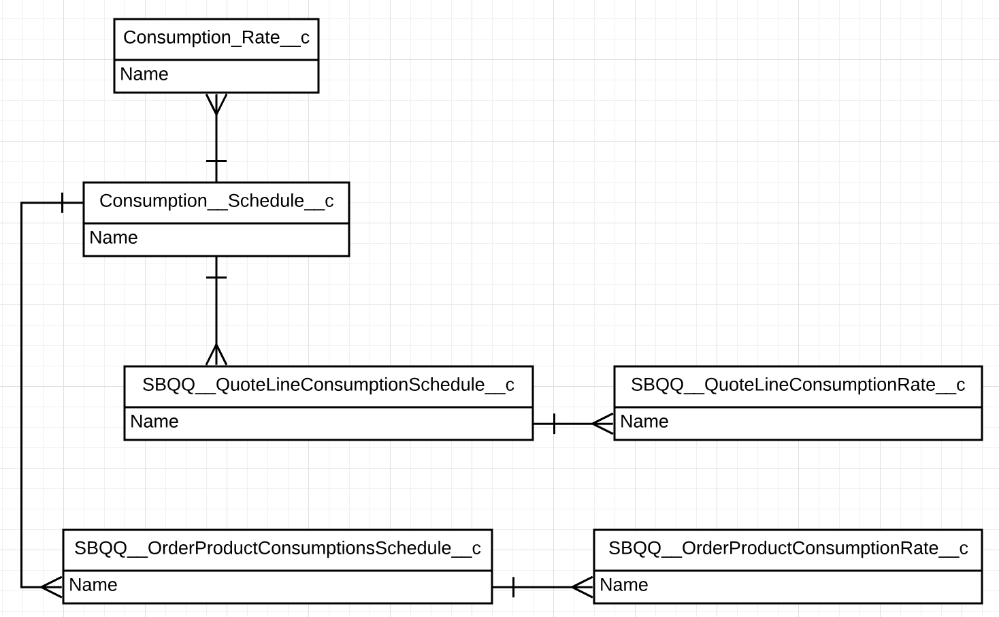

# Billing Specialist
 
* Trailhead のスーパーバッジ、[Billing Specialist](https://trailhead.salesforce.com/content/learn/superbadges/superbadge_billing_specialist) の日本語訳(**非公式**)です。
* 各カスタマイズ要素のラベル部分には補足として日本語を括弧内に記載している場合がありますが、正解チェックは英語のラベルを元に行われるため、実際のチャレンジには日本語表記を含めず、英語表記のみを使用して行って下さい。また、チャレンジ前にユーザと組織の言語・ロケールを英語に切り替えておくことを推奨します。

## このスーパーバッジを取得するためにすること
* Salesforce Billing の商品カタログ設定
* MVP (Minimum Viable Product) の顧客に対する見積税額と実際の税額の適用
* 請求書レコードの生成
* 支払いの記録と割り当て
* クレジットノートとデビットノートの記録と割り当て
* MVP の顧客に請求するための Cloud Kicks のオンボーディング
* 知識のチェック（クイズ）

## このスーパーバッジでテストする概念
* 使用量ベースの価格設定
* 見積を複数の注文に分割する
* プロセスビルダーによるプロビジョニングの自動化
* 使用量の消費プロセス
* 請求書スケジューラを使用して請求書の作成と転記を自動化する
* 代金を手動で回収し、請求書の残高を減らす
* 請求書の残高を調整する
* 自動化と入力チェックを通して請求に関する注文データの整合性を担保する
* 見積から支払までのフローを習得する

## 事前準備とメモ
* デフォルトの通貨は USD で、デフォルトのタイムゾーンは PST です。これらは日付とスケジューラに必要です。
* このスーパーバッジで利用される用語のいくつかは、UIに表示される設定上の名称と完全に一致しない場合があります。これは、Salesforce の機能に関する知識と、ビジネス上のニーズを満たす正しい機能を選択する能力をテストするためです。
* 最後の Challenge 用に、商談と見積レコード(Q-00015) があらかじめ作成されています。これらのレコードを事前に使用しないでください。使用すると、Challenge が失敗する可能性があります。
* **ポイント**: メタデータおよびレコードデータを設定するために示されている値は手動で入力せず、コピー・ペーストしてください。これにより、Challenge の失敗を引き起こすタイプミスやスペルミスの可能性が減ります。

### Salesforce Billing と Salesforce CPQ を備える Developer Edition 組織の作成
このスーパーバッジを完了するには、Salesforce CPQ、Salesforce Billing、サンプルデータを含む特別な Developer Edition 組織が必要です。無料の Developer Edition を入手して Trailhead に接続すると、このスーパーバッジの Challenge を完了することができます。

特別に Saleseforce Billing が有効化された Developer Edition 組織に最近サインアップした場合でも、このスーパーバッジのために新しい組織にサインアップしてください。常に新しいデータが追加されています。また、管理パッケージは 90日後に期限切れになるため、新しい組織が必要になる場合があることにも注意してください。

1. [Salesforce Billing およびSalesforce CPQ を備える無料の Developer Edition 組織](https://developer.salesforce.com/promotions/orgs/billingspecialist)にサインアップします。
2. フォームに入力します。Email の欄には、有効な電子メールアドレスを入力します。Username の欄には、メールアドレス形式の一意のユーザ名を入力しますが、有効な電子メールアカウントと一致している必要はありません。(例: yourname@billingcpq4ever.com) 
3. フォームに入力したら、**Sign Me Up**  (サインアップ) をクリックします。確認メッセージが表示されます。
4. ようこそメールを受信 (数分かかる場合があります) したら、それを開き、**Verify Account** (アカウントを確認) をクリックします。
5. パスワードと秘密の質問を設定して、登録を完了します。**ポイント**: 後で簡単にアクセスできるように、ユーザ名、パスワード、およびログイン URLを書き留めます。
6. Developer Edition にログインされた状態になります。

次に、新しい Developer Edition 組織を Trailhead に接続します。

1. Trailhead アカウントにログインしていることを確認してください。
2. このページの下部にある **Challenge** セクションで、選択リストから **Log into a Developer Edition** (Developer Edition にログイン) を選択します。
3. ログイン画面で、先ほど設定した Developer Edition のユーザ名とパスワードを入力します。
4. Allow Access? (アクセスを許可しますか？) の画面で、**Allow** (許可) をクリックします。
5. Want to connect this org for hands-on challenges? (この組織をハンズオンの Challenge 用に保存しますか？) の画面で、**Yes! Save it** (はい、保存します) をクリックします。Challenge のページにリダイレクトされ、新しい Developer Edition を使用してこのスーパーバッジを獲得する準備が整います。

専用の管理パッケージがインストールおよび有効化された Salesforce 組織ができたので、準備完了です。

## ユースケース
Ursa Major Solar, Inc. (UMS) は、数多くの買収と事業拡大を経て、さらに多くのビジネス変革を続けています。最近、UMS はサブスクリプションベースのビジネスモデルへの移行を決定し、市場のニーズに合わせて新商品を迅速に導入しています。UMS には、新商品を迅速に市場に投入し、顧客が UMS での経験を楽しみ続けるという安心感が必要です。UMS は、買収後に引き継がれた商品カタログの複雑さも軽減したいと考えています。

これらすべての変更のため、UMS にはチームが正確に見積、注文、請求、支払の回収を行えるシステムが必要であり、CPQ と Billing を使用してこれらすべてを Salesforce 内で行うことにしました。あなたはコンサルタントであり、現在は UMS と協力して Salesforce Billing ソリューションの実装を支援しています。MVP (Minimum Viable Product) のビジネス要件を満たすようにシステムを設定し、最初の顧客である Cloud Kicks が、新しいシステムを使用するのを支援する責任があります。この実装の MVP 部分が終了する頃には、UMS は請求書の生成と回収に Salesforce Billing を使用し、財務報告のような他のプロセスのためにすべてのトランザクションをダウンストリームの ERP に送信しているでしょう。

### 主要なステークホルダ
- Weimar Williams (Chief Financial Officer)
- Lincoln Ulrich (アカウントエグゼクティブ)
- Solange Pereira (請求オペレーションスペシャリスト)
- James August (情報管理者)
- Maria Jimenez (システム管理者)

### 標準オブジェクト
- Product (商品)
- Consumption Schedule (消費スケジュール)
- Consumption Rate (消費率)
- Account (取引先)
- Opportunity (商談)
- Opportunity Product (商談商品)
- Order (注文)
- Order Product (注文商品)
- Contract (契約)

### 管理パッケージのカスタムオブジェクト
- Quote (見積)
- Quote Line (見積品目)
- Subscription (サブスクリプション)
- Invoice (請求書)
- Invoice Line (請求書品目)
- Payment (支払)
- Payment Allocation (Invoice Line) (支払割り当て (請求書品目))
- Credit Note (クレジットノート)
- Credit Note Line (クレジットノート品目)
- Credit Note Line Allocation (クレジットノート割り当て)
- Debit Note (デビットノート)
- Billing Rule (請求ルール)
- Revenue Recognition Rule (収益認識ルール)
- Tax Integration (税インテグレーション)
- Tax Rate (税率)
- Tax Rule (税金ルール)
- Tax Treatment (税金処理)
- Invoice Scheduler (請求書スケジューラ)

### カスタムオブジェクト
* このスーパーバッジには必要ありません (管理パッケージのカスタムオブジェクトのみ)

### エンティティ図

## ビジネス要件

### Salesforce Billing の商品カタログ設定
UMS はこれまで、毎月定額料金で請求される保証およびメンテナンスサポート付きの、1 回限りの商品(購入用パネル) を販売してきました。CFO の Weimar Williams は、消費ベースのサポートを備えたサブスクリプションベースモデル(レンタル) にビジネスを移行したいと考えています。現在、UMS には主に販売され、MVP 用に実装される 4 つの商品があります。これらの商品は単月や月間および年間のサブスクリプション、消費量ベース、1回限りといった形式で販売されます。

SolarBot (使用量ベース) は、SolarBot Industries の買収による新商品です。UMS は、Billing の MVP を実装する間にこの商品を消費ベースに移行することを計画しています。これは、UMS が顧客の実際の使用状況に基づいて請求するのに役立ちます。

SolarBots は、2種類の使用状況を追跡します。
* 日単位で報告される、パネルから取り除かれた粉塵やごみのレベル (ミクロン ‘µm’ 単位で測定。例えば、取り除かれた粉塵およびごみについてのある日の報告は 100,000 ミクロンです。) 取り除かれた粉塵とごみに関して報告された使用量は、月単位で顧客に請求されます。
* 測定単位 (Unit of Measure) と一致する属性 (Matching Attribute) は、Micron (ミクロン) の値で表します。

<table>
   <tr>
      <td>消費スケジュール名: <b>SolarBot Dust and Debris Removal</b></td>
      <td>$0.01 / ミクロン (上限なし)</td>
      <td>月1回の請求</td>
   </tr>
</table>

* パネルのメンテナンスリクエスト (リクエスト単位で測定。つまり、1回のメンテナンスリクエストは 1 リクエストとして測定されます。) パネルのメンテナンスリクエストに関して報告された使用量は、年単位で顧客に請求されます。
* 測定単位 (Unit of Measure) と一致する属性 (Matching Attribute) は、Request (リクエスト) の値で表されます。

<table>
   <tr>
      <td>消費スケジュール名: <b>Panel Maintenance Request</b></td>
      <td>10 リクエストまでは $500  10 を超えるリクエストは、リクエストあたり$35 に価格が変化</td>
      <td>年1回の請求</td>
   </tr>
</table>

 

<table>
   <tbody>
      <tr>
         <td rowspan="3"><b>選択リスト値</b></td>
      </tr>
      <tr>
         <td>Micron</td>
      </tr>
      <tr>
         <td>Request</td>
      </tr>
   </tbody>
</table>

### ページレイアウトを更新する
必要なすべての項目を設定するため、消費スケジュールオブジェクトのページレイアウトの割り当てを Billing Consumption Schedule Layout に更新してください。自動マッピングプロセスに関係するすべてのオブジェクト(消費スケジュール、見積品目消費スケジュール、注文品目消費スケジュール、サブスクリプション消費スケジュール）の Unit of Measure (測定単位) 項目に、選択リスト値を追加します。Unit of Measure (測定単位) の選択リスト値セットのページに移動し、同じ値を追加します。

### 使用量ベースの価格を設定する
使用量ベースの価格設定用に Salesforce CPQ と Billing を設定し、UMS が使用量に基づいて顧客に請求できるようにする SolarBots の使用率スケジュールを作成します。UMS は、ビジネス要件によって決定される、顧客が使用しているサービスのタイプに基づいて使用量評価および請求できる必要があります。

### Major Solar Panel のレンタル
UMS は、自社の有名な商品である Major Solar Panel をサブスクリプションとしても提供することにより、その商品から収益を生み出す新しい方法を探しています。これにより、UMS はより幅広い顧客プールに到達し、B2C 市場に対応できるようになります。顧客は月額$200でパネルをレンタルでき、顧客がパネルを 2年以上更新し続けると、そのビジネスは時間の経過に伴う収益の増加の恩恵を受けます。

|商品名|商品コード|サブスクリプション価格|請求方式|
|-|-|-|-|
|Major Solar Panel Rental|PANEL-RENT|$200 / 月|Monthly in Advance|

### MVP の顧客に対する見積税額と実際の税額の適用
Ursa Major Solarには、支払いの合計金額で情報を顧客に伝えることができるように、注文と請求書の税額を計算する機能が Billing に必要です。 請求処理のスペシャリストである Solange Pereira は、このプロセスをシステムで自動化することを望んでおり、注文を所有する取引先の Shipping Address (納入先住所) に基づいて税額の見積と最終計算を行う必要があります。

Billing の MVP では、UMSは、顧客 Cloud Kicks の所在地であるカリフォルニアで税を適用できる必要があります。納入先住所は請求先住所と同じであり、注文に対して請求と税を適用するため、カリフォルニア州の税が設定される必要があります。

|Treatment Name (税金処理の名前)|State (州)|Tax Rate (税率)|Tax Code (税コード)|
|-|-|-|-|
|CA State Tax Treatment|CA|10%|12345|

### 注文のプロビジョニングプロセスの設定
UMS の情報管理者である James August は、CPQ から Billing に移動するデータの整合性を心配しています。彼は、注文が生成される前に見積が Approved (承認済み) ステータスとなることを望んでいます。

見積が承認されると、UMS では見積から注文を自動的に作成する必要があり、商品のプロビジョニング方法 (Provisioning Method) に基づいて見積を複数の注文に分割する必要があります。SolarBots は、商品を顧客に届ける、子会社の Solar Bot Industries 経由でプロビジョニングされます。保証およびメンテナンスサポートと Major Solar Panel は、カスタマーサービスチームによって社内でプロビジョニングされます。

高度な注文管理を有効にし、商品に割り当てられたプロビジョニング方法で注文するようにシステムを設定するという課題があります。ユーザが見積のステータスを手動で Approved (承認済み) に更新したときに、複数の注文を自動で生成するプロセスビルダーの自動化を設定します。

|項目ラベル|項目の API名|項目の型|
|-|-|-|
|Provisioning Method|Provisioning_Method__c|選択リスト|

ポイント: 新しい項目の API名を、見積オブジェクトの Order By (並び替え) 項目の選択リスト値として追加することを忘れないでください。また、自動マッピングプロセスに関係するすべてのオブジェクト (商品と見積品目) にカスタム項目を作成することも忘れないでください。

|商品|Provisioning Method の値|
|-|-|
|SolarBots|SolarBot Provisioning|
|Major Solar Panel|Internal|
|Major Solar Panel Rental|Internal|
|Ursa Major Warranty and Maintenance Plan|Internal|

 

<table>
   <tr>
      <td><b>プロセスの名前</b></td>
      <td>Create Order Once Quote Is Approved</td>
   </tr>
   <tr>
      <td><b>条件の名前</b></td>
      <td>Quote Equals Approved</td>
   </tr>
   <tr>
      <td><b>アクションの名前</b></td>
      <td>Order Equals TRUE</td>
   </tr>
</table>

注文が生成されると、プロビジョニングプロセスが開始されます。プロビジョニングプロセスの一環として、取引先の顧客優先度 (Customer Priority) に基づいて、注文に請求書バッチ (Invoice Batch) が自動的に割り当てられます。

|取引先の Customer Priority|Invoice Batchの値|
|-|-|
|High|White Glove Batch|
|Low or Medium|Auto-Post Batch|

注文に対する商品のプロビジョニングが完了したら、ユーザはプロビジョニング完了日 (Provisioning Complete) を手動で入力する必要があり、注文は自動的に有効化され、契約レコードが生成されます。

プロセスビルダーによる自動化を設定して、注文が作成された際に請求書バッチを割り当てます。また、ユーザがプロビジョニング完了日を手動で入力したときに、注文を有効化して契約済みにする必要があります。

**重要**: プロセスで可能な限り少ない数の操作を行うことに関するベストプラクティスに従うには、3 番目の条件で`Is Null` 演算子を使用して、条件を正しく設定する必要があります。

|項目ラベル|項目の API名|項目の型|
|-|-|-|
|Provisioning Complete|Provisioning_Complete__c|日付|

 

<table>
   <tr>
      <td><b>プロセスの名前</b></td>
      <td>Order Invoice Preparation</td>
   </tr>
   <tr>
      <td><b>1 番目の条件の名前</b></td>
      <td>White Glove Customer</td>
   </tr>
   <tr>
      <td><b>1 番目のアクションの名前</b></td>
      <td>Update Invoice Batch</td>
   </tr>
   <tr>
      <td><b>2 番目の条件の名前</b></td>
      <td>Regular Customer</td>
   </tr>
   <tr>
      <td><b>2 番目のアクションの名前</b></td>
      <td>Update Invoice Batch</td>
   </tr>
   <tr>
      <td><b>3 番目の条件の名前</b></td>
      <td>Has Order Been Provisioned</td>
   </tr>
   <tr>
      <td><b>3 番目のアクションの名前</b></td>
      <td>Activate Order</td>
   </tr>
   <tr>
      <td><b>4 番目のアクションの名前</b></td>
      <td>Contract Order</td>
   </tr>
</table>

ポイント: ベストプラクティスとして、オブジェクトごとに 1つのプロセスビルダーのみを作成します。このセクションのプロセスビルダーの要件を、注文オブジェクトの単一のプロセスビルダーにまとめます。

### 請求書レコードの生成
以前の請求システムに対する Solange の最大の不満の 1 つは、1 か月で 1 つの顧客に対して作成される可能性のある請求書の数でした。これにより、顧客が混乱し、顧客サポートのケースが増加します。Solange と UMS の全員は、顧客が負うものを 1 つの請求書に統合できることから、Salesforce Billing の使用を開始することを楽しみにしています。

UMSには、遅延を避けるために、毎日請求書を発行する必要があります。ただし、請求書を受け取る月の日付を顧客が選択できるようにすることも必要です。James は、優先度が高 (High) とマークされた取引先が所有する請求書は、支払いを転記して回収する前にレビューされる必要があるようにしたいと考えています。他のすべての請求書は、顧客への配達の遅延を減らすために自動的に転記される必要があります。

2 つの異なる顧客シナリオに基づいて請求書を毎日作成するという UMS のビジネス要件を満たすために、2 つの請求書スケジューラを作成します。

<table>
   <tr>
      <td><b>1番目の請求書スケジュール名</b></td>
      <td>High Priority Customers</td>
   </tr>
   <tr>
      <td><b>2番目の請求書スケジュール名</b></td>
      <td>Regular Customers</td>
   </tr>
</table>

### 支払いの記録と割り当て
UMS では、顧客は様々な支払種別で支払うことができ、回収されたすべての支払いは Salesforce に手動で記録され、請求書の明細残高の支払いに使用されます。UMS を使用すると、顧客は部分的に請求書を支払い、最初に支払う商品を選択できます。Solange は、支払いをどの明細に割り当てるかを選択する機能を必要としています。

### クレジットノートとデビットノートの記録と割り当て
UMS には、請求書の残高を転記後に調整する必要があるビジネス要件があります。最も一般的な目的として、UMS は請求書を早期に支払うためのインセンティブ (残高の減額) を提供し、遅れて受け取った支払いには手数料 (残高の増額) を適用します。 MVP においては、Solange には、これら 2つの最も一般的なシナリオに対処し、レポート目的で Reason Code (理由コード) を割り当てる機能が必要です。

グローバル選択リストを作成して、システムで生成されたクレジットノート (貸方票) およびデビットノート (借方票) の理由コードをキャプチャします。

<table>
    <tr>
        <td><b>オブジェクト</b></td>
        <td><b>項目ラベル</b></td>
        <td><b>項目のAPI 名</b></td>
        <td><b>項目の型</b></td>
    </tr>
    <tr>
        <td>Credite Note (クレジットノート)</td>
        <td rowspan="2">Reason Code</td>
        <td rowspan="2">Reason_Code__c</td>
        <td rowspan="2">選択リスト</td>
    </tr>
    <tr>
        <td>Debit Note (デビットノート)</td>
    </tr>
</table>

 

<table>
   <tr>
      <th colspan="2">グローバル選択リスト値セット</th>
   <tr>
   <tr>
      <td>Early Payment</td>
      <td>Late Payment</td>
   </tr>
</table>

ポイント: クレジットノートとデビットノートオブジェクトの両方に同じ項目を作成します。

### MVP の顧客に請求するためのCloud Kicks のオンボーディング
MVP の稼働に向けて Salesforce Billing の設定が完了したので、最初の顧客をオンボーディングし、UMS のビジネス要件に従ってソリューションが期待どおりに機能することを確認する必要があります。Cloud Kicks の取引先レコードに移動し、この取引先レコードが以前の Challenge で述べられていた税の要件を満たしていることを確認します。

Cloud Kicks の主な取引先責任者である Jack Rogers は、既存の見積レコード (Q-00015) を完了する準備ができており、UMS はサービスの開始日と同じ日に直ちにすべての商品をプロビジョニングすることに同意しています。Salesforce CPQ は数か月間稼働しているため、既存の見積レコード **(Q-00015)** を使用します。既存の見積レコードを更新して、見積から生成された注文がプロビジョニング方法によって分割され、開始日が本日 (この Challenge を完了する日) になるようにします。

**重要**: 後でレコードを削除する手間を軽減するために、プロビジョニングの完了に進む前に、**2つの注文レコード** の正確性を確認してください。最後の Challenge に合格するには、Q-00015 を使用することが重要です。必要に応じて、注文などのレコードを削除して、Challenge をリトライできます。レコードの削除を妨げるバリデーションメッセージが表示された場合、管理パッケージの設定でトリガをオフにすることができます。

### パネルレンタルの$1,000 のクレジット
CFO の Weimar は、Cloud Kicks のビジネスに対する感謝を示し、最初の月のパネルレンタルの請求書に対して$1,000のクレジットを提供したいと考えています。この場合、$1,000のクレジットは免税であり、税が適用されるべきではありません。

Jack は、SolarBot を**1** つ、レンタル用のパネルを**10** 枚、アセットとして別の**10** 枚、および**1** つの Ursa Major Warranty and Maintenance Plan を **Q-00015** で購入したいと考えています。

Cloud Kicks は、自社の買掛金プロセスに沿えるよう、すべての請求書に、注文開始日を請求の締め日として表示することを求めています。

Jack は、Solangeに、SolarBots (Cloud Kicks はよりたくさんの使用を計画しています) を除く、本日期日の、サービスに関する統合された請求書を希望していることを知らせました。彼はすぐに、含まれているクレジットで残高を支払う準備ができており、Jack の支払い総額は$56,750 になります。

Cloud Kicks は初日に SolarBots を使用します。これは UMSにとって大成功です！Cloud Kicks の SolarBot の粉塵およびごみの除去と、パネルメンテナンスリクエストの使用量は次の通りです。

<table>
   <tr>
      <td><b>Matching ID</b> (照合 ID)</td>
      <td><b>Matching Attribute</b> (一致する属性)</td>
      <td><b>Unit of Measure</b> (測定単位)</td>
      <td><b>Start Date/Time</b> (開始日時)</td>
      <td><b>End Date/Time</b> (終了日時)</td>
      <td><b>Quantity</b> (数量)</td>
   </tr>
   <tr>
      <td>1</td>
      <td>Micron</td>
      <td>Micron</td>
      <td>本日の日付</td>
      <td>本日の日付</td>
      <td>100,000 </td>
   </tr>
   <tr>
      <td>1</td>
      <td>Request</td>
      <td>Request</td>
      <td>本日の日付</td>
      <td>本日の日付</td>
      <td>12</td>
   </tr>
</table>

## Challenge

### Challenge 1: Billing パッケージがインストールされる
このスーパーバッジのために、Salesforce CPQ と Salesforce Billing がインストールされた組織が必要です。事前準備とメモのセクションに記載された指示に従っていることを確認してください。

### Challenge 2: 消費スケジュールの値
使用量ベースの価格設定を Salesforce CPQ と Billing で行い、UMS が顧客の使用状況に基づいて請求できるようにする使用量評価スケジュールを作成してください。

### Challenge 3: 月額のサブスクリプション商品をチェックする
消費量ベースをサポートする、サブスクリプションベースのモデル (レンタル) にビジネスを移行するために必要となるすべての設定を行ってください。

### Challenge 4: クイズ - 注文プロビジョニングプロセスの設定
注文が生成される前に見積が Approved (承認済み) ステータスになるように、すべての要件の実装を完了してください。また、見積から注文が自動的に作成され、商品のプロビジョニング方法 (Provisioning Method 項目) に基づいて見積が複数の注文に分割されるようにしてください。

1. 次の請求頻度 (サイクル) のうち、選択可能な値はどれですか？
   - A. Monthly, Quarterly, Annual, Semiannual
   - B. Biannual, Quarterly, Full Contract Term, Monthly
   - C. Monthly, Annual, Biannual, Semiannual
   - D. Full Contract, Biannual, Monthly, Quarterly

2. UMSには、複数年の取引全体に対して事前に請求書を発行して、すぐに支払えるようにすることを望んでいる一連の顧客がいます。この要件を満たすために推奨されるソリューションは次のうちどれですか？
   - A. 請求頻度として Annual (年) を選択し、期間の 1年毎に 1つずつ請求書を作成する
   - B. Billing Schedule
   - C. Invoice Plan
   - D. Billing Plan

3. 次のうち、CPQ と Billing の標準機能を正確に述べているのはどれですか？
   - A. 使用量ベースの商品は、デフォルトでエバーグリーン請求モデルで請求することができる。
   - B. 親の商品に依存している注文商品は、バンドル商品の一部であるときに個別に契約することができる。
   - C. 収益スケジュールは次のオブジェクトから作成することができる。注文商品、請求書品目、クレジットノート、デビットノート。
   - D. サブスクリプション商品はエバーグリーンに設定可能で、更新商談を生成することが可能。

### Challenge 5: 税額計算の設定
注文に対する税額の計算を自動化し、注文を所有する取引先の納入先住所で計算される見積および最終的な税額の計算に基づいて、Billing で請求するために必要なすべての設定行ってください。

### Challenge 6: クイズ - 税の設定
税額計算の設定に関する質問に回答してください。

1. どのオブジェクトに対して実際の税額が計算されますか？
   - A. 注文
   - B. 注文商品
   - C. 請求書品目
   - D. 見積品目

2. 次のビジネスシナリオに基づく、好ましい課税方法を選択してください。会社は、日常的に変化する複雑な課税管轄区域を伴うビジネスをグローバルに遂行しています。税に関連するルール、住所、送金要件は複雑です。
   - A. AppExchange にある、税のゲートウェイアプリケーション
   - B. 課税しない
   - C. 標準の税
   - D. カスタムインテグレーション

### Challenge 7: 商品のプロビジョニング方法
商品をプロビジョニングするプロセスの設定を完了し、CPQ から Billing まで移動するデータの整合性を維持してください。

### Challenge 8: プロビジョニングする商品の値
商品の正しい値、プロビジョニング方法、自動マッピングプロセス (商品と見積品目間) の設定を含む、プロビジョニングの設定を完了してください。

### Challenge 9: クイズ - 請求書レコードの生成
要件に従って請求書レコードの生成に関する質問に回答してください。

1. UMS には、最初の取引サイクルの後、営業ユーザが契約を操作する必要なく、商品が適切に請求されるように、商品を販売したいという要件があります。この要件を満たすために、どの標準オプションを使用する必要がありますか？
   - A. エバーグリーン
   - B. 手動の更新プロセス
   - C. Apex 自動更新プロセス
   - D. 終了日で契約する

2. 請求書明細が単一の請求書にまとめられるように、Solange が注文と注文商品を操作する方法にはどのようなものがありますか？
   - A. 次の請求日の上書き、請求日
   - B. 次の課金日の上書き、次の請求日の上書き
   - C. 次の課金日、次の請求日
   - D. 開始日、終了日、請求日、請求有効期限の上書き

3. UMS には、基本的な HTML テンプレートを使用して、さまざまな顧客向けに 1か月あたり約 650件の請求書を生成する機能が必要です。標準の請求書ドキュメントを生成する際に推奨されるソリューションは何ですか？
   - A. 請求書テンプレートドキュメントの生成
   - B. Conga を用いた請求書の生成
   - C. Visualforce テンプレート
   - D. Apex テンプレート

4. 注文商品の[次の請求日]に影響を与えない項目は何ですか？
   - A. 請求種別
   - B. 次の課金日
   - C. 注文商品の開始日
   - D. 請求頻度

5. 次の例で、請求書品目の開始日と終了日の例はどれですか？　課金タイプ: 繰り返し、請求種別: 前払い、請求頻度 (サイクル) : 月、注文商品の開始日: 4月12日
   - A. 開始日 = 4月12日、終了日 = 4月12日
   - B. 開始日 = 5月12日、終了日 = 5月12日
   - C. 開始日 = 4月12日、終了日 = 5月11日
   - D. 開始日 = 5月12日、終了日 = 6月11日

6. 次の例で、請求書品目の開始日と終了日の例はどれですか？　課金タイプ: 繰り返し、請求種別: 後払い、請求頻度(サイクル) : 四半期、注文商品の開始日: 5月2日
   - A. 開始日 = 5月2日、終了日 = 5月2日
   - B. 開始日 = 6月2日、終了日 = 9月1日
   - C. 開始日 = 5月2日、終了日 = 8月1日
   - D. 開始日 = 6月2日、終了日 = 6月2日

### Challenge 10: 請求書スケジューラ
優先度高および通常の顧客に対するスケジュールを含む、請求書レコードの生成に関する要件の実装を完了してください。

### Challenge 11: クイズ - 次の請求日
様々なシナリオの正しい請求日に関する質問に回答してください。

1. ある 1回限りの商品の見積/注文開始日はある月の 27日であり、また、請求日が 10日に設定された注文に属しています。次の請求日として予想される結果は何ですか？
   - A. 見積月の 10日
   - B. 見積月の 27日
   - C. 前月の 10日
   - D. 前月の 27日

2. 前払いで請求される、あるサブスクリプション商品の見積/注文開始日はある月の 15日目で、また、請求日が毎月 4日に設定された注文に属しています。次の請求日として予想される結果は何ですか？
   - A. 見積月の 15日
   - B. 前月の 4日
   - C. 前月の 15日
   - D. 見積月の 4日

3. 後払いで請求される、あるサブスクリプション商品の見積/注文開始日はある月の 3日目で、また、請求日が毎月 21日に設定された注文に属しています。次の請求日として予想される結果は何ですか？
   - A. 見積月の 3日
   - B. 前月の 3日
   - C. 見積月の 21日
   - D. 前月の 21日

### Challenge 12: クイズ - 請求書の期日
サブスクリプション商品、既存の契約、将来の請求書など、様々なシナリオで請求書の期日に関する質問に回答してください。

1. 請求書発行日が 1月1日で、1回限りの商品の請求書品目の開始日が 4月15日で、注文のお支払い条件が Net 45 (請求日から 45日以内) の場合、正しい請求書の期日はどれですか。
   - A. 2月14日
   - B. 2月15日
   - C. 5月30日
   - D. 5月31日

2. 請求書発行日が 11月5日で、使用量ベースの商品の請求書品目の開始日が 11月1日で、注文のお支払い条件が Net 90 (請求日から 90日以内) の場合、正しい請求書の期日はどれですか。
   - A. 2月5日
   - B. 2月3日
   - C. 2月1日
   - D. 1月30日

3. UMS の顧客はよく、サブスクリプション商品を支払う前に、1回限りの商品の支払いを済ませたいと考えています。この要件を達成するためにシステムを設定する適切な方法は何ですか？
   - A. 管理パッケージの設定で高度な AR (売掛金勘定) を無効化する。
   - B. 取引先の支払レベル項目で、品目レベルの値を選択する。
   - C. 1回限りのパネル商品に遷移し、支払レコードを作成する。
   - D. 管理パッケージの設定で高度な AR (売掛金勘定) を有効化する。

4. Cloud Kicks は、既存の契約からパネルを取り除き、今後請求されたくないことを UMS に知らせました。 UMS は、そのユースケースが Salesforceでどのように解決されるかを尋ねています。このリクエストを処理する正しい選択肢はどれですか？
   - A. 注文で [注文の削減] ボタンをクリックして、相殺する注文を作成する。
   - B. CPQ を通して修正を実行する。
   - C. そのパネル商品に対応する注文商品で、[請求保留] を [はい] に設定する。
   - D. 商談商品の終了日を今日の日付に変更する。

### Challenge 13: 調整の実施 - 理由コード
クレジットノートおよびデビットノートに関して、Solange が直面する一般的なシナリオに対処するための調整を完了し、レポート目的のために理由コードを割り当ててください。

### Challenge 14: クイズ - 返金と取り消し
返金と請求書の取り消しのための一連の行動に関する質問に回答してください。

1. Cloud Kicks から転記された現金支払いを受け取りましたが、Solangeは誤った取引先に適用されていることに気付きました。このエラーを修正するためのベストプラクティスは何ですか？
   - A. 支払レコードを削除する。
   - B. 支払レコードを正しい取引先に再割当てする。
   - C. クレジットノートを作成し、請求書品目に対して割り当てる。
   - D. 返金レコードを作成し、支払レコードを再作成する。

2. Solangeは、請求書の 1 つが生成され転記されたが、余計な商品が請求されているため、正味合計金額が間違っていることに気付きました。その請求書はまだ顧客に送信されていません。エラーを修正するために請求書をキャンセルする正しい方法は何ですか？
   - A. 請求書をドラフトに変更し、手動で商品を削除し、再転記する。
   - B. 請求書を削除し、注文から商品を取り除き、[今すぐ請求] を使用して請求書を再生成する。
   - C. 手動で訂正を行い、監査履歴レコードにメモを残す。
   - D. [キャンセル & 再請求] ボタンを使用する。

### Challenge 15: MVP の顧客への請求
MVP の顧客への請求に関する要件を満たすように指示に従ってください。これらの設定には、既存の見積レコード (Q-00015) を使用してください。

## 補足とヒント

### Challenge 2
* Panel Maintenance Request の価格設定について、条件がやや分かりづらいですが、10リクエストまでは 1リクエストあたり$50となるように設定します。

### Challenge 9
* [請求日の上書き](https://help.salesforce.com/articleView?id=blng_override_billing_dates.htm&type=5&language=ja)

### Challenge 11
* [Help - [次の請求日] について](https://help.salesforce.com/articleView?id=blng_date_guidelines.htm&type=5&language=ja)

### Challenge 12
* [Help - お支払い条件](https://help.salesforce.com/articleView?id=blng_payment_terms.htm&type=5)

### Challenge 14
* [Help - 返金の適用](https://help.salesforce.com/articleView?id=blng_refunds_overview.htm&type=5&lanaguage=ja)
* [Help - 請求および請求書のキャンセル](https://help.salesforce.com/articleView?id=blng_invoice_cancel_parent.htm&type=5&language=ja)

### Challenge 15
* [Help - 使用量評価および処理](https://help.salesforce.com/articleView?id=blng_usage_parent.htm&type=5)
<!-- textlint-disable jtf-style/1.1.3.箇条書き -->
* 注文商品に対して、注文商品の消費スケジュールや使用量サマリーのレコードは、注文を作成した際に自動作成されます。これらが自動作成されない場合は設定に誤りがあるはずです。
* クレジットノート品目の割り当てができない場合は、Invoice (請求書) のステータスが `Posted` になっているか確認してみてください。
<!-- textlint-enable jtf-style/1.1.3.箇条書き -->
