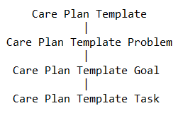

# Health Cloud Specialist
 
* Trailhead のスーパーバッジ、[Health Cloud Specialist](https://trailhead.salesforce.com/content/learn/superbadges/superbadge-health-cloud-specialist) の日本語訳(**非公式**)です。
* 各カスタマイズ要素のラベル部分には補足として日本語を括弧内に記載している場合がありますが、正解チェックは英語のラベルを元に行われるため、実際のチャレンジには日本語表記を含めず、英語表記のみを使用して行って下さい。また、チャレンジ前にユーザと組織の言語・ロケールを英語に切り替えておくことを推奨します。

---
## このスーパーバッジを取得するためにすること
* Health Cloud のユーザ、プロファイル、権限を作成します。
* Health Cloud において Lightning アプリケーションビルダーを使用します。
* ケアコーディネーションへの洞察を示します。
* 患者の 360 度ビューを表示します。
* 医療技術セールスチームを強化するための戦略を作成します。

## このスーパーバッジでテストする概念
* Health Cloud の設定とセットアップ
* ケアコーディネーション
* ケアプログラム
* 提供者
* 相互運用性
* 利用管理
* インテリジェントなセールス
* デバイス管理
* セキュリティ

所用時間 : 推定 8 時間 

## 事前準備とメモ
### Health Cloud を備える Developer Edition 組織の作成
#### 注意
このスーパーバッジを完了するには、Salesforce Health Cloud、専用の設定、サンプルデータを含む特別な Salesforce 環境が必要です。**特別に Health Cloud が有効化された Developer Edition 組織に最近サインアップした場合でも、このスーパーバッジのために新しい組織にサインアップしてください。また、Health Cloud 管理パッケージは 30 日後に期限切れになることに注意してください。**

1. [こちら](https://trailhead.salesforce.com/en/promo/orgs/healthcloudspecialist)から、Health Cloud を備える無料のテスト環境にサインアップします。
2. フォームに入力します。Email の欄には、有効な電子メールアドレスを入力します。Username の欄には、メールアドレス形式の一意のユーザ名を入力しますが、有効な電子メールアカウントと一致している必要はありません。(例: `@hc4ever.sample.com`) 
3. フォームに入力したら、**Sign Me Up**  (サインアップ) をクリックします。確認メッセージが表示されます。
4. ようこそメールを受信 (数分かかる場合があります) したら、それを開き、**Verify Account** (アカウントを確認) をクリックします。
5. パスワードと秘密の質問を設定して、登録を完了します。**ポイント**: 後で簡単にアクセスできるように、ユーザ名、パスワード、およびログイン URLを書き留めます。
6. Health Cloud が有効化された Developer Edition にログインされた状態になります。

次に、新しい Developer Edition 組織を Trailhead に接続します。

1. Trailhead アカウントにログインしていることを確認してください。
2. このページの下部にある **Challenge** セクションで、選択リストから **Connect Org** (組織を接続) を選択します。
3. ログイン画面で、先ほど設定した Developer Edition のユーザ名とパスワードを入力します。
4. Allow Access? (アクセスを許可しますか？) の画面で、**Allow** (許可) をクリックします。
5. Want to connect this org for hands-on challenges? (この組織をハンズオンの Challenge 用に保存しますか？) の画面で、**Yes! Save it** (はい、保存します) をクリックします。Challenge のページにリダイレクトされ、新しい Developer Edition を使用してこのスーパーバッジを獲得する準備が整います。
6. 専用の管理パッケージがインストールおよび有効化された Salesforce 組織ができたので、準備完了です。

#### 注意
* Challenge を始める前に、[このスーパーバッジの Help 記事](https://trailhead.salesforce.com/help?article=Health-Cloud-Specialist-Superbadge-Trailhead-Challenge-Help)を確認してください。Health Cloud を備えた **Developer Edition** 組織をこのスーパーバッジの Challenge に使用するようにしてください。他の作業に使用した組織を使用すると、このスーパーバッジの Challenge に失敗する可能性があります。
* Salesforce 認定資格プログラムの情報および、スーパーバッジの行動規範については、[スーパーバッジ Challenge の Help 記事](https://trailhead.salesforce.com/help?article=Superbadge-Challenge-Help) を確認してください。

## ユースケース
医療イノベーションのリーダーである Cumulus Health は、2 型糖尿病の発生を減少させるための重要なインフルエンサーとなることに力を注いでいます。新設された Cumulus Health グローバル財団 (以下、財団) は、世界中で個人のウェルビーイングを促進し、健康格差を減らすことを目的としています。

主な取り組みの 1 つとして、新しい健康アドボカシー・教育プログラムによる、個人の教育と能力向上の支援があります。この財団は、そのビジョンを実現するために、いくつかの異なる地域のコミュニティや医療従事者と提携しています。そのためには、世界各地のプログラムをサポートできるシステムが必要です。来月には、糖尿病予防・教育プログラム (Diabetes Prevention and Education Program, DPEP) の効果を実証するためのパイロットプログラムを展開したいと考えています。

各地域の拠点には、主任ケアコーディネータとパイロットプログラムの患者たちがいます。あなたには、新しいプログラムのニーズを満たすために、新しい Health Cloud の実装が適切に設定されていることを確認する責任があります。一部の設定はすでに実施されていますが、チームはそれが最も効果的な方法で機能しているかどうか確信が持てていません。また、可能な限り **FHIR R4 に準拠した医療データモデル** を活用するなど、Health Cloud を使用するための最新のベストプラクティスに従っていることを確認したいと考えています。チームの要件を確認し、プログラムのロールアウトをサポートするための戦略を定義しましょう。

## ビジネス要件

### システム管理をレビューする

早速、プロジェクトに参加して設定を始めます。まず、各地域の拠点にいるケアコーディネータ用にカスタムプロファイルを作成します。 **Health Cloud Admin** プロファイルをコピーして、新しいプロファイル `Care Coordinator Admin` を作成します。Care Coordinator Admin プロファイルで、新しいユーザ `Dania Thurayya` を作成します。Dania に以下の権限セットを割り当ててください。

* Health Cloud Foundation
* Health Cloud Permission Set License

適切なオブジェクトに、`Patient` (患者) という名前のカスタムレコードタイプを作成します。説明には `Represents an individual patient or participant` (個人の患者または参加者を表す) と入力します。レコードタイプは Care Coordinator Admin、Health Cloud Admin、システム管理者プロファイルで利用可能にしてください。Health Cloud で個々の患者を表現する方法はたくさんあります。ベストプラクティスに従い患者のレコードタイプを作成してください。

チームはリレーションのマッピングを使用したくなるでしょう。作成したレコードタイプをカスタムメタデータで正しく設定します。新しい機能をデモするために、`Shankar Suman` の患者レコードを作成します。

これまでの経験から、チームが効率的にケアを提供するのにコンソールビューが役立つと判断しました。**コンソールナビゲーション**を使用して、`Care Coordination Console` という名前の Lightning アプリケーションを作成します。以下のプロファイルに対してアプリケーションを有効にします。

* Care Coordinator Admin
* System Administrator
* Health Cloud Admin

アプリケーションのナビゲーション項目に以下を含めます。
+ Home (標準のホームページアイコン)
* Patients (稲妻アイコン)
* Leads (リード)
* Accounts (取引先)
* Cases(ケース)
* Care Plan Templates (ケアプランテンプレート)

**Patient Console with Pinned Leftbar** の Lightning レコードページをコピーして、`Care Coordination Account Page` という名前でレコードページを作成します。API 参照名が `Care_Coordination_Account_Page` となっていることを確認してください。このページを Care Coordination Console アプリケーションのデフォルトとして設定します。

### ケアコーディネーションを設定する
基本的な設定が完了したら、続いてチームごとの要件を確認します。ケアコーディネータは、特定の標準的なケアをすばやく再現する方法を必要としています。糖尿病患者の標準的な目標を含むケアプランテンプレートを作成したいと思います。新しいアプリケーションを使用して、`Diabetes Care Plan Template` (糖尿病のケアプランテンプレート) という名前のケアプランテンプレートを作成します。以下のモデルに従います。

ケアプランテンプレートには、これらの要素がこの順序で含まれていることを確認してください。

* ケアプランテンプレートの問題
  * `High Blood Sugar` (高血圧)
  * `Sedentary Lifestyle` (座りっぱなしの生活)
  * `Lack of Diabetes Self-Care Awareness` (糖尿病のセルフケアに対する意識の低さ)
  * `Labwork` (研究職)
* ケアプランテンプレートの目標 1
  * Related Problem (関連する問題): **High Blood Sugar**
  * Name (ToDo): `Control Glucose Levels`
  * Tasks (ToDo):
    * `Order Labs` をケアコーディネータに割り当てます。
    * `Self-Care: Daily Glucose Self-Check` を患者に割り当てます。
* ケアプランテンプレートの目標 2
  * Related Problem (関連する問題): **Lack of Diabetes Self-Care Awareness**
  * Name (名前): `Diabetes Self-Care`
  * Tasks (ToDo):
    * `Schedule Education Enrollment` をケアコーディネータに割り当てます。
    * `Exercise: Daily Walk` を患者に割り当てます。

財団は、適切な食生活が、糖尿病と同時に起こっている問題だと地域社会から聞いています。追加のケアプランテンプレートを、`Care Plan Template for Nutrition Education` (栄養指導のためのケアプランテンプレート) という名前で作成します。そのケアプランテンプレートに `Nutrition Education` のケアプランテンプレートの問題を含めてください。

#### 注意
Shankar Suman に対して複数のケアプランを作成しようとしています。組織の設定で、患者に対して複数のケアプランを作成できるようにしてください。

Shankar Suman はパイロットプログラムへの 1 人目の参加者です。彼のケアコーディネータは Dania Thurayya です。Diabetes Care Plan Template に基づいて、`Diabetes Education Care Plan` という名前のケアプランを作成します。次の問題を含めてください。

* High Blood Sugar
* Sedentary Lifestyle
* Lack of Diabetes Self-Care Awareness

件名項目には `Diabetes Education Care Plan` と入力してください。Dania Thurayya をケアコーディネータとして、Shankar Suman を患者として追加してください。

次に、Nutrition Education のケアプランテンプレートに基づいて、`Nutrition Education` という名前のケアプランを Shankar に作成します。件名には `Nutrition Education` と入力し、Dania Thurayya をケアコーディネータにしてください。

それぞれの患者ケアの 360 度ビューを得るために、Cumulus Health は分野 (ソーシャルワーカ、栄養士、専門家など) に応じてケースチームのメンバーを割り当てる方法を求めています。
Martha Ortiz と Adam Burke はケースでよく協業します。 `Diabetes Education` という名前のケースチームを作成し、Martha を Primary Care Physician の役割として、Adam を Diabetes Educator の役割としてチームに加えます。このチームを Shankar の両方のケアプランに関連付けてください。

## タイムラインビュー、患者プロファイル、社会的決定要因の設定
包括的なケアを提供するためには、チームメンバーは患者に関連する出来事を縦断的に見られる必要があります。患者のタイムラインでは、臨床医は以下を確認することができようになるはずです。

* Clinical encounters (臨床受診)
* Health conditions (健康状態)
* Medication Statements (薬剤ステートメント)
* Patient immunizations (患者免疫付与)

また、既存の Diabetes_Coaching_Session__c カスタムオブジェクトで追跡できる、糖尿病のコーチングセッションに患者がいつ参加したかについても見られるようにすべきです。チームは、糖尿病のコーチングセッションがなぜ患者のタイムラインに表示されないのかと思っています。コーチングセッションが Shankar の臨床データに追加できることを確認します。Diabetes_Coaching_Session__c カスタムオブジェクトを有効にして、患者のタイムラインに表示されるようにします。ユーザが糖尿病のコーチングセッションの上にカーソルを置いたときに、Coaching Description (コーチングの説明) 項目がタイムラインに表示されるようにしてください。

タイムラインを設定している間、ケアプランの ToDo がタイムラインに表示されることに注意してください。Shankar Suman の各オブジェクトの臨床データの例を 1 つ、次のように入力します。

<!-- textlint-disable jtf-style/1.1.3.箇条書き -->   
* Clinical Encounters
  * Status (状況): **Finished**
  * Start Date (開始日): 過去 30 日以内の日付と時間を選択してください。
  * End Date (終了日): 開始日から 1 時間後
  * Category (カテゴリ): **Home Health**
  * Service Type (サービス種別): **Homoeopathy**
* Health Conditions
  * Condition Code (状態コード): **Type 2 Diabetes**
  * Onset Period Start (発症期間開始): 約 1 年前の日付と時間を選択してください。
* Medication Statement
  * Medication (薬剤): **Metformin**
  * Status (状況): **Completed**
  * Start Date (開始日): 過去 30 日以内の日付と時間を選択してください。
* Patient Immunization
  * Vaccine Code (ワクチンコード): **Pfizer-BioNTech COVID-19**
  * Status (状況): **Completed**
  * Vaccination Date (ワクチン接種日): 過去の任意の日付と時間を選択してください。
* Diabetes Coaching Session
  * Coaching Description: `Initial coaching session, with resources and plan`
  * Session Type: **Extended**
  * Coaching Date: 本日の日付
<!-- textlint-enable jtf-style/1.1.3.箇条書き -->

Diabetes Education Care Plan のケアプランの下に Shankar Suman に対して以下の ToDo を追加します。

* 件名が `Education on daily management` で期日が本日より 1 週間後
* 件名が `Fasting blood glucose check` で期日が明日

Shankar のタイムラインタブを参照し、ToDo、臨床受診、健康状態、薬剤ステートメント、患者免疫付与、糖尿病のコーチングセッションのレコードが表示されていることを確認します。

ケアコーディネータは、大切な情報を素早く見つけるために、患者の情報のスナップショットビューを必要としています。患者カードを設定して、参加者に関する以下の関連情報を表示します。組織内には、すでに非アクティブな設定レコードがいくつかあります。それらを自由に使ってください。

* Address
* Contact Preferences
* Medications
* Conditions
* Insurance Plan
* Member Id
* Allergies

ケアコーディネータは患者に関連する様々な人々とコミュニケーションをとります。Shankar の人間関係を追跡するため、世帯と適切なロールを設定します。それらの個人のレコードは既にシステムに存在しますが、Shankar とまだ関連付けられていません。(Shankar を患者のロールで自身の世帯に関連付けることを忘れないでください。) 以下に対してリレーションを設定します。

* **Karpani Burman** (spouse / 配偶者) 
* **Get Cloudy Consulting** (employee / 従業員)
* **Anna Jones**
  * Role: `Transportation Coordinator`
  * Inverse Role: `Patient`

ケアコーデネーションの土台がほぼ全て整いました。最後の課題は、患者の健康に影響を与える社会経済的な要因を財団がすべて理解することです。プログラム参加への重要な障壁の 1 つが交通手段であることをチームは既に知っています。プログラムチームは、この障壁を克服するための介入策をブレインストーミングしました。この機能に対するソリューションをモデル化するるために、`Transportation Program` という名前のケア介入種別と、`Inadequate Transportation` という名前のケア障壁種別を作成します。両方のレコードを有効にしてください。

Shankar Suman にケア障壁のエントリを作成することで新しい機能をデモします。

* Tab (タブ): Social Determinants (社会的決定要因)
* Name (名前): `No Automobile` (自動車を保有していない)
* Type (ケア障害種別): **Inadequate Transportation** (交通手段の不足)
* Start and End Dates (開始日と終了日): 任意の日付を入力してください

最後に、以下の名前で 2 つの介入を追加します。
* `Call patient to arrange transportation` (移動を手配するために患者に電話する)
* `Provide public transportation resources` (公共交通機関の情報を提供する)

## ケアプログラムを設定する
財団は、ケアプログラムの提供を標準化することを目標としています。チームは、患者の転帰を改善するためのケアプログラムの例を見たいと考えています。`Diabetes Management` という名前で、`Care Program to help patients manage diabetes conditions` という説明のあるケアプログラムを作成します。親プログラム項目は空白のままにしてください。開始日と終了日には任意の日付を入力してください。

Shankar のケアコーディネータである Dania は、彼に糖尿病のケアプログラムに登録してもらいたいと考えています。しかし初めに、チームはプログラムに参加するための対象資格と規則を設定する必要があります。以下の 3 つの、登録対象資格基準レコードを作成してください。

1. 名前: `Confirm Type 2 diabetes`
2. 名前: `Confirm low income household band`
3. 名前: `Confirm physician referral or prescription received`

財団は、プログラムの初期展開において、適格な患者のみが登録されるようにしたいと考えています。これらの登録対象資格基準レコードをケアプログラム対象資格規則に関連付けます。

* ケアプログラム: **Diabetes Management**
  * 登録対象資格基準: **Confirm Type 2 diabetes**
* ケアプログラム: **Diabetes Management**
  * 登録対象資格基準: **Confirm low income household band**
* ケアプログラム: **Diabetes Management**
  * 登録対象資格基準: **Confirm physician referral or prescription received**

ケアプログラムの目的に合わせて、プログラム目標を設定しましょう。チームは、糖尿病管理ケアプログラムの目標を以下のように設定しました。

* `Adhere to treatment protocol` (治療プロトコルを遵守する)
* `Maintain healthy lifestyle` (健康的なライフスタイルを維持する)
* `Exercise 30 minutes each day` (毎日 30 分運動する)
* `Improve quality of life` (生活の質を改善する)

プログラム参加者に特典を提供しようと、チームは張り切っています。現在、いくつかの商品が利用可能です。以下の商品を Diabetes Management のケアプログラムに関連付けてください。

* 名前: `Monthly consultation with a nutritionist`
  * 商品: **Nutritionist Services**
* 名前: `Weekly coaching with care coordinator`
  * 商品: **Coaching**

このプログラムは、まず 2 つのプロバイダから展開されます。次のステップは、ケアプログラム提供者を設定することです。以下の詳細に基づいて 2 つのケアプログラム提供者レコードを作成してください。

|名前|アカウント(取引先)|ケアプログラム商品|
|-|-|-|
|Cumulus Health Nutritionist|Cumulus Health Physician Group|Monthly consultation with nutritionist|
|Cumulus Health Wellness Clinic|Cumulus Health Hospital|Weekly coaching with care coordinator|

リーダーシップチームは、特定のケアプログラムへの募集活動をどのように追跡すればよいかと考えています。`Initial outreach: radio spots` という名前のキャンペーンを作成します。ケアプログラムのキャンペーンを定義し、**Initial outreach: radio spots** キャンペーンと Diabetes Management ケアプログラムを関連付けます。

次に、同意ドキュメントをケアプログラムに関連付けて、参加者の同意を追跡できるようにします。Diabetes Management ケアプログラムに対して、以下のデータ使用目的レコードを作成します。

* 名前: `Diabetes Management Care Program Consent Forms`
* 目的 (ケアプログラムオブジェクトを選択): **Diabetes Management**

**注意:** データ型として、目的項目でケアプログラムを選択する必要があります。

次の認証フォームを作成します。

* Authorization Form Name (認証フォーム名): `Authorization to Disclose PHI`
* Revision Number (リビジョン番号): `1.0`
* Effective From (有効開始日): 本日から一週間後の日付
* Effective To Date (有効終了日): 本日から一年後の日付
* Is Signature Required (署名が必要): **True**

次の認証フォームテキストを作成します。

* Name (名前): `Authorization to Disclose PHI`
* Authorization Form (認証フォーム): **Authorization to Disclose PHI**
* Content Document (コンテンツドキュメント): **AUTHORIZATION TO DISCLOSE PERSONAL AND HEALTH INFORMATION**
* Locale (ロケール): ユーザのロケールレコードに合わせます
* Active (有効): **True**

Authorization to Disclose PHI の認証フォームを編集します。

* Default Auth Form Text (デフォルトの認証フォームテキスト): **Authorization to Disclose PHI**

次の情報で認証フォームデータの使用レコードを作成します。

* Authorization Form Data Use Name (名前): `Authorization to Disclose PHI`
* Authorization Form (認証フォーム): 作成した認証フォームを選択します
* Data Use Purpose (データ使用目的): 作成したデータ使用目的を選択します

財団は、これまでのあなたの仕事をとても心強く思っており、ケアプログラムへの参加と同意ですべてがうまくいくことを望んでいます。最初のステップは、参加者を迅速に登録するために、プログラムへの登録の標準的な自動化を調整することです。**Program Enrollment** という名前のフローを使用したアクションを作成します。作成したアクションは患者のレコードページで利用できるようにしてください。

* 表示ラベル: `Enroll in Care Program`
* 名前: `Enroll_in_Care_Program`
* 説明: `Enroll in Program flow with care plan selection`

デモでは、Shankar の登録の自動化をユーザがどのように素早く起動できるかを示しましょう。患者レコード上の自動化を使用して、Shankar を Diabetes Management のケアプログラムに登録してください。

* 商品を選択してください
  * **Monthly consultation with a nutritionist**
  * **Weekly coaching with care coordinator**
* 商品に関連する提供者を選択してください

登録を完了し、同意の取得に進みます。同意書を確認し、(これはデモであることを忘れないでください)、署名欄で署名し、同意を完了します。

## プロバイダのプロファイルをさらに定義する
組織には **Hospital Record Page** という名前の Lightning レコードページがあります。このページを Care Coordination Console アプリケーションとその業務に該当するレコードタイプに割り当ててください。

Cumulus Health 社は、医療施設と医師グループの買収により、地域拠点の健康増進に挑戦しています。既に 2 つの取引先がシステムに登録されています。Cumulus Health Hospital と Cumulus Health Physician Group です。チームは、異なる取引先がどのように関連しているかを示したいと考えています。標準機能を使って、Cumulus Health Physician Group をより大きな Cumulus Health Hospital とどのように関連付けることができるかを示してください。

チームは、施設の標準的な営業時間をその施設のレコード上で確認したいと考えています。Cumulus Health Physician Group と Cumulus Health Hospital の両方に営業時間を設定してください (取引先オブジェクトの営業時間項目を使用します)。

* 月曜から金曜
* 9:00 AM から 5:00 PM
* 太平洋標準時 (アメリカ合衆国 / ロサンゼルス)

2 人の臨床医がチームに加わったので、Health Cloud でそれを設定する必要があります。組織には、あらかじめ設定された Provider レコードタイプがあります。Provider Record Page という Lightning ページを Care Coordination Console アプリケーションと Provider レコードタイプに割り当ててください。

Provider レコードタイプで、`Magaly Rivera` と `Matthew Watkins` という 2 つの個人取引先レコードを作成します。Magaly Rivera を連絡先として病院に関連付け、Provider の役割を持たせます。Matthew Watkins は Provider の役割を持つ連絡先として、医師グループに関連付けます。

後ほど、プロバイダの検索を設定します。これを機能させるには、Magaly のデータが検索されるように設定する必要があります。Magaly Rivera の**関連**タブに移動し、以下のレコードを作成します。

Healthcare Provider (ヘルスケア提供者) レコードを作成します。

* Name (ヘルスケア提供者名): Magaly Rivera
* Practitioner (医師): **Magaly Rivera**
* Practitioner Type (提供者種別): **Medical Doctor**
* Practitioner Class (提供者クラス): **Solo Practitioner**
* Initial Start Date (最初の開始日): 現在から 2 週間前の日付

Healthcare Provider Specialty (ヘルスケア提供者の専門分野) レコードを設定します。

* Name (名前): `Physician/Endocrinology`
* Practitioner (医師): **Magaly Rivera**
* Specialty (専門分野): **Endocrinology**
* Specialty Role (専門分野ロール): **Specialist**
* Active (有効): **True**

Healthcare Practitioner Facility (ヘルスケア担当医師の施設) レコードを設定します。

* Name (医師の施設名): `Cumulus Health Hospital`
* Account (アカウント): **Cumulus Health Hospital**
* Practitioner (医師): **Magaly Rivera**
* Primary Facility (主施設): **True**
* Active (有効): **True**

Care Provider Facility Specialty (ケア提供者施設の専門分野) レコードを設定します。

* Name (提供者施設の専門分野名): `Endocrinology`
* Specialty (専門分野): **Endocrinology**
* Practitioner Facility (医師の施設): **Cumulus Health Hospital**
* Account (アカウント): **Magaly Rivera**
* Primary Specialty (主な専門分野): **True**
* Active (有効): **True**

Cumulus Health のチームメンバーは、医師に専門分野や領域分類がある場合、それを知る必要があります。パイロットプログラムは糖尿病ケアであるため、内分泌学の専門分野と分類学コードを設定します。以下の設定を完了し、Magaly のレコードを更新して、この医師の専門分野と領域分類を反映させてください。

Care Taxonomy (ケア分類) レコードを作成します。

* Name (名前): `Internal Medicine, Endocrinology, Diabetes & Metabolism`
* Taxonomy Code (分類コード): `207RE0101X`
* Taxonomy type (分類タイプ): **Allopathic and Osteopathic Physicians**
* Active (有効): **True**

Healthcare Provider Taxonomies (ヘルスケア提供者の分類) レコードを次の通り設定します。

* Taxonomy name (分類名): `Internal Medicine, Endocrinology, Diabetes & Metabolism`
* Taxonomy (分類): **Internal Medicine, Endocrinology, Diabetes & Metabolism**
* Primary Taxonomy (主分類): **True**
* Practitioner (医師): **Magaly Rivera**
* Active (有効): **True**

Cumulus Health Business Office は、全国プロバイダ識別子 (NPI) を使用して適切な報告および請求を行えるようにしたいと考えています。以下の取引先に関連する、2 つのヘルスケア提供者 NPI レコードを作成します。

* Cumulus Health Hospital に対して
  * Name (名前): `1345677600`
  * NPI type (NPI の種別): **Organization**
  * NPI: `1345677600`
* Cumulus Health Physician Group に対して
  * Name (名前): `1245678201`
  * NPI type (NPI の種別): **Organization**
  * NPI: `1245678201`

地域の拠点に最高のサービスを提供するために、Cumulus Health チームは、医師の資格と免許のステータスを追跡しています。以下の資格と医師を関連付けます。

Magaly Rivera のレコードに以下の資格情報を追加します。

* Board certification name (専門委員会による認可名): `ABMS Board Certification`
* Board name (委員会名): `American Board of Endocrinology Specialties`
* Expiration Date (有効期限): 現在から 1 年後の日付

Matthew Watkins のレコードに以下の資格情報を追加します。

* Board certification name (専門委員会による認可名): `AOA Board Certification`
* Board name (委員会名): `Bureau of Diabetes Specialists`
* Expiration Date (有効期限): 現在から 1 年後の日付

Cumulus Health Patient Services は、医師の施設に関する追加情報に素早くアクセスしたいと考えています。医師のレコードに、勤務しているすべての施設が表示されるように、提供者リレーションカードを設定します。

* Card Reference Name (参照名): `PractitionersRelationshipCard`
* Card Developer Name (API 参照名): `PractitionersRelationshipCard`
* Displayed on (表示するページ): Provider レコードタイプの取引先オブジェクト
* ページとカードの関連: **Directly** (直接的)
* 情報を表示したいオブジェクト: **Healthcare Practitioner Facility**
  * ソースオブジェクトとして PractitionerId を選択
* Card Fields (項目):
  * Facility name (取引先名)
  * Specialties provided by doctor at that facility
  * Provider’s Facility NPI

医師のリレーションカードが作成できたので、それが Provider Record Page の Facilities (施設) タブにあるリレーションカードコンポーネントに表示されるようにしてください。

Cumulus Health には、専門医療についてや、患者の近くにいる医師を見つけることについての問い合わせがよく寄せられます。提供者検索を含む Care Coordination Console のホームページを作成します。

* Page Name (表示ラベル): `Care Coordination Console Home`
* Developer Name (API 参照名): `Care_Coordination_Console_Home`
* Layout (テンプレート): ホームテンプレート - 1 つの範囲

Provider Search (提供者検索) コンポーネントをページにドロップします。

Admitting Privileges (入院特権、医師が患者を救命を通さずに治療のために入院させる権利のこと) という名前で 2 つのカスタム項目を作成します。

Healthcare Practitioner Facility (ヘルスケア担当医師の施設) オブジェクト:

* 型: 選択リスト
* 表示ラベル: `Admitting Privileges`
* 値: Yes または No

Care Provider Searchable Field (ケア提供者検索可能項目) オブジェクト:

* 型: テキスト
* 表示ラベル: `Admitting Privileges`

この新しいカスタム項目に関連するマッピングを 2 つのエンティティで表示するために、**Care Provider Search Config** (ケア提供者検索設定) に新しいレコードを作成します。

チームが **Care Coordination Console Home** ページでプロバイダ検索を使用できるようにします。検索パネルに **Admitting Privileges** (入院特権) 項目が表示されるようにしてください。その他の項目を自由に追加することもできます。Magaly Rivera のケア提供者施設レコードを更新し、彼女の入院特権を反映させることで、検索機能をチームに示すことができます。

任意: プロバイダ検索がどのように機能するかを実際に試すことができます (検索のデモは Challenge では検証されませんが、もし試してみたければご自身で確認できます)。ある患者が、自宅から 50 マイル以内にある、入院特権を持つ内分泌学者について問い合わせるために、Cumulus Health のコールセンターに電話をかけてきました。患者の住所と 50 マイルの距離と、Specialty Type を **Specialist** にして、距離ベースの検索を行います。結果レコードには Magaly Rivera だけが含まれることを確認してください。

## ケア要請と利用管理を設定する
Cumulus Health には、ケアの妥当性をレビューするステップを合理化するという第二の目的があります。以前のシステムには十分な情報がなく、ビジネスニーズが変わったときに再設定するのは簡単ではありませんでした。あなたの目標は、Health Cloud がどのように合理化された利用管理を提供するかを実証することです。

ケア要請のカスタマイズ設定から始めます。`Diabetes Care` (糖尿病の治療) という表示ラベルでケア要請のレコードタイプを作成します。それを Care Request (ケア要請) のページレイアウトと関連付けます。レコードタイプは有効にし、これまでに設定したプロファイルで利用可能になるようにしてください。追加のオブジェクトについてもこの手順を繰り返し、各オブジェクトにも Diabetes Care の表示ラベルを使用します。

* Caes (ケース) : Care Request のページレイアウトに関連付けます。
* Care Diagnosis (ケア診断) : Care Diagnosis のページレイアウトに関連付けます。
* Care Request Item (ケア要請品目)  Care Request Item のページレイアウトに関連付けます。

ケア要請の設定で、`Diabetes Care` という表示ラベルと、ケア要請種別を `Service Request` としたケア要請の構成レコードを作成します。Care Request Item と Care Diagnosis オブジェクトを利用可能にしてください。

新しいケア要請の構成の作成が完了したら、**Care Coordination Console Home** ページ (前の Challenge で作成したページ) に **Create Care Request** (ケア要請の作成) コンポーネントを追加します。

Care Coordination Console Home ページからケア要請を作成することで新しい機能をデモしましょう。次の情報を入力します。

* Case (ケース):
  * Case Origin (ケース発生源): **Phone** (電話)
* Care Request (ケア要請):
  * Member (メンバー): **Shankar Suman**
  * Name (名前): `Diabetes care request`
* Care Request Item (ケア要請品目):
  * Name (名前): `Blood Glucose Monitor`
* Care Diagnosis (ケア診断):
 * Name (名前): `Type 2 Diabetes`
 * Discharge Diagnosis code (退院診断コード): **E11.22, Type 2 diabetes mellitus with diabetic chronic kidney disease**
 * Modified Diagnosis code (変更済み診断コード): **E11.22, Type 2 diabetes mellitus with diabetic chronic kidney disease**
 * Diagnosis Code (診断コード): **E11.65, Type 2 diabetes mellitus with hyperglycemia**

レコードを保存し、新しいケア要請を確認してください。

## インテリジェントなセールスを使用して生産性を最大化する
医療技術企業である Vance Laboratories は、財団への主要な寄付者です。同社の支援により、Cumulus Health グローバル財団は当初の予定よりも早く成長することができました。あなたは、Vance のチームメンバ数人と何度か会話を交わし、医療技術営業におけるペインポイントを聞いてきました。あなたの洞察は次の通りです。Vance の売上が増えれば、財団の資金も増える。そこで、Health Cloud のインテリジェントなセールス機能のデモを提案することになりました。

最初のステップは在庫のロケーションの設定です。ミネソタ州から始めましょう。

* Name (ロケーション名): `Minnesota Medical Supplies`
* Location Type (ロケーション種別): **Inventory Location**
* Inventory Location (在庫のロケーション): **True**

Visitor Address (訪問者住所) は、ユーザが近くの在庫を探したり、商品の転送を依頼するのに役立ちます。訪問者住所を作成して、訪問者住所項目で選択できるようにします。

* Address (町名・番地): `7255 Minnesota 61`
* City (市区郡): `Tofte`
* State (都道府県): `MN`
* Zip/Postal Code (郵便番号): `55615`
* Country (国): `United States`
* Location Type (ロケーション種別): `Warehouse`
* Address Type (住所種別): `Mailing`

次に、在庫を定義しましょう。`Hip Prosthesis` という名前の商品を、Minnesota Medical Supplies のロケーションに対して作成します。このデモでは、在庫数量を `50`、数量測定単位を `Each` とします。

最後に、商品履行場所を作成します。

* Name (商品履行場所名): `Minnesota Hip Devices`
* Product (商品): `Hip Prosthesis`
* Fulfillment Location (履行場所): `Minnesota Medical Supplies`
* Responsible User (担当ユーザ): `Janet Campbell`
* Account (取引先): `Cumulus Health Hospital`
* Account Location (取引先所在地): `Cleveland`

アクションプランテンプレートを設定し、医療技術営業のエグゼクティブが外科症例訪問時に実行しなければならないタスクを、事前定義したリストとして管理します。次のアクションプランテンプレートを作成しましょう。

* Name (名前): `Surgical Visit`
* Action Plan Type (アクションプラン種別): **Visit Execution** (訪問実行)
* Target Object (対象オブジェクト): **Visit** (訪問)

次に **Order Authorization** フローを追加し、必須にします。Surgical Visit アクションプランてプレートを公開します。

アプリケーションのホームページ上の **My Visits** (私の訪問) コンポーネントから、外科症例訪問を作成して、**Intelligent Sales** (インテリジェントなセールス) アプリケーションでデモをしましょう。次の情報を含めます。

* Visit Location (場所): **Minnesota Medical Supplies**
* Visit Type (訪問種別): **Replenish Hip repair devices**
* Primary Visitor (プライマリの訪問者): **Janet Campbell**
* Account to Visit (取引先): **Cumulus Health Hospital**
* Product (商品): **Hip Prosthesis**
* Product Quantity (数量): `2`
* Action Plan Template (アクションプランテンプレート): **Surgical Visit**

## 患者のデバイスを管理する
パイロットプログラムの一部として、Shankar は SmartScale を受け取ることになりました。以下の情報で納入商品レコードを作成して、デバイスを追跡する方法をデモしてみましょう。

* Asset Name (納入商品名): `Shankar Suman's SmartScale 2.0`
* Product (商品): **SmartScale 2.0**
* Account (取引先): **Shankar Suman**
* Serial Number (シリアルナンバー): `PMSS2020001`
* Unique Identifier (一意の識別子): `PM_SS_JF001`
* Description (説明): `SmartScale shipped to Shankar Suman`
* Price (価格): `$299`
* Quantity (数量): `1`

あらかじめ設定された自動化機能を使って、個々の患者への機器登録を効率化したいです。患者のレコードページに、**Register Device and Create Shipping Request** (デバイスの登録と出荷依頼の作成) というクイックアクションを追加します。Shakar の SmartScale の出荷依頼を作成してください。

機器の出荷情報として次の情報を利用します。

* Street: `1 Market Street`
* City (市区郡): `San Francisco`
* State/Province (都道府県): `CA`
* ZipCode (郵便番号): `94105`
* Country (国): `US`

Shankar が体重計を受け取った後、彼のケアコーディネーターは Shankar のレコードページの **Remote Monitoring** (リモート監視) タブでケア指標目標を作成することができます。次の情報を入力して、Shankar のケア指標目標を追加してください。

* Name (名前): `Individual Body Weight - Shankar Suman`
* Patient (患者): **Shankar Suman**
* Type (種別): **MAX** (最大)
* Numeric Value (数値): `210`
* Code (コード): `Body Weight Code Set`
* Units of Measure (測定単位): **lbs**
* Start Date (開始日): 本日から 1 ヶ月前の日付
* End Date (終了日): 本日から 1 年後の日付

最後に、患者のレコードの Remote Monigoring (リモート監視) タブの下にリモート監視グラフを表示し、デバイスデータに簡単にアクセスできるようにします。リモート監視グラフのデモを行うため、いくつかのケア観察レコードを作成してください。

やりました！デモは大成功でした。おめでとうございます。この成果は、財団を成長させ、世界中の地域社会にポジティブな健康成果をもたらすでしょう。