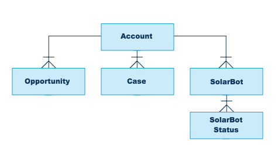

# Lightning Experience Reports & Dashboards Specialist
 
* Trailhead のスーパーバッジ、[Lightning Experience Reports & Dashboards Specialist](https://trailhead.salesforce.com/content/learn/superbadges/superbadge-lex-rd) の日本語訳(**非公式**)です。
* 各カスタマイズ要素のラベル部分には補足として日本語を括弧内に記載している場合がありますが、正解チェックは英語のラベルを元に行われるため、実際のチャレンジには日本語表記を含めず、英語表記のみを使用して行って下さい。また、チャレンジ前にユーザと組織の言語・ロケールを英語に切り替えておくことを推奨します。

---
## このスーパーバッジを取得するためにすること
1. レポートとダッシュボードの表示とアクセスを管理する
2. レポートタイプと項目を適用する
3. レコードのフィルタリング戦略を設計する
4. レポートグラフとダッシュボードを作成して表示する
5. バケット項目、グループ化、およびカスタム集計項目を適用する
6. ダッシュボードコンポーネントを作成する

## このスーパーバッジでテストする概念
* フォルダの共有
* Lightning レポートビルダー
* レポートタイプ
* レポートの検索条件、クロス条件、検索条件ロジック
* レポートのバケット項目とグループ化
* レポートグラフ
* カスタム集計項目
* Lightning ダッシュボードビルダー

## 事前準備とメモ
<!-- textlint-disable jtf-style/1.1.3.箇条書き -->
* ペンと紙を準備して、要件を読み進める際にメモを取ってください。
* このスーパーバッジ用に、新しい Trailhead Playground を作成してください。この組織をほかの目的で使用すると、課題について検証する際に問題を引き起こす可能性があります。[1](#footnote1)
* 商談オブジェクトの種別 (Type) 選択リストに、**SolarBot** を追加してください。[このヘルプ記事](https://help.salesforce.com/articleView?id=updating_picklists.htm&type=5)が参考になります。
* SolarBot社の買収に伴う資産を実装するため、[未管理パッケージ](https://login.salesforce.com/packaging/installPackage.apexp?p0=04t1H0000018kE1)をインストールしてください。(パッケージ ID: 04t1H0000018kE1) 管理パッケージ、未管理パッケージ、アプリケーションを AppExchange からインストールする際に問題が発生した場合は、[この記事](https://force.desk.com/customer/en/portal/articles/2710899-installing-a-package-or-app-to-complete-a-trailhead-challenge?b_id=13478)に示す手順に従ってください。
* 未管理パッケージをインストールした後は SolarBots アプリケーション内の Data Import タブから、Import ボタンを選択してください[*2](#footnote2)。
* [この説明にならって](https://help.salesforce.com/articleView?id=creating_and_editing_groups.htm&type=5)以下の 6つの公開グループを作成してください。
  * Executive Team (エグゼクティブチーム)
  * Report and Dashboard Administrators (レポート・ダッシュボード管理者)
  * Research and Development Team (R&D (研究開発) チーム)
  * Sales Leadership Team (セールスリーダシップチーム)
  * Sales Team (セールスチーム)
  * Support Team (サポートチーム)
* このスーパーバッジのすべてのステップは Lightning Experience で完了してください。
* このスーパーバッジで利用される用語のいくつかは、UI に表示される設定上の名称名と完全に一致しない場合があります。これは、Salesforce の機能に関する知識と、ビジネス上のニーズを満たす正しい機能を選択する能力をテストするためです。
<!-- textlint-enable jtf-style/1.1.3.箇条書き -->

## ユースケース
Ursa Major Solar, Inc. は、先日、戦略的パートナーである SolarBot Industries を買収した太陽光エネルギー機器のサプライヤです。社名から分かるように、SolarBot Industries は SolarBot を製造しています。SolarBot とは、自律型のロボット周辺機器で、割り当てられたソーラーパネルにゴミや破片が付着しないようにしたり、パネルのステータス指標に関して IoT フィードバックを毎日提供したり、パネルのメンテナンスを依頼したり追跡したりします。充電クレードルに戻ったときは「ビーッ！ビーッ！ブーン！」と鳴ります。SolarBot はかわいいロボットですが、パフォーマンスへの影響は深刻です。それらに塵、砂、水、苔が蓄積すると太陽光パネルの発電効率が最大で 85％ も減少してしまいます。Ursa Major の顧客は SolarBot が好きで、SolarBot Industries と Ursa Major の合併は円滑に進みました。

Ursa Major Solar の経営陣は、SolarBot Industries のデータをできるだけ早く理解して適用したいと考えています。ケース、商談、IoT データセットは、既に Ursa Major の Salesforce 組織にロードされています。データ分析や使用にあたってチームに情報を提供するのはあなた次第です。SolarBot の古いレポートを管理し、新しいレポートを設計し、エグゼクティブダッシュボードを作成し、レポートとダッシュボードのアクセスを管理し、レコードやアプリケーション上にデータを表示します。このデータを活用することで、チームは太陽光発電事業に関してよりいっそう明るい意思決定を行うことができるでしょう。

## 主要なステークホルダ
SolarBot のデータが欲しい部署のリーダやユーザに対してインタビューを行いました。彼/彼女らは必要なレポートやダッシュボードに関して多くの便利なフィードバックを与えてくれました。主要なステークホルダは以下の通りです。
* Sita Nagappan-Alvarez (CEO)
* Gabriela Livingston (セールスオペレーションスペシャリスト)
* Ada Balewa (製品サポートスペシャリスト)
* Maria Jimenez (システム管理者)

## 標準オブジェクト
Ursa Major は以下の標準オブジェクトを利用しています。
* Account (取引先) - Usra Major から機器を購入する法人顧客
* Opportunity (商談) - 顧客やリードに対する潜在的な販売
* Case (ケース) - 顧客から報告されるサポートに関する問題

## カスタムオブジェクト
SolarBot Industries は IoT データを管理するためのシンプルなデータモデルを採用しています。以下のカスタムオブジェクトは Usra Major のスキーマにマージされます。
* SolarBot - 取引先に割り当てられた SolarBot
* SolarBot Status - 各 SolarBot からの、パネルの生産性や問題に関する日次のレポート

## エンティティ図

## ビジネス要件
### フォルダを管理しレポートを整理する
#### フォルダ管理
あなたは、車の鍵が見つからなくて、ポケット、カバン、ジャケット、カウンターを探すときの恐怖感を知っていますか？そして、すべてが正しい場所にあるときの満足感についてはどうでしょうか？堅実なフォルダと情報セキュリティのバックボーンを備えたこのレポートプロジェクトを開始して、快適さと満足さを感じられるようにしましょう。Ursa Major の Salesforce システム管理者である Maria Jimenez が、フォルダとアクセスの要件を整理するのを手伝ってくれました。

SolarBot のレポートフォルダは **SolarBot [チーム/グループ名] Reports** という命名規則を用いています。ここで、チームとグループは以下の通りです。
* Executive (エグゼクティブ)
* Sales (セールス)
* Support (サポート)
* R&D

また、サポートチームのフォルダ内には、**Status Reports** と呼ばれるサブフォルダがあります。

見失った車のキーを覚えていますか？あなたの猫が本棚の後ろでそれをトントン叩いていたことが分かりました。あなたは、それを必要とするあなたの家庭内の人、すなわち人間だけに棚へのアクセス権を与えることにします。同様の原則に従って、Ursa Major では、以下の要件に基づいて、既存の公開グループに対してのみレポートフォルダへのアクセスを許可します。以下のルールに従ってレポートフォルダへのアクセス権を設定しましょう。

* Report and Dashboard Administrator はすべてのレポートフォルダを参照でき、アクセス権を制御できます。
* Sales Leadership Team はセールスのレポートのアクセスを制御でき、サポートのレポートを参照可能です。
* Sales Team はセールスのレポートを参照可能です。
* Support Team はサポートのレポートを参照・変更可能です。
* Executive Team はすべてのレポートを参照可能で、エグゼクティブのレポートを変更できます。
* Research and Development(R&D) Team は R&D のレポートを管理でき、サポートのレポートを参照できます。

#### レポートの片付け
SolarBot Industries のデータがあなたの組織にロードされてからの短時間の間に、レポートを作成しているユーザがいます。あなたは、データ分析 (#datamagic!) にかかわる人々が大好きですが、フォルダの混乱や重複は好きではありません。ほとんどのユーザは Maria の Chatter のアナウンスに注意を払い、自分のレポートを個人用フォルダまたはチームフォルダに移動しました。しかし、いくつかのレポートが仲間から外れてしまっています。Maria はこれらのレポートにラベルを付け、Acquisition Reports フォルダに配置しました。ここで、レポート名に基づいてそれらのレポートを適切なフォルダに移動してください。削除するレポートは、Report Recycle Bin フォルダに配置してください。

#### カスタムオブジェクトデータのレポート
レポートを片付けている間、いくつかのレポートに SolarBot や SolarBot Status カスタムオブジェクトのシステム項目が含まれていることに気が付きました。それらの項目は隠されておらず、レポートを作成する際に単純に便利ではありません。そして、それらは潜在的に混乱を招きます。ユーザがこれらのカスタムオブジェクトのレポートを作成するためのソリューションを新規に設定してください。

* ソリューションのラベル名を **SolarBots and Status Data** としてください。
* ソリューションの説明に **Use this for creating reports that use SolarBot and SolarBot Status data.** と入力してください。
* 作成したソリューションを Other Reports (その他のレポート) のカテゴリに格納してください。
* このソリューションを利用するレポートには、関連する SolarBot Status レコードの有無にかかわらず、SolarBot の情報が含まれます。SolarBot はまだ有効化されていないかもしれません。
* このソリューションでは、以下の項目をレポートで選択不可としてください。
  * kWh Roll-Up
  * Temp Roll-Up
  * Obscured Roll-Up
  * Number of Status Records
  * Maintenance Requested

これは、ユーザがレポートを作成するために構築する唯一の新しいソリューションですが、あなたは最初から利用できるオプションでレポートを作成することもできます。

### セールスレポートを作成する
お菓子屋さんにいる子供のように、セールスチームのメンバーは、Ursa Major の顧客に販売する新しい選択肢について目を丸くして興奮しています。セールスオペレーションの Gabriela Livingston は、セールスコールシートについて 1回目のアイデアを送ってきました。以下のレポートを作成したら、セールスチーム用に作成したフォルダにそれらのレポートを配置します。それではレポートの作成に取り掛かりましょう！

#### SolarBot の商談が無い取引先
Gabriela とセールスチームは、ファミリーの中で最も新しく、最も働いているメンバーである SolarBot を、Usra Major の全顧客に紹介することに、個人的な義務感を抱いています。どの顧客に電話をかけるべきかを列挙したレポートが必要です。データ統合プロセスにより、SolarBot の潜在的な販売活動は、商談の種別の選択リストが **SolarBot** に設定されています。この新しいレポート **Accounts Without SolarBot Opportunities** では、まだ SolarBot に関わる商談がない取引先の取引先名、取引先の電話番号、および取引先の種別を表示する必要があります。このレポートには、標準のレポートタイプを使用してください。

#### SolarBot の優先順位の高いケースの候補
Ursa Major の優れたサポートチームが対応するとしても、カスタマーサポートへ連絡することは、人々にとって楽しいことではありません。残念ながら、Ursa Major には、他の誰よりもサポートを必要としている顧客がいます。サポートケースのパターンを分析すると、パネルのパフォーマンス低下が永続的な問題であることが分かりました。Ursa Major のセールスチームは、SolarBot によりパネルのクリーニングとメンテナンスを行うことでソーラーパネルの性能が大幅に向上することを知っています。そこでチームは、頻繁に連絡してくる顧客と話したいと思っています。Gabriela は、**SolarBot High-Case Candidates** というレポートを必要としています。このレポートでは、SolarBot を持たないすべての取引先の電話番号、ケースの件名、オープンフラグ、クローズ済フラグを表示し、取引先ごとにレコードを整理します。
* 取引先ごとに 1 回だけ電話を表示することでレポートを簡素化してください。
* セールスチームが、SolarBot を販売するのにどの顧客が最適かを確認しやすくするため、ケースの数が多い順に一覧を優先度付けしてください。
* Maria は取引先オブジェクトに Number of SolarBots (SolarBot の数) という積み上げ集計項目を追加しました。この項目は、取引先に紐づく SolarBot の数を表示します。

#### SolarBotの保証コールシート
おや、セールスチームの誕生日ですか？彼らは SolarBot がメニュー上の唯一の新製品ではないことを学びました。すべてのボットには別途販売されているメンテナンス保証もあります。チームが販売を開始するために、Gabriela は **SolarBot Warranty Call Sheet** というレポートを求めています。このレポートには、取引先、電話番号、Warranty Status (保証状況)、および保証対象外の SolarBot ごとに、いつ保証が期限が切れたかを表示します。このレポートを意図した通りに機能させるため、表示される取引先を決定する基準をユーザが調整できないようにしましょう。

### サポートレポートを作成する
Ursa Major のサポートチームは買収以来、SolarBot を修理・テスト・改善してきています(その結果、SolarBot は良いポータブル飲料用コースターを作り出しています)。チームは SolarBot の未来を明るく見ています。顧客はパネルに関する問題が少なくなるため、サポートへの問い合わせは少なくて済みます。しかし、そうであっても、チームは SolarBot をどう保守していくかを懸念しています。製品サポートスペシャリストの Ada Balewa は、サポートチームの SolarBot サポート対応の準備を手伝っています。彼女はあなたにいくつかのレポートを依頼しました。

#### SolarBot Ownershipによる上位ケース発生要因
Ada の最初の仕事は、SolarBot を所有している顧客がサポートを求めている理由と、その問題が SolarBot を所有していない顧客からのものと異なるかどうかを理解することです。SolarBots が故障するのですか？彼らは汚れてしまって、それを綺麗にするためにさらに小さなボットを必要としますか？彼らは電気羊の夢を見ていますか？ケースが、SolarBot オーナーのカテゴリ間でどのように分布しているかを調べるため、**Top Case Drivers by SolarBot Ownership** というレポートを作成します。
* 3つのカテゴリに分かれる **SolarBot Ownership** という分類項目を作成してレポートを整理します。
  * SolarBot を 1 つも所有していない場合は **No SolarBots** と表示します。
  * SolarBot を 1 から 3 つ所有している場合は **Some SolarBots** と表示します。
  * 3つより多く SolarBot を所有している場合は **Several SolarBots** と表示します。
  * SolarBot Ownership で分類した後は、ケースを原因で集計します。
* ケースごとに、取引先名と件名を表示します。
* 個々のケースを表示しますが、レコードの合計は表示しません。
* レポートはサポートチームのために作成したフォルダに保存します。

#### SolarBot のステータス平均
Ada とのミーティングの間、チームの誰かが SolarBot の顧客からの最初の入電を転送します。Ada は SolarBot に関する質問に答えることに問題はありませんが、彼女はレコードにある必要なすべての情報をすばやく見つけることができません。彼女は毎日の Kilowatt Hours (発電量)、Panel Temperature (パネル温度)、Percent Obscured (雲に覆われている割合) を見ることができますが、他の SolarBotと比較した最近の平均とパフォーマンスの傾向を推測することしかできません。Ada は、すべての SolarBotの、平均の Percent Obscured (雲に覆われている割合)、平均の Panel Temperature (パネル温度)、平均 Kilowatt Hours (発電量) を、Status Date ごとに表示する、**SolarBot Status Averages** というレポートを作成して欲しいと思っています。サポートチームは毎日の平均だけを知る必要があります。彼らは個々の SolarBot に関する情報、レコードの数、集計を見る必要はありません。このレポートを **Status Reports** (ステータスレポート) フォルダに保存します。

### R&D レポートを組み立てる
Usra Major の研究開発 (R&D) チームは、SolarBot 社の買収が完了したことを歓迎しています。彼らは SolarBot 社の製品の長所と短所を理解したいので、パネル温度と発電量の間の傾向を評価するのに役立つレポート **Temperature to kWh Research** を作成するよう依頼しました。レポートは以下の要件を満たす必要があります。

* **Temperature Range** (温度範囲)という項目でレコードを 4 つのカテゴリに分類します。最も温度の低い Temperature Range からレポートの先頭に表示してください。
  * 65℃以下は **Low** を表示します。
  * 65℃より大きく 80℃までは **Medium** と表示します。
  * 80℃より大きく 95℃までは **High** と表示します。
  * 95℃より大きい場合は **Very High** と表示します (人間にも Bot にも不快な温度です) 。 
* 各 Temperature Range で、平均の Kilowatt Hours (発電量) と平均の Panel Temperature (パネル温度) だけを表示します。
* R&D チーム用に作成したフォルダにレポートを格納します。

### エグゼクティブレポートを実装する
Ursa Major の全体的なビジネスの見通しは既に良かったのですが、SolarBot はそれを完全に晴れやかにします。アナリストが Usra Major の CEO である Sita Nagappan-Alvarez に、顧客が少なくとも 1 つの SolarBot を持っていれば、商談が成立する可能性が 10% 高くなると伝えたところ、Sita は商談を再評価することを熱望しています。彼女は、以下の仕様を満たす **SolarBot Loyalty Revenue** レポートとそれに付随するグラフを求めています。

* レポートは Opportunity Name (商談名)、Account Name (取引先名)、Type (種別)、Probability (確度)、Amount (金額)、また、Expected Revenue (期待収益) を合計で表示し、Stage (フェーズ) でレコードを整理してください。
* レポートにはすべての日付のすべての商談を含めてください。
* レポートには新しい項目である **Adjusted Expected Revenue** (調整済み期待収益) を含めてください。この項目はアナリストが正しい場合にどうなるかを示します。この列で、もし顧客が少なくとも 1 つの Solarbot を保有しているなら、小計または総計で期待収益の 10% 上乗せした値を表示し、顧客が Solarbot を保有していない場合は、元の値を表示します。オブジェクトには新しい項目を作成しないでください。
* グラフは、Stage (フェーズ) ごとに、元の Expected Revenue (期待収益) と Adjusted Expected Revenue を隣に並べて、フェーズが下に来るように表示します。
* エグゼクティブチーム用に作成したフォルダにレポートを保存します。

### レポートの更新を完了する
毎日、各 SolarBot は落ち葉を掃除し、白カビをこすり落とし、パートナーのパネルをスムーズに動かし続けています。SolarBot のように、レポート管理者は本当に自分の仕事を終えることはありません。ユーザがデータについて尋ねる新しい質問を思いついたとき、ユーザはあなたにその質問を持ってきます。レポートを更新して、ユーザが必要とする回答を得られるようにしましょう。

#### セールスレポートの改良
Gabriela はセールスチームとともに、チームがあなたの作成したレポートが大好きであると言ってきましたが、いくつかの微修正を要求しています。営業担当者が地域別に通話リストを分割するのを支援するために、Billing State (都道府県(請求先)) で **Accounts Without SolarBot Opportunities** レポートを整理する必要があります。また、**SolarBot Warranty Call Sheet** レポートを拡張して、今後 45 日間に保証期間が終了する SolarBot を保有する顧客をレポートに追加で含めたいと考えています。チームはいくつかの重要な州に集中しているため、この SolarBot Warranty Call Sheet レポートにはネバダ州 (NV)、ユタ州 (UT)、カリフォルニア州 (CA) の顧客だけを含めてください。フィルタ管理のベストプラクティスは、Warranty Status (保証ステータス) や、Billing State (都道府県(請求先)) など同様の項目に対するフィルタ条件をグループ化することです。

#### サポートレポートの改良
進行中のサポートチームの Chatter 会話の中で、ちょうど Ada からサポートレポートについてメンションされました。**Top Case Drivers by SolarBot Ownership** レポートでは、SolarBot の顧客について、原因が Equipment Complexity のケースが増加を示しました。チームは、これらの顧客に手を差し伸べて教育を提供する予定であるため、電話番号とそのケースがオープンかどうかをレポートに追加したいと考えています。また、このレポートにはグラフが必要です。グラフは、Ownership のカテゴリごとにケースの原因の相対的な割合を示すことによって、SolarBot Ownership とケースの原因の関係を視覚化するのに役立ちます。たとえば、複数の SolarBot を所有している顧客は、SolarBot を所有していない顧客よりも原因が Equipment Complexity のケースが多いことがわかります。データ分析のベストプラクティスに従うには、Y 軸に数値以外のカテゴリを配置して注意を引きます。そのカテゴリの件数を X 軸に配置します。すべてのケースの原因を分析に含めます。

Adaは、**SolarBot Status Averages** レポートにいくつかの調整が必要であることも伝えています。最初に、サポートチームは時間の経過とともに傾向を把握したいので、レポートでは日単位ではなく週単位でデータを表示する必要があります。次に、**Weekly Panel Temperature and kWh** と呼ばれるこのレポートのグラフが必要で、平均の Panel Temperature (パネル温度) と平均の Kilowatt Hours (発電量) を線で、時間の経過に伴い表示します。続いて、彼らは SolarBot の各レコードページでこのグラフを見たいと思っています。**SolarBot Status Page With Chart** という名前でそのページを作成してください。グラフには、個々の SolarBot に関する情報だけを含めてください。

#### R&D レポートの改良
R&Dチームは、**Temperature to kWh Research** レポートの変更を依頼するよう、音を鳴らしてあなたの机まで知らせるよう SolarBot にプログラムを組みました。Panel Temperature (パネル温度) と Kilowatt Hours (発電量) との全体的な関係は明らかになっていますが、チームは、各 SolarBot のモデルがパネルの発電効率に異なる影響を与えるという理論を持っています。チームは引き続き、平均のパネル温度と平均の発電量を Temperature Range (温度範囲) で分解して見たいと考えています。さらに、別の軸で SolarBot Model ごとの平均のパネル温度と平均の発電量を比較したいと考えています。また、レポートに固有のグラフが必要です。グラフには、Low から Very High に至るまでの 4 つの温度範囲のカテゴリがあり、その中に、モデルごとに発電量の平均を表示します。X 軸に温度範囲のカテゴリを置き、Y 軸で値を表示します。あなたがレポートの改良作業を終了すると、SolarBot は元気に鳴いて R&D チームの方へに戻っていきます。いいロボットです。

### SolarBot の影響ダッシュボードを設計する
SolarBot が対象のソーラーパネルの効率を向上させるように、よく設計されたダッシュボードはレポートの有用性を高めます。Sita は、SolarBot の買収が Ursa Major に及ぼす影響を追跡できるダッシュボードを 1つ依頼しました。ダッシュボードには**SolarBot Impact Dashboard** と名前を付け、**SolarBot Dashboards** という新しいフォルダに保存します。すべての内部ユーザがフォルダを表示できるようにし、Report and Dashboard Administrators がフォルダを管理できるようにしてください。以下のコンポーネントをダッシュボードに含めます。コンポーネントには、Usra Major のチームが既に作成を依頼したレポートのみを使用してください。

* 最初のコンポーネント**SolarBot Pipeline by Stage** は、リーダーシップチームに SolarBot の商談の価値を示すために作成した、商談のレポートを使用します。Expected revenue (期待収益)と Adjusted expected revenue の合計を、商談のフェーズごとに、隣同士に縦棒グラフで並べます。表示単位を千として、フェーズは Qualification から始めて Closed Won で終わるように表示します。6X4 のサイズでダッシュボードの左上に配置します。
* 2 番目のコンポーネント**Case Drivers and SolarBot Ownership** は、顧客が保有する SolarBot の数 (No SolarBots, Some SolarBots, Several SolarBots) に応じてそれぞれケースがどのように分布しているかのビューを与えます。このコンポーネントは高さのある 3X8 のサイズとし、この高さをうまく利用できるグラフを選択し、各分類で、ケースの原因がそれぞれ全体の何パーセントを占めているかを表示してください。
* 次のコンポーネント**Temperature and Kilowatt Hour Relationship** は、様々な Temperature Range (温度範囲) の中でどの SolarBot のモデルが最も効率的であるかというビューを提供します。4 つのモデルでそれぞれ線を表示し、温度の上昇に伴う平均の Kilowatt Hours (発電量) を表示する必要があります。4X4 の大きさで、SolarBot Pipeline by Stage コンポーネントの下に配置します。
* **SolarBot Evangelism Countdown** コンポーネントは、すべての取引先に少なくとも 1 つの SolarBot の商談があるという目標に対する進捗をトラッキングします。これは 2X4 のサイズで **Temperature and Kilowatt Hour Relationship** と **Case Drivers and SolarBot Ownership** の間に配置します。次に示す範囲ごとに、指定した色を利用してください。
  * 取引先の数が 0–5: 緑色
  * 取引先の数が 5-10: 黄色
  * 取引先の数が 10-15: 赤色
* 最後に、**Opportunity Overview** コンポーネントは商談を詳細な一覧で表示します。以下のデータを含めてください。
  * Opportunity Owner (商談所有者)
  * Opportunity Name (商談名)
  * Probability (確度)
  * Amount (金額)
  * Expected Revenue (期待収益)
  * Stage (フェーズ)
    * データを商談のフェーズの早い順番から並ぶように整理します。金額の高い商談にスポットを当てやすくするため、金額が $20,000 から $50,000 の間の場合はグレーに、$50,000 を上回る場合は青色にします。Sita はこの情報をダッシュボード上で視覚的に顕著に表示したいため、これを 9X4 のサイズでダッシュボードの下部に配置してください。

### 分析結果をより見やすく便利にする
SolarBot が屋上で騒音を発したけれども、誰もそれを聞くことができなかった場合は、実際には音が鳴ったのでしょうか？たとえ最高のレポートやダッシュボードであっても、ユーザが見たり使ったりしなければ、影響を与えることはできません。あなたのレポートやダッシュボードがそれらにふさわしい注目を集めるのに役立つ、いくつかの提案が Maria からありました。

1. Sita は、太陽エネルギーの利用促進のためのメタファーとして、またプレゼンテーション、パーカー、アートワークの配色として、夜明け(暗闇から日の出が少しずつ覗く)を利用することを好んでいます。**SolarBot Impact Dashboard** の全体的な配色が Sitaの色の好みと一致するように設定しましょう。唯一の例外は、**Opportunity Overview** コンポーネントであり、これらの商談は先が非常に明るいため、コンポーネントも完全に明るくなければなりません。

2. Usra Major のセールス担当、太陽光の先駆的ユーザであるの 2 つの著名な取引先をよく強調しています。Heinrich Technical Instruments または Big State Recycling の情報のみをダッシュボードで表示する方法を作成します。ビューを改善するこのソリューションには **Marquee Accounts** と名前をつけ、すべてのコンポーネントが設定した条件に従っていることを確認してください。

3. 分析の可視性を高める最も大胆な方法は、ユーザが毎日データとやり取りするアプリの中心にそれを配置することです。**SolarBot Impact Dashboard** を SolarBot App Page に配置します。SolarBot App Page は、SolarBot アプリケーションにアクセスする誰もが最初にアクセスします。Maria はあなたのためにこの Lightning ページを作成しています。

4. 最良のデータは新鮮なデータです。R&D チームと週に 1 回のミーティングがあり、そこでは温度に応じた発電量に関する最新情報を提供しています。毎週火曜日午前 9 時にメールで Temperature to kWh Research のレポートを受け取って、会議前に最新のデータを入手しましょう。(Tips：このスーパーバッジを終えたら、これをオフにして残りの人生でレポートを受け取らないようにしましょう。)

## Challenge
### Challenge 1: フォルダを管理しレポートを整理する
まだであれば、事前準備のセクションから未管理パッケージをインストールし、SolarBot のデータをインポートしてください。SolarBot の商談種別と公開グループを追加します。フォルダのアクセス権を設定し、既存のレポートの格納箇所を再編成し、ユーザがカスタムオブジェクトについてレポートする方法を構築してください。**SolarBots and Status Data** という名前のそのレポートソリューションでこの Challenge の検証が完了した後は、それを修正しないでください。

### Challenge 2: セールスチームのレポートを作成する
Accounts without SolarBot Opportunities、SolarBot High-Case Candidates、SolarBot Warranty Call Sheet のレポートを作成して、セールスチームがどの取引先にコールすべきかを理解できるようにしてください。

### Challenge 3: サポートチームのレポートを作成する
Top Case Drivers by SolarBot Ownership と SolarBot Status Averages のレポートを構築して、サポートチームが顧客により良いサービスを提供できるようにしてください。

### Challenge 4: R&Dチームのレポートを作成する
Temperature to kWh Research レポートを作成して、R&D チームが SolarBot の最適な温度を評価できるようにしてくささい。

### Challenge 5: エグゼクティブチームのレポートを作成する
SolarBot Loyalty Revenue レポートとエグゼクティブチーム用のグラフを設計して、商談のクローズ率の増加が収益に与える影響を理解できるようにしてください。

### Challenge 6: 既存のレポートを更新する
セールス、サポート、R&D のレポートへの変更を、3つのグラフも含めて実装してください。

### Challenge 7: SolarBotのダッシュボードを作成する
SolarBot Impact Dashboard を構築し、SolarBot のビジネスへの影響を Usra Major が評価できるようにしてください。Challenge を検証する直前にダッシュボードを更新してください。

### Challenge 8: レポートとダッシュボードをより見やすく便利にする
SolarBot Impact Dashboard の有用性を色を用いて高め、著名な取引先を強調できるように、SolarBot App Page にダッシュボードを配置します。自身で Temperature to kWh Research レポートを受け取れるように登録してください。

## 訳注
- <a name="footnote1">[1]</a> : Developer Edition 組織を利用する場合は事前に私のドメインの設定を済ませてください。
- <a name="footnote2">[2]</a> : データインポート後に SolarBot や SolarBot Status のレコードをいくつか確認しイメージをつかんでおくと良いでしょう。以下に項目の補足を示します。
  - SolarBotオブジェクト
    - Under Warranty? : 保証対象かどうか (True(チェックがある場合)は保証対象)
    - Warranty Expiration : 保証期限
  - SolarBot Statusオブジェクト
    - Panel Temperature : パネルの温度
    - Percent Obscured : 曇りの度合
    - Kilowatt Hours : 発電量 (キロワット時)
    - Maintenance Requested : 修理依頼が出されているかどうか
