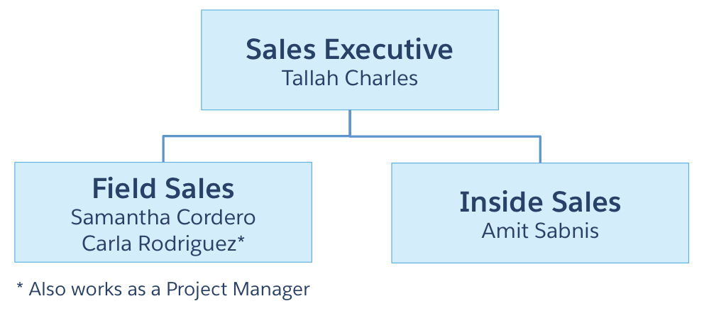

# Security Specialist
 
* Trailhead のスーパーバッジ、[Security Specialist](https://trailhead.salesforce.com/content/learn/superbadges/superbadge_security) の日本語訳(**非公式**)です。
* 各カスタマイズ要素のラベル部分には補足として日本語を括弧内に記載している場合がありますが、正解チェックは英語のラベルを元に行われるため、実際の Challenge には日本語表記を含めず、英語表記のみを使用して行って下さい。また、Challenge 前にユーザと組織の言語・ロケールを英語に切り替えておくことを推奨します。

---
## このスーパーバッジを取得するためにすること
1. オブジェクトレベルのセキュリティ設定を設定して、どのユーザがどのオブジェクトにアクセスできるかを制御する
2. レコードレベルのセキュリティ設定を設定して、特定のレコードを作成および編集できるユーザを制御する
3. セキュリティのベストプラクティスに準拠するように適切なパスワードポリシーを設定する
4. データ保持要件を満たすために項目レベルの変更を追跡する
5. レポート、ダッシュボード、および公開リストビューのセキュリティ設定を設定してユーザに適切な権限を付与する
6. ユーザログインのセキュリティを強化するために 2要素認証を設定する
7. Salesforce 設定への変更を追跡する機能を説明する

## このスーパーバッジでテストする概念
* データセキュリティ
* ユーザ認証
* ユーザ権限

## 事前準備とメモ
* ペンと紙を準備して、要件を読み進める際にメモを取ってください。
* このスーパーバッジ用に、新しい Trailhead Playground を作成してください。この組織をほかの目的で使用すると、課題について検証する際に問題を引き起こす可能性があります。
* [Security スーパーバッジの管理パッケージ](https://login.salesforce.com/packaging/installPackage.apexp?p0=04t36000000jWht)をインストールしてください。(パッケージ ID: 04t36000000jWht) 管理パッケージ、未管理パッケージ、アプリケーションを AppExchange からインストールする際に問題が発生した場合は、[この記事](https://force.desk.com/customer/en/portal/articles/2710899-installing-a-package-or-app-to-complete-a-trailhead-challenge?b_id=13478)に示す手順に従ってください。
* Trailhead Playground 組織では 1人のユーザしか新規作成できませんが、このスーパーバッジの Challenge を完了するために、多くの権限 (プロファイル、ロール、公開グループ、等) を作成することができます。様々なセキュリティ設定をテストするためのユーザを作成することをお勧めします。Samantha Cordero という名前のユーザをこの目的のために作成してください。

## ユースケース
GenZ Capital は Z 世代[*1](#footnote1)の顧客に金融サービスを提供するスタートアップ企業です。彼らはソーシャルメディアを通して全てのサービスを提供しています。GenZ の IT 部門は素晴らしい (絵文字をサポートするシステムは最先端です) 一方で、チームは、金融サービス界の大物である OldGuard Finance に買収される準備があまり出来ていませんでした。OldGuard は GenZ のシステムに徹底的なセキュリティ監査を実施しており、現在、変更が必要です。

あなたは、Salesforce の最高レベルのセキュリティコンサルタントとして、ソーシャルメディアのダイレクトメッセージを通して主要なステークホルダと会い、包括的なセキュリティの変更要件をまとめました。

### 標準オブジェクト
取引に関連する全てのデータを保存するため、GenZ は以下の標準オブジェクトを利用しています。

- Account (取引先) - GenZ Capital から金融サービスパッケージを購入する法人
- Contact (取引先責任者) - GenZ Capictal の見込みまたは既存の顧客の担当者
- Opportunity (商談) - GenZ Capital の金融パッケージに関する取引

### カスタムオブジェクト
このスーパーバッジのために、GenZ はカスタムオブジェクトを利用していません。

## ビジネス要件
このセクションに記載されている内容は、たくさん行ってきたミーティングの集大成であり、GenZ の Salesforce 組織をクラウド版フォート・ノックス[*2](#footnote2)に変えるための作業の基礎となります。

### システムとデータセキュリティの要件
政府の財務規制を遵守するには、GenZ はデータ保持と暗号化の両方のポリシーを実装する必要があり、買収会社  OldGuard Finance は、リモートワーカーとモバイルデバイスに対する厳格なアクセスポリシーを持っています。OldGuard Finance はまた、GenZ にパスワードのベストプラクティスの実装を求めています。

あなたは一連の会話を通してステークホルダーとこれらのニーズを詳細に探究しました。そして以下の短い要件リストをまとめました。

- **リモート/モバイルユーザのセキュリティ** - リモートワーカーは、Salesforce にアクセスするために VPN を使用する必要があります。すべてのモバイルユーザは多要素認証 (MFA) を使用する必要があります。すべてのモバイルユーザは、管理者によって個別に承認される必要があります。
注：使いやすさのために、単独の認証ではなく MFA を管理することにしました。
- **パスワードポリシー** - パスワードは 90 日ごとにリセットする必要があります。パスワードは 8 文字以上で、アルファベットと数字の両方を含める必要があります。
- **項目追跡** - 商談の金額項目の値の変更を追跡する必要があります。 

### 組織のセキュリティ要件
GenZ の各ロールを調査し、以下のロール固有の要件をまとめました。

#### 組織の概要
GenZ の営業組織構造には 3つのコアチームがあります。フィールドセールス、インサイドセールス、セールスエグゼクティブです。GenZ には、最も複雑な取引の実装をしやすくするため、プロジェクトマネージャとして行動する個人もいます。

#### 一般的なレコードレベルのセキュリティ要件
組織のデフォルトのレコードアクセスを以下の通り設定してください。

* 商談を所有するユーザ(とそのマネージャ)だけに、**商談レコードへのアクセスを制限してください**
* 誰が所有しているかにかかわらず、一般に取引先への参照権限のあるプロファイルが割り当たっていれば、組織の誰にでも**取引先レコードへのアクセスを許可してください** (注: 取引先責任者に対してはデフォルトの設定のままにしてください。)

注: これらの一般的なレコードレベルのセキュリティ要件は、以降のより詳細な要件によって上書きされる可能性があります。

#### フィールドセールスユーザに対する要件
フィールドセールスのユーザは自身のリストビューを作成できますが、他の人のリストビューの作成・管理はできません。また、レポート・ダッシュボードを作成できますが、レポート・ダッシュボードフォルダの作成・管理はできません。必要に応じてシステム管理者から権限を付与することで、モバイルアクセスが可能です。Salesforce へのログイン時間帯の制限はありません。所有する商談に対する参照・作成・編集権限があります(削除はありません)。また、すべての取引先を参照・編集できます。

注: フィールドセールスユーザにすべての取引先の参照・編集権限を付与するとき、プロファイルの [すべてのデータの参照] や [すべてのデータの編集] 権限は利用しないでください。

#### インサイドセールスユーザに対する要件
インサイドセールスユーザは Salesforce にメインオフィスからのみアクセスでき(IPアドレスは 0.0.0.0)、営業時間の間のみアクセスできます(8:00 AM～6:00 PM、太平洋標準時 (PST)、月～金)。モバイルアクセスはできません。レポート・ダッシュボードを作成でき、レポート・ダッシュボードフォルダを作成・管理できます。自身または他の人のためのリストビューを作成・管理できます。インサイドセールスユーザは、取引先と商談を作成でき、すべての取引先と商談を参照・編集できます(削除はありません)。

注: インサイドセールスユーザにすべての取引先と商談の参照・編集権限を付与するとき、プロファイルの [すべてのデータの参照] や [すべてのデータの編集] 権限は利用しないでください。

#### セールスエグゼクティブユーザに対する要件
セールスエグゼクティブユーザは、(他の共有設定に関わらず)すべての取引先と商談を参照できます。しかし、取引先と商談の作成・編集・削除はできません。レポート・ダッシュボードを作成できますが、レポート・ダッシュボードフォルダは作成・管理できません。自身のリストビューは作成できますが、他の人のリストビューの作成・管理はできません。必要に応じてシステム管理者から権限を付与することで、モバイルアクセスが可能です。Salesforce へのログイン時間帯の制限はありません。

#### プロジェクトマネージャでもあるユーザに対する特別な要件
社内で他のすべての責任を負うため、プロジェクトマネージャの権限は、他のさまざまなユーザ権限で設定されます。たとえば、Carla Rodriquez の主な仕事はシニアフィールドセールスアソシエイトですが、彼女はプロジェクトマネージャも務めています。このため、プロファイルを使用してレコードレベルの権限を設定することはできません。また、プロジェクトマネージャとレコードを共有するためにロールを使用しないでください。 プロジェクトマネージャは、種別が Existing Customer - Upgrade でフェーズが Closed Won であるすべての商談を参照できますが、他のユーザが所有する他の商談は参照できません。プロジェクトマネージャは、必要に応じてシステム管理者から権限を付与することで、モバイルアクセスが可能です。プロジェクトマネージャに関連するセキュリティの設定に名前を付けるときは、**Project Managers** という名前を使用します。

注: Challenge を始める前に、[Security Specialist: Trailhead Challenge Help (英語)](https://trailhead.salesforce.com/help?article=Security-Specialist-Superbadge-Trailhead-Challenge-Help) の記事を参照してください。

## Challenge
### Challenge 1: オブジェクトレベルのセキュリティを設定する
ビジネス要件を満たすプロファイルを作成してください。チーム名をプロファイルに含めて、以下の名前でプロファイルを作成してください。**Field Sales User**、**Inside Sales User**、**Sales Executive User**

### Challenge 2: レコードレベルのセキュリティを設定する
ビジネス要件を満たすようレコードレベルに関連した Salesforce の他の設定を行ってください。Samantha Cordero のユーザを作成し、彼女に **Field Sales User** のプロファイルと **Field Sales** のロールを割り当てます。Samantha が所有者の商談を作成し、フェーズを **Needs Analysis** に設定します。また、フェーズが **Closed Won** で種別が **Existing Customer - Upgrade** で Samantha が所有する商談も作成してください。

この Security スーパーバッジの未管理パッケージをインストール後、以下の手順で全ての Apex テストを実行してください。
1. 設定のクイック検索ボックスで `Apex テスト実行` と検索します。
2. [テストを選択...] ボタンをクリックします。
3. ドロップダウンメニューから[すべての名前空間]を選択します。
4. sb_security.BeAwesome を選択します。
5. [実行]ボタンをクリックします。

この Challenge をチェックする前に、すべての単体テストが合格していることを確認してください。(テスト名の隣、[状況] に緑色のチェックがつきます)

### Challenge 3: クイズ - 適切なパスワードポリシーを設定する
1. Which password practice creates the most risk for compromising an account? (アカウントを危険にさらすリスクが最も大きいパスワードの習慣はどれですか？)
    - A. Password reuse (パスワードの使いまわし)
    - B. Requiring a minimum password length of 8 characters (パスワードに最低 8 文字を要求する)
    - C. Using an English-language word or series of words in the password (英単語または連続した英単語をパスワードに用いる)
    - D. Using a mix of upper and lower characters and numbers (大文字小文字と数字を組み合わせて用いる)

2. When is it appropriate to share your Salesforce credentials with another person? (他の人に Salesforceの認証情報を共有するのに最も適しているのはいつですか？)
    - A. When working with your company's internal IT Help Desk (社内の IT ヘルプデスクと一緒に働いているとき)
    - B. When talking to someone from Salesforce Support (Salesforce のサポートの誰かと話しているとき)
    - C. When you have an assistant or executive admin (アシスタントまたはエグゼクティブのシステム管理者がいるとき)
    - D. All of the above (上記のすべて)
    - E. Never (決して共有しない)

3. Which of the following isn't a best practice for password user requirements? (パスワードのユーザ要件のベストプラクティスでないのは次のうちどれですか？)
    - A. Minimum password length of 8-10 characters (最低 8～10 文字の文字数)
    - B. Using a mix of alpha and numberic characters (英数字を組みわせて用いること)
    - C. Requiring users to reset their password at least once a year (最低 1 年に 1 回パスワードのリセットをユーザに要求すること)
    - D. Users not reusing their Salesforce password on other website and services (他のウェブサイトやサービスに Salesforce のパスワードを使いまわさないこと)

### Challenge 4: 項目レベルの変更を追跡する
要件の中で特定された項目の変更を追跡するよう設定を見直して更新してください。

### Challenge 5: レポート、ダッシュボード、公開リストビューのセキュリティを設定する
従業員が適切なデータだけを見られるようにし、レポートのための他のセキュリティ要件を設定してください。

### Challenge 6: 多要素認証を設定する
要件に応じて多要素認証を適切に設定してください。多要素認証を Samantha Cordero に割り当ててください。

### Challenge 7: クイズ - Salesforce設定の変更を追跡する
1. What feature would you use to track changes to settings in Salesforce? (Salesforceの設定の変更をトラッキングするにはどの機能を利用しますか？)
    - A. Setup History Tracking (設定変更履歴管理)
    - B. Field Audit Trail (項目監査履歴)
    - C. Setup Audit Trail (設定変更履歴)
    - D. Field History Tracking (項目履歴管理)

2. How many days worth of changes to settings you can download? (何日分の設定変更をダウンロードできますか？)
    - A. 90 days (90 日)
    - B. 180 days (180 日)
    - C. 370 days (370 日)
    - D. 365 days (365 日)

3. How many settings changes can you view directly within Setup (without downloading history)? (設定画面から直接、何件の設定変更を確認できますか？(ダウンロードの履歴は除く))
    - A. The 20 most recent changes (最近の 20 件の変更)
    - B. The past 5-180 days of changes (過去 5～180 日間の変更)
    - C. The 20-180 most recent changes (最近の 20～180 件の変更)
    - D. The past 180 days of changes (過去 180 日間の変更)

4. If a settings change was made by a delegate acting on behalf of an end user, what data is logged within settings change tracking? (もし、代理ユーザ(システム管理者やカスタマーサポート担当者など)がエンドユーザに代わって設定変更を行った場合、何のデータが設定変更履歴に記録されますか？)
    - A. The username of the delegated user (代理ユーザのユーザ名)
    - B. The full name of the delegated user (代理ユーザの氏名)
    - C. The Salesforce IDs of both end and delegated users (エンドユーザ、代理ユーザ両方の Salesforce ID)
    - D. The usernames both the end and delegated users (エンドユーザ、代理ユーザ両方のユーザ名)

## 訳注
* <a name="footnote1">[1]</a> : 概ね 1990 年代中盤から 2000 年代終盤までに生まれた世代のこと。
* <a name="footnote2">[2]</a> : ケンタッキー州にあるアメリカ陸軍の施設および、隣接する金塊保管庫。保管庫は米国財務省により運営されており、多くの物理的セキュリティで有名。
